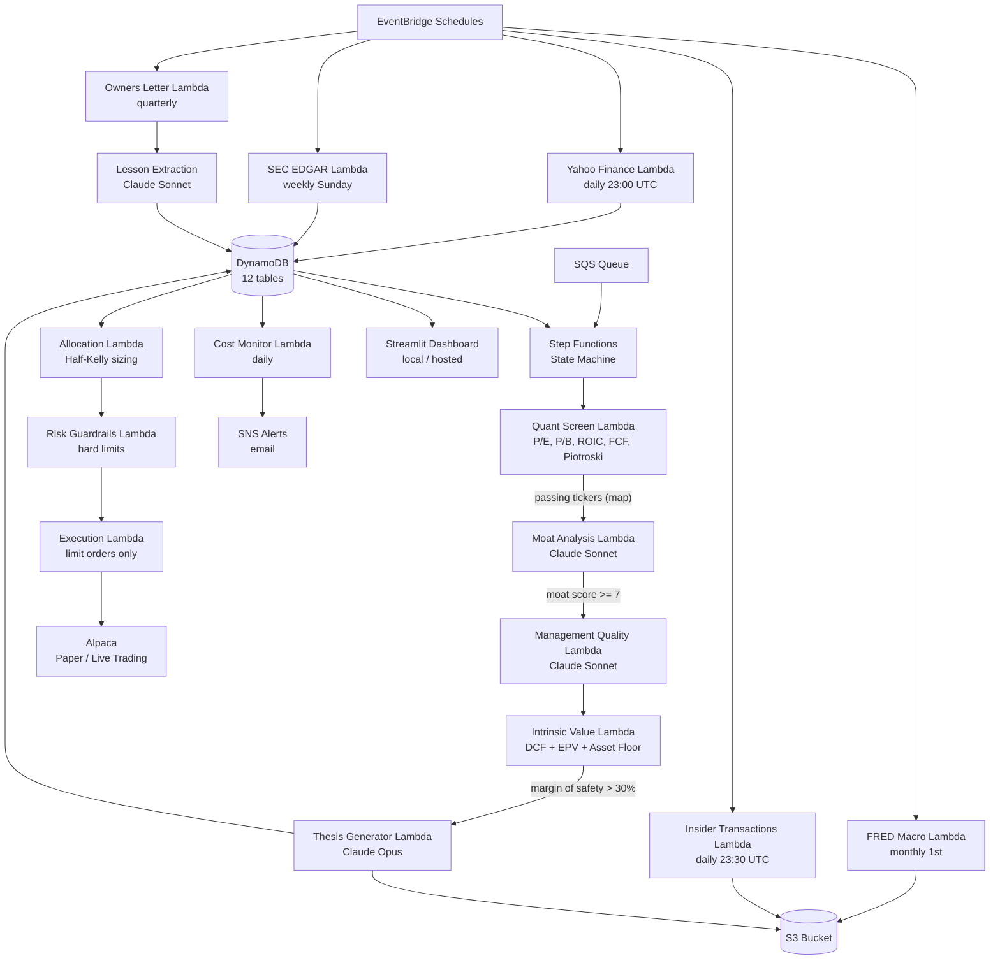

# Omaha Oracle

Omaha Oracle is an autonomous stock-picking and portfolio-management agent built on the investing philosophy of Benjamin Graham, David Dodd, and Warren Buffett. It automatically collects financial data for a watchlist of companies, applies quantitative screening rules (price ratios, profitability scores, debt limits), sends the best candidates to Anthropic's Claude AI for a deep qualitative review of competitive advantages and management quality, calculates what a company is intrinsically worth using discounted cash-flow mathematics, and — when a stock trades at a meaningful discount to that worth — places a paper trade through the Alpaca brokerage API. Every quarter it writes a Buffett-style "owner's letter" reviewing its own decisions, extracts structured lessons from its mistakes, and automatically injects those lessons into future analyses so it improves over time. The entire system runs on AWS serverless infrastructure (no servers to manage) and exposes a Streamlit web dashboard for monitoring.

---

## How It Works (The Simple Version)

Think of Omaha Oracle as a tireless junior analyst who reads every company's annual report, runs a set of strict financial tests, consults two senior experts for their opinions, does the valuation math, and then recommends a buy — all while keeping meticulous notes so they learn from every mistake.

1. **Collect the raw material.** Every day, week, and month, the agent automatically fetches the latest stock prices, ten years of financial statements from the SEC, and macroeconomic indicators (interest rates, inflation, etc.) and saves them to a database in the cloud.

2. **Run the first filter.** The agent scores every company on six quantitative tests — for example, "Has it consistently earned a good return on the money invested in it?" and "Is its debt level low enough to survive a downturn?" Companies that fail too many tests are skipped without spending any AI resources on them.

3. **Ask the AI experts.** For companies that pass the filter, the agent sends their financial data to Claude (Anthropic's AI) with two different questions: first, "Does this company have a durable competitive advantage — a *moat*?" and second, "Does management act like an owner of the business, or like an employee?" Only companies that score highly on both questions advance further.

4. **Calculate what it's worth and buy if cheap enough.** The agent computes an intrinsic value — what the business would be worth to a private buyer — using three different mathematical models. If the current stock price is at least 30% below that value (a "margin of safety"), the agent submits a limit buy order through Alpaca. Position sizes are calculated using the Half-Kelly formula to avoid over-concentrating in any single bet.

5. **Review mistakes and improve.** Each quarter, the agent audits every decision it made: which buys worked, which didn't, and which good opportunities were missed. Claude writes a candid post-mortem letter, extracts actionable lessons, and those lessons are injected into every future analysis — so the agent's judgment compounds over time just as an investor's experience would.

---

## Architecture Overview

### Entry Points

| Trigger | What Happens |
|---|---|
| **EventBridge schedule** (daily/weekly/monthly) | Ingestion Lambdas run automatically to fetch fresh data |
| **SQS message** | Drops a ticker into the analysis pipeline (Step Functions state machine) |
| **EventBridge quarterly schedule** | Owners-letter Lambda runs the post-mortem cycle |
| **`python run_dashboard.py`** | Starts the Streamlit dashboard locally for human monitoring |
| **`cdk deploy`** from `infra/`** | Deploys or updates all AWS infrastructure |

### Core Processing Pipeline



### Key Modules and Their Responsibilities

**`src/shared/`** — Cross-cutting utilities used by every Lambda function.

- **`config.py`** — Centralized settings singleton using Pydantic. Resolves configuration in priority order: environment variable → `.env` file → AWS SSM Parameter Store. All 12 DynamoDB table names and the S3 bucket name are automatically derived from the `ENVIRONMENT` value (`dev`/`staging`/`prod`) if not explicitly set.
- **`llm_client.py`** — The single gateway to Anthropic's Claude API. Routes calls to one of three model tiers (Opus for final investment theses, Sonnet for moat/management analysis, Haiku for bulk tasks), prepends a hardcoded guardrail to every system prompt that prohibits momentum trading and technical analysis, enforces the monthly spend budget, and retries transient API errors with exponential back-off.
- **`cost_tracker.py`** — Records every Claude API call (tokens in, tokens out, cost in USD) to a DynamoDB table. Used by `llm_client.py` to check whether the monthly budget is exhausted before making a new call.
- **`dynamo_client.py`** — Generic DynamoDB read/write helper used throughout the codebase to avoid repeating boilerplate `boto3` calls.
- **`s3_client.py`** — Helper for reading and writing JSON and Markdown documents to S3. Investment theses and quarterly letters are stored as Markdown files; raw financial data is stored as JSON.
- **`lessons_client.py`** — Loads lessons extracted from quarterly post-mortems and scores them for relevance to the current analysis (by ticker, sector, industry, analysis stage, and recency). Returns the top-5 most relevant lessons as formatted text for injection into Claude's prompts.
- **`logger.py`** — Structured JSON logging that writes to stdout, which CloudWatch Logs automatically collects in AWS.

**`src/ingestion/`** — Lambda handlers that fetch raw data from external sources on a schedule.

- **`yahoo_finance/handler.py`** — Uses the `yfinance` library to download current price metrics (P/E, P/B, market cap, sector) and up to 10 years of daily price history. Stores results in DynamoDB and S3.
- **`sec_edgar/handler.py` + `parser.py`** — Fetches XBRL-tagged financial facts (revenue, earnings, assets, liabilities, cash flow, etc.) directly from the SEC's public EDGAR API. The parser extracts 14 standardized financial line items per filing year.
- **`fred/handler.py`** — Downloads 10 macroeconomic time series from the Federal Reserve Economic Data API: Federal Funds Rate, 10-year and 2-year Treasury yields, the yield-curve spread, CPI, unemployment, the VIX volatility index, high-yield credit spreads, GDP, and consumer sentiment.
- **`insider_transactions/handler.py`** — Fetches Form 4 insider-trading filings from the SEC for companies on the watchlist and stores them to S3.

**`src/analysis/`** — The core analytical pipeline, orchestrated by the Step Functions state machine.

- **`quant_screen/handler.py` + `metrics.py`** — Applies six quantitative filters without using AI: P/E ≤ 15, P/B ≤ 1.5, Debt/Equity < 0.5, 10-year average ROIC ≥ 12%, positive free cash flow in at least 8 of the last 10 years, and Piotroski F-score ≥ 6. Thresholds are configurable in DynamoDB. Companies failing too many tests are eliminated here at zero AI cost.
- **`moat_analysis/handler.py` + `prompts.py`** — Sends a company's financial profile to Claude Sonnet and asks it to evaluate competitive advantages (network effects, switching costs, cost advantages, intangible assets, efficient scale) and return a structured JSON score from 0–10 with supporting evidence.
- **`management_quality/handler.py` + `prompts.py`** — Sends a second prompt to Claude Sonnet asking it to assess capital-allocation discipline, insider ownership, historical return on incremental capital, and candor in shareholder communications. Returns a JSON score from 0–10.
- **`intrinsic_value/handler.py` + `models.py`** — Calculates intrinsic value using three models without LLM involvement: a 3-scenario Discounted Cash Flow model (bear/base/bull growth rates at 2%/6%/10% with a 10% discount rate), an Earnings Power Value (owner earnings ÷ 10%), and a net-net asset floor. The composite is weighted 60% DCF + 30% EPV + 10% asset floor. Outputs a margin-of-safety percentage.
- **`thesis_generator/handler.py` + `prompts.py`** — For companies passing all prior filters, sends the complete analysis package to Claude Opus and asks it to write a Buffett-style investment thesis in Markdown. The thesis is saved to S3 and a summary is stored in DynamoDB.

**`src/portfolio/`** — Buy/sell decision-making and order execution.

- **`allocation/handler.py`** — Loads the latest analysis from DynamoDB and evaluates a BUY, SELL, or HOLD decision for each ticker in the portfolio and watchlist.
- **`allocation/buy_sell_logic.py`** — Implements the explicit rules: BUY requires margin of safety > 30%, moat score ≥ 7, management score ≥ 6, available cash, fewer than 20 existing positions, and sector exposure below 35%. SELL is triggered if the moat score drops below 5 for two consecutive quarters, the price exceeds 150% of intrinsic value, or fraud flags appear. The minimum holding period is 365 days unless the investment thesis is definitively broken.
- **`allocation/position_sizer.py`** — Computes position size using the Half-Kelly criterion (f\* = (b·p − q) / (2·b)), capped at 15% of portfolio value. Adjusts Kelly fraction by the geometric mean of confidence-calibration factors derived from past lessons.
- **`execution/handler.py`** — Submits the actual orders. Uses limit orders exclusively (no market orders). Orders above $10,000 are automatically split into 3–5 tranches. Live trading is only enabled when `ENVIRONMENT=prod`; all other environments use Alpaca's paper-trading endpoint.
- **`execution/alpaca_client.py`** — A direct REST client for the Alpaca API using `requests`. Does not use the `alpaca-py` SDK.
- **`risk/handler.py` + `guardrails.py`** — Hard-coded guardrails that sit between the allocation decision and execution. Enforces: maximum 15% of portfolio in any single position, maximum 35% in any sector, zero leverage, zero short positions, zero options or derivatives, zero cryptocurrency, and a minimum 10% cash reserve. Also implements a circuit breaker: any LLM BUY signal is rejected if the company failed the quantitative screen.

**`src/monitoring/`** — Observability and the self-improvement feedback loop.

- **`owners_letter/handler.py`** — Runs in five sequential phases each quarter: (1) audits all past decisions and classifies them as GOOD_BUY, BAD_BUY, MISSED_OPPORTUNITY, etc. using price-change thresholds; (2) sends the audit results to Claude Sonnet to write a candid post-mortem letter; (3) extracts structured lessons (with type, severity, actionable rule, and prompt-injection text) to DynamoDB; (4) auto-adjusts screening thresholds for minor lessons (≤20% change per quarter) and flags moderate-to-severe lessons for human review; (5) the updated lessons are picked up by `LessonsClient` and injected into future analyses.
- **`alerts/handler.py`** — Routes alert events to AWS SNS (Simple Notification Service), which sends email notifications to the address configured in `ALERT_EMAIL`.
- **`cost_monitor/handler.py`** — Runs daily. Queries the cost-tracking DynamoDB table and the AWS Cost Explorer API to compute total monthly spend (LLM + AWS infrastructure). Publishes an SNS alert if spend exceeds 80% of the $67/month budget.

**`src/dashboard/`** — A local Streamlit web application for human monitoring.

- **`app.py`** — Multi-page Streamlit entry point. Sets page configuration and routes between the six dashboard pages.
- **`data.py`** — Data-fetching layer used by all dashboard pages. Reads from DynamoDB and S3 so the pages themselves contain only rendering logic.
- **`pages/portfolio.py`** — Displays current positions, their cost basis, current value, gain/loss, and intrinsic value estimates.
- **`pages/watchlist.py`** — Shows all companies under monitoring with their latest quantitative scores and screening status.
- **`pages/signals.py`** — Displays recent BUY/SELL/HOLD signals with the underlying analysis that drove each decision.
- **`pages/cost_tracker.py`** — Visualizes LLM spend by model and module over time against the monthly budget.
- **`pages/letters.py`** — Renders the quarterly owner's letters stored in S3.
- **`pages/feedback_loop.py`** — Displays the lessons extracted from past post-mortems and shows how they are being applied to current analyses.

**`infra/`** — AWS Cloud Development Kit (CDK) code that defines all cloud infrastructure as Python code.

- **`app.py`** — CDK entry point. Instantiates all four stacks and wires them together.
- **`stacks/data_stack.py`** — Creates the S3 bucket, all 12 DynamoDB tables (with appropriate partition/sort keys), the SQS queue for triggering analysis, and the EventBridge rules that trigger ingestion Lambdas on schedule.
- **`stacks/analysis_stack.py`** — Deploys the five analysis Lambda functions and defines the Step Functions state machine that orchestrates them, including the parallel map step for processing multiple tickers concurrently (max concurrency: 3).
- **`stacks/portfolio_stack.py`** — Deploys the allocation, execution, and risk Lambda functions with appropriate IAM permissions to read from DynamoDB and call the Alpaca API.
- **`stacks/monitoring_stack.py`** — Deploys the cost monitor, alerts, and owners-letter Lambdas. Creates the SNS topic and subscribes the alert email to it.

**`prompts/`** — Standalone Markdown files containing the master prompt templates for Claude. These are the authoritative source of the agent's qualitative judgment instructions.

| File | Purpose |
|---|---|
| `system_prompt_base.md` | Base system instructions (currently a scaffold, not yet populated) |
| `anti_style_drift_guardrail.md` | The prohibitions against momentum trading, technical analysis, shorts, options, and crypto — also hardcoded in `llm_client.py` |
| `moat_analysis.md` | Instructions for evaluating competitive moats |
| `management_assessment.md` | Instructions for evaluating management quality |
| `thesis_generation.md` | Instructions for writing Buffett-style investment theses |
| `owners_letter.md` | Instructions for the quarterly post-mortem letter |
| `lesson_extraction.md` | Instructions for extracting structured lessons from post-mortems |

**`docs/`** — Project documentation.

- **`omaha_oracle_build_plan_v2.md`** — The master build plan describing the intended system design and sprint breakdown.
- **`architecture/cost_budget.md`** — Breakdown of the $67/month infrastructure budget.
- **`architecture/data_model.md`** — Detailed description of all DynamoDB table schemas.
- **`architecture/system_overview.md`** — System overview document (currently empty scaffold).
- **`sprints/sprint_1_foundation.md` through `sprint_4_polish.md`** — Sprint-by-sprint development plans.

**`tests/`** — Test suite.

- **`unit/`** — Unit tests using `pytest` and `moto` (a library that mocks AWS services locally). Covers individual Lambda handlers, the LLM client, cost tracker, and analysis modules without requiring real AWS credentials or API keys.
- **`integration/`** — Integration tests that test multiple components interacting. May require real or localstack AWS resources.
- **`manual/`** — Ad-hoc debug scripts for running individual components interactively during development.
- **`fixtures/mock_data.py`** — Shared test fixtures providing realistic mock company financial data.

**Root-level files:**

- **`.env.example`** — Template listing all required environment variables with placeholder values. Copy to `.env` and fill in real values to run locally.
- **`.env`** — Live secrets file (not committed to version control). Loaded automatically by Pydantic Settings in local development.
- **`pyproject.toml`** — Python project metadata and all dependency groups: core runtime, `[dashboard]` extras, `[dev]` tooling, and `[infra]` CDK dependencies.
- **`run_dashboard.py`** — Convenience script that sets `PYTHONPATH=src` and launches the Streamlit dashboard.
- **`repo_structure.txt`** — A previously saved snapshot of the directory tree; informational only.
- **`.gitignore`** — Standard Python + AWS gitignore patterns.

---

## Setup & Configuration

### Prerequisites

| Requirement | Version | Notes |
|---|---|---|
| Python | ≥ 3.12 | Required by `pyproject.toml` |
| AWS CLI | Any recent | Configured with a profile named `omaha-oracle` |
| Node.js | ≥ 18 | Required by AWS CDK |
| AWS CDK CLI | ≥ 2.130 | `npm install -g aws-cdk` |
| Anthropic account | — | API key with Claude access |
| Alpaca account | — | Paper-trading account (free); live trading requires margin approval |
| FRED account | — | Free API key from [fred.stlouisfed.org](https://fred.stlouisfed.org/docs/api/api_key.html) |

### Environment Variables

Copy `.env.example` to `.env` and populate each value:

| Variable | Required | Description |
|---|---|---|
| `AWS_PROFILE` | Yes | AWS CLI profile name to use for all AWS calls (`omaha-oracle` by convention) |
| `AWS_REGION` | Yes | AWS region where all resources are deployed (default: `us-east-1`) |
| `ANTHROPIC_API_KEY` | Yes | Secret key for the Anthropic API — the source of all Claude AI calls |
| `ALPACA_API_KEY` | Yes | Public key for the Alpaca brokerage API |
| `ALPACA_SECRET_KEY` | Yes | Secret key for the Alpaca brokerage API |
| `ALPACA_BASE_URL` | Yes | `https://paper-api.alpaca.markets` for paper trading; change to live URL only in prod |
| `FRED_API_KEY` | Yes | API key for the Federal Reserve Economic Data service |
| `SEC_USER_AGENT` | Yes | Identifies your application to the SEC API — required by their terms of service (e.g., `OmahaOracle you@example.com`) |
| `ENVIRONMENT` | Yes | `dev`, `staging`, or `prod` — controls table names, S3 bucket names, and whether live trading is permitted |
| `LOG_LEVEL` | No | Logging verbosity: `DEBUG`, `INFO`, `WARNING`, `ERROR` (default: `INFO`) |
| `MONTHLY_LLM_BUDGET_CENTS` | No | Monthly Claude API spend limit in US cents (e.g., `5000` = $50). The system refuses new AI calls when this limit is reached, except for final thesis generation |
| `ALERT_EMAIL` | No | Email address that receives SNS cost alerts and portfolio notifications |
| `SNS_TOPIC_ARN` | No | ARN of the SNS topic created by the CDK monitoring stack — automatically set after `cdk deploy` |

Any API key variable can alternatively be stored in AWS SSM Parameter Store at `/omaha-oracle/{ENVIRONMENT}/{param-name}` (e.g., `/omaha-oracle/dev/anthropic-api-key`) and will be fetched automatically at runtime if the environment variable is absent.

### Installation

```bash
# 1. Clone the repository
git clone <repo-url> omaha_oracle
cd omaha_oracle

# 2. Create and activate a virtual environment
python -m venv .venv
source .venv/bin/activate        # macOS/Linux
.venv\Scripts\activate           # Windows PowerShell

# 3. Install runtime and dev dependencies
pip install -e ".[dev,dashboard,infra]"

# 4. Copy the env template and fill in your credentials
cp .env.example .env
# Edit .env with your API keys and AWS settings

# 5. (Optional) Run the test suite to verify your setup
pytest tests/unit/
```

### Deploying the Infrastructure to AWS

```bash
# Bootstrap CDK in your AWS account (one-time per account/region)
cd infra
cdk bootstrap aws://YOUR_ACCOUNT_ID/us-east-1

# Deploy all four stacks
cdk deploy --all -c env=dev

# For production
cdk deploy --all -c env=prod
```

### Running the Dashboard Locally

```bash
# From the repo root
python run_dashboard.py
# Dashboard opens at http://localhost:8501
```

---

## Common Workflows

### Workflow 1: Daily Market Data Ingestion

**Trigger:** EventBridge fires the Yahoo Finance Lambda at 23:00 UTC and the Insider Transactions Lambda at 23:30 UTC every trading day.

**What happens internally:**
1. The Yahoo Finance Lambda iterates over every ticker in the `watchlist` DynamoDB table and fetches the latest price, P/E ratio, P/B ratio, market capitalization, and sector from `yfinance`. It also downloads up to 10 years of daily price history.
2. Current metrics are upserted into the `companies` DynamoDB table; price history is written to S3 as JSON under `raw/prices/{ticker}/{date}.json`.
3. Simultaneously, the Insider Transactions Lambda fetches recent Form 4 filings from the SEC for watchlist companies and stores them to S3 under `raw/insider_transactions/`.
4. Separately, once a week (Sunday 02:00 UTC) the SEC EDGAR Lambda fetches XBRL financial facts for all watchlist companies and updates the `financials` DynamoDB table. Once a month (1st of the month, 03:00 UTC) the FRED Lambda refreshes 10 macroeconomic series and stores them to S3 under `processed/macro/`.

**Result:** All downstream analysis always has access to fresh data without any manual intervention.

---

### Workflow 2: End-to-End Company Analysis

**Trigger:** A ticker symbol is placed on the SQS queue — either manually or by a scheduled process that sweeps the watchlist.

**What happens internally:**
1. Step Functions picks up the SQS message and starts the state machine. Up to 3 companies are processed in parallel.
2. **Quant Screen (no AI):** The Lambda loads 10 years of financials from DynamoDB and computes P/E, P/B, Debt/Equity, 10-year average ROIC, FCF consistency, and Piotroski F-score. If the company fails the configured thresholds, it is logged as FAIL and the state machine exits for that ticker — no AI spend occurs.
3. **Moat Analysis (Claude Sonnet):** A passing company's financial summary is sent to Claude Sonnet with the moat-analysis prompt. Claude returns a JSON object with a score (0–10) and evidence for each moat type. If the score is below 7, the pipeline exits.
4. **Management Quality (Claude Sonnet):** A second prompt assesses capital allocation, insider ownership, and shareholder communications quality. Returns a JSON score. Any past lessons from `LessonsClient` relevant to this ticker or sector are injected into both prompts.
5. **Intrinsic Value (no AI):** The Lambda runs three valuation models on the historical financial data and produces a composite intrinsic value and a margin-of-safety percentage. If margin of safety is below 30%, the pipeline exits.
6. **Thesis Generation (Claude Opus):** If all gates are passed, the entire analysis package (quant data, moat score, management score, intrinsic value, relevant lessons) is sent to Claude Opus which writes a full Buffett-style investment thesis in Markdown. The thesis is saved to S3 (`theses/{ticker}/{date}.md`) and a summary is written to DynamoDB (`analysis` table).

**Result:** A structured analysis record in DynamoDB and a Markdown thesis in S3, readable in the dashboard's Signals and Owner's Letters pages. Downstream, the Allocation Lambda reads these results to decide whether to submit a buy order.

---

### Workflow 3: Quarterly Post-Mortem and Lesson Injection

**Trigger:** EventBridge fires the Owners Letter Lambda once per quarter (e.g., first day of January, April, July, October).

**What happens internally:**
1. **Outcome Audit:** The Lambda loads all investment decisions from the past quarter from the `decisions` DynamoDB table and compares them against actual price outcomes. Each decision is classified: GOOD_BUY (price up ≥ 15%), BAD_BUY (price down ≥ 15%), MISSED_OPPORTUNITY (passed on a company that rose ≥ 30%), or NEUTRAL.
2. **Letter Generation:** The full audit report is sent to Claude Sonnet with the `owners_letter.md` prompt. Claude writes a candid, self-critical Markdown letter in Buffett's style. The letter is saved to S3 under `letters/{year}/Q{N}_{date}.md`.
3. **Lesson Extraction:** The letter and audit data are sent to Claude Sonnet again with the `lesson_extraction.md` prompt. Claude extracts structured lessons with fields: `lesson_type`, `severity` (minor/moderate/severe), `actionable_rule`, and `prompt_injection_text`. Lessons are written to the `lessons` DynamoDB table.
4. **Threshold Adjustment:** The Lambda reviews minor-severity lessons and applies small automatic adjustments to screening thresholds in the `config` DynamoDB table (capped at a 20% change per quarter). Moderate and severe lessons are flagged with a `requires_human_review` attribute.
5. **Future Injection:** From this point forward, every time `LessonsClient` is called during analysis, it queries the `lessons` table, scores lessons for relevance to the current context, and the top-5 are appended to the Claude prompts — so the next analysis literally incorporates learned wisdom from past mistakes.

**Result:** A human-readable quarterly letter in S3, structured lessons in DynamoDB, and continuously improving analysis quality over time.

---

## Glossary

**Margin of Safety** — The percentage gap between a stock's current market price and its calculated intrinsic value. A 30% margin of safety means the stock trades at 70 cents for every dollar of estimated worth. The concept comes from Benjamin Graham as protection against valuation error.

**Moat** — Short for "economic moat," Warren Buffett's term for a durable competitive advantage that protects a business from competitors — analogous to the moat around a castle. Examples include network effects, high switching costs, cost advantages, and strong brand intangibles.

**Piotroski F-score** — A 0–9 integer score developed by academic Joseph Piotroski that grades a company's financial health across profitability, leverage, and operating efficiency signals. Omaha Oracle requires a score of 6 or higher.

**DCF (Discounted Cash Flow)** — A valuation method that estimates what a business is worth today based on the cash it is expected to generate in the future, discounted back at a required rate of return. Omaha Oracle runs three scenarios (pessimistic, base case, optimistic) and weights them by probability.

**EPV (Earnings Power Value)** — A simpler valuation method that assumes no growth: current normalized owner earnings divided by the required rate of return. Developed by Columbia Business School professor Bruce Greenwald as a conservative baseline.

**WACC (Weighted Average Cost of Capital)** — The minimum return a business must earn on its assets to satisfy both its debt holders and equity owners. Omaha Oracle uses a fixed 10% WACC as its discount rate, consistent with Buffett's long-run equity return hurdle.

**ROIC (Return on Invested Capital)** — Net operating profit after tax divided by the capital deployed in the business. A high and consistent ROIC (Omaha Oracle requires ≥ 12% averaged over 10 years) is a hallmark of a high-quality business with pricing power.

**Half-Kelly** — A position-sizing formula that risks half of what the mathematically optimal Kelly Criterion would suggest, as a practical hedge against estimation error in probability and payoff estimates. Omaha Oracle caps it further at 15% of portfolio value.

**Paper Trading** — Simulated trading that records hypothetical orders and positions without using real money. Alpaca provides a paper-trading API endpoint; Omaha Oracle defaults to paper trading in all non-production environments.

**Step Functions** — AWS Step Functions is an orchestration service that runs a series of Lambda functions in a defined sequence or in parallel, with branching logic, retry policies, and error handling built in. Omaha Oracle uses it to run the five-stage analysis pipeline.

**Lambda** — AWS Lambda is a "serverless" compute service that runs code in response to events without requiring a persistent server. Each component of Omaha Oracle (ingestion, analysis steps, portfolio management, monitoring) is deployed as a separate Lambda function.

**SSM Parameter Store** — AWS Systems Manager Parameter Store is a secure key-value store for configuration data and secrets. Omaha Oracle uses it as a fallback source for API keys that are not set as environment variables.

**XBRL** — Extensible Business Reporting Language. A standard format the SEC requires public companies to use when filing financial statements, which allows machines to parse financial data reliably without screen-scraping PDF documents.

**EventBridge** — AWS EventBridge is a scheduling and event-routing service. Omaha Oracle uses it to trigger ingestion and monitoring Lambda functions on a calendar schedule (daily, weekly, monthly, quarterly).
