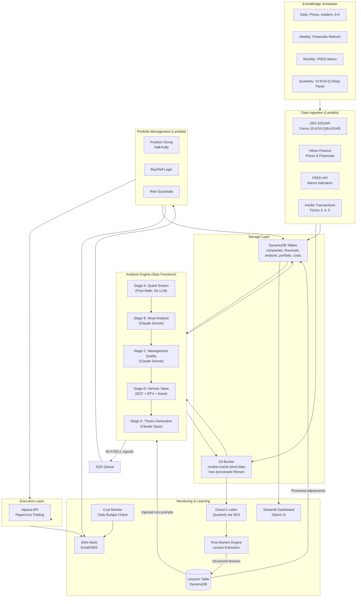

# Omaha Oracle — Complete Implementation-Ready Build Plan

**Version:** 2.0 (Reinforcement Learning Feedback Loop Edition)  
**Date:** March 15, 2026  
**Project Root:** `C:\Users\peder\Documents\omaha_oracle`  
**Target:** Solo retail investor, long-only US equities, 5+ year horizon  
**Budget:** $600–$800/year total operating cost  
**Timeline:** 4–6 weeks part-time to paper-trading MVP

---

## Table of Contents

1. [Architecture Overview](#1-architecture-overview)
2. [Step 1 — Shared Utilities & CDK Foundation](#2-step-1--shared-utilities--cdk-foundation)
3. [Step 2 — Data Ingestion Pipeline ("Scuttlebutt Engine")](#3-step-2--data-ingestion-pipeline)
4. [Step 3 — Security Analysis Module ("Graham-Dodd Analyst")](#4-step-3--security-analysis-module)
5. [Step 4 — Capital Allocation & Portfolio Management](#5-step-4--capital-allocation--portfolio-management)
6. [Step 5 — Execution Layer](#6-step-5--execution-layer)
7. [Step 6 — Monitoring, Alerting & Reinforcement Learning Feedback Loop](#7-step-6--monitoring-alerting--owners-letter)
8. [Step 7 — Risk Management & Guardrails](#8-step-7--risk-management--guardrails)
9. [Step 8 — Cost Budget Breakdown](#9-step-8--cost-budget-breakdown)
10. [Step 9 — Vibe Coding Implementation Plan (Sprint Prompts)](#10-step-9--vibe-coding-implementation-plan)
11. [DynamoDB Table Schemas](#11-dynamodb-table-schemas)
12. [LLM Prompt Templates](#12-llm-prompt-templates)
13. [Known Limitations & Honest Assessment](#13-known-limitations--honest-assessment)

---

## 1. Architecture Overview

### Mermaid Architecture Diagram



### Design Principles

1. **Serverless-only:** Lambda + DynamoDB + S3 + Step Functions. Zero EC2. Zero idle cost.
2. **Cost-paranoid:** Every LLM call gated by `check_budget()`. Haiku for pre-filtering, Sonnet for analysis, Opus only for final thesis.
3. **Paper-first:** System defaults to paper trading. Live trading requires explicit `ENVIRONMENT=prod`.
4. **Anti-style-drift:** Every LLM prompt includes a guardrail system message prohibiting momentum, technical analysis, or market timing.
5. **Audit trail:** Every decision logged with full reasoning chain in DynamoDB.
6. **Self-improving feedback loop:** Every quarterly Owner's Letter triggers a structured post-mortem that extracts lessons, classifies mistakes, and feeds corrections back into future analysis prompts and screening thresholds. The system learns from its own errors.

---

## 2. Step 1 — Shared Utilities & CDK Foundation

### 2.1 `src\shared\config.py`

```python
"""
Omaha Oracle — Central Configuration
Reads from environment variables with SSM Parameter Store fallback.
All SSM paths namespaced under /omaha-oracle/{env}/
"""
from __future__ import annotations

import os
from functools import lru_cache
from typing import Optional

import boto3
from pydantic import Field
from pydantic_settings import BaseSettings


class OracleConfig(BaseSettings):
    """Configuration loaded from env vars, with SSM fallback for secrets."""

    # --- Environment ---
    environment: str = Field(default="dev", alias="ENVIRONMENT")
    aws_region: str = Field(default="us-east-1", alias="AWS_REGION")

    # --- DynamoDB Tables ---
    companies_table: str = Field(default="omaha-oracle-dev-companies")
    financials_table: str = Field(default="omaha-oracle-dev-financials")
    analysis_table: str = Field(default="omaha-oracle-dev-analysis")
    portfolio_table: str = Field(default="omaha-oracle-dev-portfolio")
    cost_tracker_table: str = Field(default="omaha-oracle-dev-cost-tracker")
    config_table: str = Field(default="omaha-oracle-dev-config")
    decisions_table: str = Field(default="omaha-oracle-dev-decisions")
    watchlist_table: str = Field(default="omaha-oracle-dev-watchlist")
    lessons_table: str = Field(default="omaha-oracle-dev-lessons")

    # --- S3 ---
    data_bucket: str = Field(default="omaha-oracle-dev-data")

    # --- LLM ---
    anthropic_api_key: Optional[str] = Field(default=None, alias="ANTHROPIC_API_KEY")
    llm_model_opus: str = Field(default="claude-opus-4-20250514")
    llm_model_sonnet: str = Field(default="claude-sonnet-4-20250514")
    llm_model_haiku: str = Field(default="claude-haiku-4-5-20251001")
    llm_monthly_budget_usd: float = Field(default=50.0)

    # --- Alpaca ---
    alpaca_api_key: Optional[str] = Field(default=None, alias="ALPACA_API_KEY")
    alpaca_secret_key: Optional[str] = Field(default=None, alias="ALPACA_SECRET_KEY")
    alpaca_base_url: str = Field(
        default="https://paper-api.alpaca.markets",
        alias="ALPACA_BASE_URL",
    )

    # --- Notifications ---
    alert_email: str = Field(default="", alias="ALERT_EMAIL")
    sns_topic_arn: str = Field(default="", alias="SNS_TOPIC_ARN")

    # --- SEC EDGAR ---
    sec_user_agent: str = Field(
        default="OmahaOracle contact@example.com",
        alias="SEC_USER_AGENT",
    )

    # --- FRED ---
    fred_api_key: Optional[str] = Field(default=None, alias="FRED_API_KEY")

    class Config:
        env_file = ".env"
        env_file_encoding = "utf-8"
        populate_by_name = True

    def _resolve_ssm(self, param_name: str) -> Optional[str]:
        """Fetch a parameter from SSM Parameter Store."""
        try:
            ssm = boto3.client("ssm", region_name=self.aws_region)
            resp = ssm.get_parameter(
                Name=f"/omaha-oracle/{self.environment}/{param_name}",
                WithDecryption=True,
            )
            return resp["Parameter"]["Value"]
        except Exception:
            return None

    def get_anthropic_key(self) -> str:
        """Return API key from env or SSM."""
        if self.anthropic_api_key:
            return self.anthropic_api_key
        key = self._resolve_ssm("anthropic-api-key")
        if not key:
            raise ValueError("ANTHROPIC_API_KEY not found in env or SSM")
        return key

    def get_alpaca_keys(self) -> tuple[str, str]:
        """Return (api_key, secret_key) from env or SSM."""
        api_key = self.alpaca_api_key or self._resolve_ssm("alpaca-api-key")
        secret = self.alpaca_secret_key or self._resolve_ssm("alpaca-secret-key")
        if not api_key or not secret:
            raise ValueError("Alpaca credentials not found in env or SSM")
        return api_key, secret

    def table_name(self, base: str) -> str:
        """Generate environment-aware table name."""
        return f"omaha-oracle-{self.environment}-{base}"

    def bucket_name(self) -> str:
        return f"omaha-oracle-{self.environment}-data"


@lru_cache()
def get_config() -> OracleConfig:
    """Singleton config instance."""
    return OracleConfig()
```

### 2.2 `src\shared\logger.py`

```python
"""
Omaha Oracle — Structured JSON logging for Lambda/CloudWatch.
"""
from __future__ import annotations

import json
import logging
import os
import sys
import uuid
from contextvars import ContextVar
from typing import Any

_correlation_id: ContextVar[str] = ContextVar("correlation_id", default="")


def set_correlation_id(cid: str | None = None) -> str:
    """Set or generate a correlation ID for the current context."""
    cid = cid or str(uuid.uuid4())[:8]
    _correlation_id.set(cid)
    return cid


def get_correlation_id() -> str:
    return _correlation_id.get()


class JsonFormatter(logging.Formatter):
    """Emit structured JSON lines for CloudWatch."""

    def format(self, record: logging.LogRecord) -> str:
        log_entry: dict[str, Any] = {
            "timestamp": self.formatTime(record),
            "level": record.levelname,
            "logger": record.name,
            "message": record.getMessage(),
            "correlation_id": get_correlation_id(),
            "function": os.environ.get("AWS_LAMBDA_FUNCTION_NAME", "local"),
        }
        if record.exc_info and record.exc_info[0]:
            log_entry["exception"] = self.formatException(record.exc_info)
        # Merge any extra fields passed via `extra={}`
        for key in ("ticker", "module", "cost_usd", "tokens", "action"):
            val = getattr(record, key, None)
            if val is not None:
                log_entry[key] = val
        return json.dumps(log_entry, default=str)


def get_logger(name: str) -> logging.Logger:
    """Return a logger configured for structured JSON output."""
    logger = logging.getLogger(name)
    if not logger.handlers:
        handler = logging.StreamHandler(sys.stdout)
        handler.setFormatter(JsonFormatter())
        logger.addHandler(handler)
        logger.setLevel(os.environ.get("LOG_LEVEL", "INFO"))
        logger.propagate = False
    return logger
```

### 2.3 `src\shared\cost_tracker.py`

```python
"""
Omaha Oracle — LLM Cost Tracker
Tracks token usage per call, writes to DynamoDB, enforces monthly budget.
"""
from __future__ import annotations

import datetime
from decimal import Decimal
from typing import Any

import boto3
from boto3.dynamodb.conditions import Key

from src.shared.config import get_config
from src.shared.logger import get_logger

logger = get_logger(__name__)

# Pricing per 1M tokens (as of March 2026 — update if pricing changes)
PRICING = {
    "claude-opus-4-20250514": {"input": 15.00, "output": 75.00},
    "claude-sonnet-4-20250514": {"input": 3.00, "output": 15.00},
    "claude-haiku-4-5-20251001": {"input": 0.80, "output": 4.00},
}


class CostTracker:
    def __init__(self):
        self.config = get_config()
        self.table = boto3.resource(
            "dynamodb", region_name=self.config.aws_region
        ).Table(self.config.cost_tracker_table)

    def log_usage(
        self,
        model: str,
        input_tokens: int,
        output_tokens: int,
        module: str,
        ticker: str = "SYSTEM",
    ) -> float:
        """Log a single LLM call's cost. Returns cost in USD."""
        pricing = PRICING.get(model, PRICING["claude-sonnet-4-20250514"])
        cost = (input_tokens * pricing["input"] + output_tokens * pricing["output"]) / 1_000_000
        now = datetime.datetime.now(datetime.timezone.utc)
        month_key = now.strftime("%Y-%m")

        self.table.put_item(
            Item={
                "month_key": month_key,
                "timestamp": now.isoformat(),
                "model": model,
                "input_tokens": input_tokens,
                "output_tokens": output_tokens,
                "cost_usd": Decimal(str(round(cost, 6))),
                "module": module,
                "ticker": ticker,
            }
        )

        logger.info(
            f"LLM cost: ${cost:.4f}",
            extra={"cost_usd": cost, "tokens": input_tokens + output_tokens, "module": module},
        )
        return cost

    def get_monthly_spend(self, month_key: str | None = None) -> float:
        """Get total LLM spend for a given month (default: current)."""
        if month_key is None:
            month_key = datetime.datetime.now(datetime.timezone.utc).strftime("%Y-%m")

        response = self.table.query(
            KeyConditionExpression=Key("month_key").eq(month_key),
            ProjectionExpression="cost_usd",
        )
        total = sum(float(item["cost_usd"]) for item in response.get("Items", []))

        # Handle pagination
        while "LastEvaluatedKey" in response:
            response = self.table.query(
                KeyConditionExpression=Key("month_key").eq(month_key),
                ProjectionExpression="cost_usd",
                ExclusiveStartKey=response["LastEvaluatedKey"],
            )
            total += sum(float(item["cost_usd"]) for item in response.get("Items", []))

        return total

    def check_budget(self) -> dict[str, Any]:
        """Check if monthly LLM budget is exhausted."""
        spend = self.get_monthly_spend()
        budget = self.config.llm_monthly_budget_usd
        remaining = budget - spend
        exhausted = remaining <= 0

        if exhausted:
            logger.warning(
                f"LLM budget exhausted: ${spend:.2f} / ${budget:.2f}",
                extra={"action": "budget_exhausted"},
            )

        return {
            "budget_usd": budget,
            "spent_usd": round(spend, 2),
            "remaining_usd": round(max(0, remaining), 2),
            "exhausted": exhausted,
            "utilization_pct": round((spend / budget) * 100, 1) if budget > 0 else 100,
        }
```

### 2.4 `src\shared\llm_client.py`

```python
"""
Omaha Oracle — LLM Client
Thin wrapper around Anthropic SDK with tiered model routing,
cost tracking, retry logic, and structured JSON output enforcement.
"""
from __future__ import annotations

import json
import time
from typing import Any, Literal

import anthropic

from src.shared.config import get_config
from src.shared.cost_tracker import CostTracker
from src.shared.logger import get_logger

logger = get_logger(__name__)

Tier = Literal["thesis", "analysis", "bulk"]

TIER_MAP: dict[Tier, str] = {
    "thesis": "claude-opus-4-20250514",      # Opus — final thesis only
    "analysis": "claude-sonnet-4-20250514",   # Sonnet — moat, mgmt, general
    "bulk": "claude-haiku-4-5-20251001",      # Haiku — pre-filtering, high-volume
}

MAX_RETRIES = 3
BACKOFF_BASE = 2.0

# System instruction appended to all calls to enforce structured output
JSON_ENFORCEMENT = """
You MUST respond with valid JSON only — no markdown, no preamble, no explanation
outside the JSON object. If a field is uncertain, use null rather than guessing.
"""

ANTI_STYLE_DRIFT = """
You are an analytical assistant applying the Graham-Dodd-Buffett value investing
framework. You must NEVER recommend or consider: momentum strategies, technical
analysis, chart patterns, market timing, short selling, options strategies,
or cryptocurrency. Focus exclusively on intrinsic business value, durable
competitive advantages, management quality, and margin of safety.
"""


class LLMClient:
    """Tiered LLM client with cost tracking and retry logic."""

    def __init__(self):
        self.config = get_config()
        self.client = anthropic.Anthropic(api_key=self.config.get_anthropic_key())
        self.cost_tracker = CostTracker()

    def invoke(
        self,
        tier: Tier,
        user_prompt: str,
        system_prompt: str = "",
        module: str = "unknown",
        ticker: str = "SYSTEM",
        max_tokens: int = 4096,
        temperature: float = 0.2,
        require_json: bool = True,
    ) -> dict[str, Any]:
        """
        Send a prompt to Claude with tiered model selection.

        Returns:
            {
                "content": <parsed JSON dict or raw string>,
                "model": <model used>,
                "input_tokens": int,
                "output_tokens": int,
                "cost_usd": float,
            }
        """
        # Budget gate
        budget_status = self.cost_tracker.check_budget()
        if budget_status["exhausted"]:
            # Allow thesis tier even when budget is tight (it's rare and high-value)
            if tier != "thesis":
                raise BudgetExhaustedError(
                    f"Monthly LLM budget exhausted: ${budget_status['spent_usd']:.2f} "
                    f"of ${budget_status['budget_usd']:.2f}"
                )
            logger.warning("Budget exhausted but allowing thesis-tier call")

        model = TIER_MAP[tier]
        full_system = ANTI_STYLE_DRIFT + "\n\n" + system_prompt
        if require_json:
            full_system += "\n\n" + JSON_ENFORCEMENT

        last_error = None
        for attempt in range(1, MAX_RETRIES + 1):
            try:
                response = self.client.messages.create(
                    model=model,
                    max_tokens=max_tokens,
                    temperature=temperature,
                    system=full_system.strip(),
                    messages=[{"role": "user", "content": user_prompt}],
                )
                break
            except anthropic.RateLimitError as e:
                last_error = e
                wait = BACKOFF_BASE**attempt
                logger.warning(f"Rate limited (attempt {attempt}), waiting {wait}s")
                time.sleep(wait)
            except anthropic.APIError as e:
                last_error = e
                if attempt == MAX_RETRIES:
                    raise
                wait = BACKOFF_BASE**attempt
                logger.warning(f"API error (attempt {attempt}): {e}, waiting {wait}s")
                time.sleep(wait)
        else:
            raise last_error  # type: ignore[misc]

        # Extract usage
        input_tokens = response.usage.input_tokens
        output_tokens = response.usage.output_tokens

        # Log cost
        cost = self.cost_tracker.log_usage(
            model=model,
            input_tokens=input_tokens,
            output_tokens=output_tokens,
            module=module,
            ticker=ticker,
        )

        # Parse response
        raw_text = response.content[0].text
        content: Any
        if require_json:
            try:
                content = json.loads(raw_text)
            except json.JSONDecodeError:
                # Try to extract JSON from markdown fences
                import re
                match = re.search(r"```(?:json)?\s*\n?(.*?)\n?```", raw_text, re.DOTALL)
                if match:
                    content = json.loads(match.group(1))
                else:
                    logger.error(f"Failed to parse JSON response: {raw_text[:200]}")
                    content = {"raw": raw_text, "parse_error": True}
        else:
            content = raw_text

        return {
            "content": content,
            "model": model,
            "input_tokens": input_tokens,
            "output_tokens": output_tokens,
            "cost_usd": cost,
        }


class BudgetExhaustedError(Exception):
    """Raised when the monthly LLM budget is exhausted."""
    pass
```

### 2.5 `src\shared\dynamo_client.py`

```python
"""
Omaha Oracle — DynamoDB CRUD Helpers
"""
from __future__ import annotations

from typing import Any, Optional

import boto3
from boto3.dynamodb.conditions import Key, Attr
from botocore.exceptions import ClientError

from src.shared.config import get_config
from src.shared.logger import get_logger

logger = get_logger(__name__)


class DynamoClient:
    """Generic CRUD helper for DynamoDB with consistent error handling."""

    def __init__(self, table_name: str | None = None):
        self.config = get_config()
        self._resource = boto3.resource("dynamodb", region_name=self.config.aws_region)
        self._table_name = table_name

    def _table(self, table_name: str | None = None):
        name = table_name or self._table_name
        if not name:
            raise ValueError("Table name must be provided")
        return self._resource.Table(name)

    def put_item(self, item: dict[str, Any], table_name: str | None = None) -> bool:
        try:
            self._table(table_name).put_item(Item=item)
            return True
        except ClientError as e:
            logger.error(f"DynamoDB put_item failed: {e}")
            return False

    def get_item(
        self, key: dict[str, Any], table_name: str | None = None
    ) -> Optional[dict[str, Any]]:
        try:
            resp = self._table(table_name).get_item(Key=key)
            return resp.get("Item")
        except ClientError as e:
            logger.error(f"DynamoDB get_item failed: {e}")
            return None

    def query(
        self,
        key_condition: Any,
        table_name: str | None = None,
        index_name: str | None = None,
        filter_expression: Any = None,
        limit: int | None = None,
        scan_forward: bool = True,
    ) -> list[dict[str, Any]]:
        kwargs: dict[str, Any] = {"KeyConditionExpression": key_condition}
        if index_name:
            kwargs["IndexName"] = index_name
        if filter_expression:
            kwargs["FilterExpression"] = filter_expression
        if limit:
            kwargs["Limit"] = limit
        kwargs["ScanIndexForward"] = scan_forward

        items: list[dict[str, Any]] = []
        try:
            table = self._table(table_name)
            resp = table.query(**kwargs)
            items.extend(resp.get("Items", []))
            while "LastEvaluatedKey" in resp:
                kwargs["ExclusiveStartKey"] = resp["LastEvaluatedKey"]
                resp = table.query(**kwargs)
                items.extend(resp.get("Items", []))
        except ClientError as e:
            logger.error(f"DynamoDB query failed: {e}")
        return items

    def update_item(
        self,
        key: dict[str, Any],
        update_expression: str,
        expression_values: dict[str, Any],
        table_name: str | None = None,
    ) -> bool:
        try:
            self._table(table_name).update_item(
                Key=key,
                UpdateExpression=update_expression,
                ExpressionAttributeValues=expression_values,
            )
            return True
        except ClientError as e:
            logger.error(f"DynamoDB update_item failed: {e}")
            return False

    def delete_item(self, key: dict[str, Any], table_name: str | None = None) -> bool:
        try:
            self._table(table_name).delete_item(Key=key)
            return True
        except ClientError as e:
            logger.error(f"DynamoDB delete_item failed: {e}")
            return False

    def scan_all(self, table_name: str | None = None) -> list[dict[str, Any]]:
        items: list[dict[str, Any]] = []
        try:
            table = self._table(table_name)
            resp = table.scan()
            items.extend(resp.get("Items", []))
            while "LastEvaluatedKey" in resp:
                resp = table.scan(ExclusiveStartKey=resp["LastEvaluatedKey"])
                items.extend(resp.get("Items", []))
        except ClientError as e:
            logger.error(f"DynamoDB scan failed: {e}")
        return items

    def batch_write(self, items: list[dict[str, Any]], table_name: str | None = None) -> bool:
        try:
            table = self._table(table_name)
            with table.batch_writer() as batch:
                for item in items:
                    batch.put_item(Item=item)
            return True
        except ClientError as e:
            logger.error(f"DynamoDB batch_write failed: {e}")
            return False
```

### 2.6 `src\shared\s3_client.py`

```python
"""
Omaha Oracle — S3 Helpers for JSON and Markdown
"""
from __future__ import annotations

import json
from typing import Any, Optional

import boto3
from botocore.exceptions import ClientError

from src.shared.config import get_config
from src.shared.logger import get_logger

logger = get_logger(__name__)


class S3Client:
    """Helpers for reading/writing JSON and markdown to S3."""

    def __init__(self, bucket: str | None = None):
        self.config = get_config()
        self.bucket = bucket or self.config.bucket_name()
        self._client = boto3.client("s3", region_name=self.config.aws_region)

    def write_json(self, key: str, data: Any) -> bool:
        try:
            self._client.put_object(
                Bucket=self.bucket,
                Key=key,
                Body=json.dumps(data, default=str, indent=2),
                ContentType="application/json",
            )
            return True
        except ClientError as e:
            logger.error(f"S3 write_json failed for {key}: {e}")
            return False

    def read_json(self, key: str) -> Optional[Any]:
        try:
            resp = self._client.get_object(Bucket=self.bucket, Key=key)
            return json.loads(resp["Body"].read().decode("utf-8"))
        except ClientError as e:
            if e.response["Error"]["Code"] == "NoSuchKey":
                return None
            logger.error(f"S3 read_json failed for {key}: {e}")
            return None

    def write_markdown(self, key: str, content: str) -> bool:
        try:
            self._client.put_object(
                Bucket=self.bucket,
                Key=key,
                Body=content.encode("utf-8"),
                ContentType="text/markdown",
            )
            return True
        except ClientError as e:
            logger.error(f"S3 write_markdown failed for {key}: {e}")
            return False

    def read_markdown(self, key: str) -> Optional[str]:
        try:
            resp = self._client.get_object(Bucket=self.bucket, Key=key)
            return resp["Body"].read().decode("utf-8")
        except ClientError as e:
            if e.response["Error"]["Code"] == "NoSuchKey":
                return None
            logger.error(f"S3 read_markdown failed for {key}: {e}")
            return None

    def list_keys(self, prefix: str) -> list[str]:
        keys: list[str] = []
        try:
            paginator = self._client.get_paginator("list_objects_v2")
            for page in paginator.paginate(Bucket=self.bucket, Prefix=prefix):
                for obj in page.get("Contents", []):
                    keys.append(obj["Key"])
        except ClientError as e:
            logger.error(f"S3 list_keys failed for prefix {prefix}: {e}")
        return keys
```

### 2.7 CDK Infrastructure

#### `infra\app.py`

```python
#!/usr/bin/env python3
"""
Omaha Oracle — CDK App Entry Point
"""
import os
import aws_cdk as cdk
from stacks.data_stack import DataStack
from stacks.analysis_stack import AnalysisStack
from stacks.portfolio_stack import PortfolioStack
from stacks.monitoring_stack import MonitoringStack

app = cdk.App()
env_name = app.node.try_get_context("env") or "dev"

env = cdk.Environment(
    account=os.environ.get("CDK_DEFAULT_ACCOUNT"),
    region=os.environ.get("CDK_DEFAULT_REGION", "us-east-1"),
)

data = DataStack(app, f"OmahaOracle-{env_name}-Data", env_name=env_name, env=env)
analysis = AnalysisStack(
    app, f"OmahaOracle-{env_name}-Analysis", env_name=env_name, data_stack=data, env=env
)
portfolio = PortfolioStack(
    app, f"OmahaOracle-{env_name}-Portfolio", env_name=env_name, data_stack=data, env=env
)
monitoring = MonitoringStack(
    app, f"OmahaOracle-{env_name}-Monitoring", env_name=env_name, data_stack=data, env=env
)

app.synth()
```

#### `infra\stacks\data_stack.py`

```python
"""
Omaha Oracle — Data Stack
S3 buckets, DynamoDB tables, EventBridge schedules, ingestion Lambdas.
"""
import aws_cdk as cdk
from aws_cdk import (
    Stack,
    Duration,
    RemovalPolicy,
    aws_s3 as s3,
    aws_dynamodb as dynamodb,
    aws_lambda as _lambda,
    aws_events as events,
    aws_events_targets as targets,
    aws_sqs as sqs,
    aws_iam as iam,
)
from constructs import Construct


class DataStack(Stack):
    def __init__(self, scope: Construct, id: str, env_name: str, **kwargs):
        super().__init__(scope, id, **kwargs)
        self.env_name = env_name
        prefix = f"omaha-oracle-{env_name}"

        # ── S3 Bucket ──
        self.data_bucket = s3.Bucket(
            self, "DataBucket",
            bucket_name=f"{prefix}-data",
            removal_policy=RemovalPolicy.RETAIN,
            lifecycle_rules=[
                s3.LifecycleRule(
                    prefix="raw/",
                    transitions=[
                        s3.Transition(
                            storage_class=s3.StorageClass.INFREQUENT_ACCESS,
                            transition_after=Duration.days(90),
                        )
                    ],
                )
            ],
        )

        # ── DynamoDB Tables (all on-demand) ──
        common_table_props = dict(
            billing_mode=dynamodb.BillingMode.PAY_PER_REQUEST,
            removal_policy=RemovalPolicy.RETAIN,
            point_in_time_recovery=True,
        )

        self.companies_table = dynamodb.Table(
            self, "CompaniesTable",
            table_name=f"{prefix}-companies",
            partition_key=dynamodb.Attribute(name="ticker", type=dynamodb.AttributeType.STRING),
            **common_table_props,
        )

        self.financials_table = dynamodb.Table(
            self, "FinancialsTable",
            table_name=f"{prefix}-financials",
            partition_key=dynamodb.Attribute(name="ticker", type=dynamodb.AttributeType.STRING),
            sort_key=dynamodb.Attribute(name="period", type=dynamodb.AttributeType.STRING),
            **common_table_props,
        )

        self.analysis_table = dynamodb.Table(
            self, "AnalysisTable",
            table_name=f"{prefix}-analysis",
            partition_key=dynamodb.Attribute(name="ticker", type=dynamodb.AttributeType.STRING),
            sort_key=dynamodb.Attribute(name="analysis_date", type=dynamodb.AttributeType.STRING),
            **common_table_props,
        )

        self.portfolio_table = dynamodb.Table(
            self, "PortfolioTable",
            table_name=f"{prefix}-portfolio",
            partition_key=dynamodb.Attribute(name="pk", type=dynamodb.AttributeType.STRING),
            sort_key=dynamodb.Attribute(name="sk", type=dynamodb.AttributeType.STRING),
            **common_table_props,
        )

        self.cost_tracker_table = dynamodb.Table(
            self, "CostTrackerTable",
            table_name=f"{prefix}-cost-tracker",
            partition_key=dynamodb.Attribute(name="month_key", type=dynamodb.AttributeType.STRING),
            sort_key=dynamodb.Attribute(name="timestamp", type=dynamodb.AttributeType.STRING),
            **common_table_props,
        )

        self.config_table = dynamodb.Table(
            self, "ConfigTable",
            table_name=f"{prefix}-config",
            partition_key=dynamodb.Attribute(name="config_key", type=dynamodb.AttributeType.STRING),
            **common_table_props,
        )

        self.decisions_table = dynamodb.Table(
            self, "DecisionsTable",
            table_name=f"{prefix}-decisions",
            partition_key=dynamodb.Attribute(name="decision_id", type=dynamodb.AttributeType.STRING),
            sort_key=dynamodb.Attribute(name="timestamp", type=dynamodb.AttributeType.STRING),
            **common_table_props,
        )

        self.watchlist_table = dynamodb.Table(
            self, "WatchlistTable",
            table_name=f"{prefix}-watchlist",
            partition_key=dynamodb.Attribute(name="ticker", type=dynamodb.AttributeType.STRING),
            **common_table_props,
        )

        self.lessons_table = dynamodb.Table(
            self, "LessonsTable",
            table_name=f"{prefix}-lessons",
            partition_key=dynamodb.Attribute(name="lesson_type", type=dynamodb.AttributeType.STRING),
            sort_key=dynamodb.Attribute(name="lesson_id", type=dynamodb.AttributeType.STRING),
            **common_table_props,
        )

        # ── SQS Queue (ingestion → analysis decoupling) ──
        self.analysis_queue = sqs.Queue(
            self, "AnalysisQueue",
            queue_name=f"{prefix}-analysis-queue",
            visibility_timeout=Duration.minutes(15),
            retention_period=Duration.days(7),
        )

        # ── Lambda Layer (shared deps) ──
        self.shared_layer = _lambda.LayerVersion(
            self, "SharedLayer",
            code=_lambda.Code.from_asset("layers/shared"),
            compatible_runtimes=[_lambda.Runtime.PYTHON_3_12],
            description="Shared dependencies: anthropic, pydantic, yfinance, etc.",
        )

        # ── Common Lambda props ──
        self._lambda_env = {
            "ENVIRONMENT": env_name,
            "DATA_BUCKET": self.data_bucket.bucket_name,
            "ANALYSIS_QUEUE_URL": self.analysis_queue.queue_url,
            "COMPANIES_TABLE": self.companies_table.table_name,
            "FINANCIALS_TABLE": self.financials_table.table_name,
            "CONFIG_TABLE": self.config_table.table_name,
        }

    def create_ingestion_lambda(
        self, id: str, handler: str, timeout_minutes: int = 5, memory_mb: int = 256
    ) -> _lambda.Function:
        fn = _lambda.Function(
            self, id,
            function_name=f"omaha-oracle-{self.env_name}-{id.lower()}",
            runtime=_lambda.Runtime.PYTHON_3_12,
            handler=handler,
            code=_lambda.Code.from_asset("src"),
            layers=[self.shared_layer],
            environment=self._lambda_env,
            timeout=Duration.minutes(timeout_minutes),
            memory_size=memory_mb,
        )
        self.data_bucket.grant_read_write(fn)
        self.companies_table.grant_read_write_data(fn)
        self.financials_table.grant_read_write_data(fn)
        self.config_table.grant_read_data(fn)
        self.analysis_queue.grant_send_messages(fn)
        return fn
```

#### `infra\stacks\analysis_stack.py`

```python
"""
Omaha Oracle — Analysis Stack
Step Functions state machine, analysis Lambdas.
"""
import aws_cdk as cdk
from aws_cdk import (
    Stack, Duration,
    aws_lambda as _lambda,
    aws_stepfunctions as sfn,
    aws_stepfunctions_tasks as sfn_tasks,
    aws_iam as iam,
)
from constructs import Construct


class AnalysisStack(Stack):
    def __init__(self, scope: Construct, id: str, env_name: str, data_stack, **kwargs):
        super().__init__(scope, id, **kwargs)
        self.env_name = env_name
        prefix = f"omaha-oracle-{env_name}"

        common_env = {
            "ENVIRONMENT": env_name,
            "DATA_BUCKET": data_stack.data_bucket.bucket_name,
            "ANALYSIS_TABLE": data_stack.analysis_table.table_name,
            "FINANCIALS_TABLE": data_stack.financials_table.table_name,
            "COMPANIES_TABLE": data_stack.companies_table.table_name,
            "COST_TRACKER_TABLE": data_stack.cost_tracker_table.table_name,
            "CONFIG_TABLE": data_stack.config_table.table_name,
        }

        def make_lambda(name: str, handler: str, timeout: int = 5, memory: int = 256):
            fn = _lambda.Function(
                self, name,
                function_name=f"{prefix}-{name.lower()}",
                runtime=_lambda.Runtime.PYTHON_3_12,
                handler=handler,
                code=_lambda.Code.from_asset("src"),
                layers=[data_stack.shared_layer],
                environment=common_env,
                timeout=Duration.minutes(timeout),
                memory_size=memory,
            )
            data_stack.data_bucket.grant_read_write(fn)
            data_stack.analysis_table.grant_read_write_data(fn)
            data_stack.financials_table.grant_read_data(fn)
            data_stack.companies_table.grant_read_data(fn)
            data_stack.cost_tracker_table.grant_read_write_data(fn)
            data_stack.config_table.grant_read_data(fn)
            fn.add_to_role_policy(iam.PolicyStatement(
                actions=["ssm:GetParameter"],
                resources=[f"arn:aws:ssm:*:*:parameter/omaha-oracle/{env_name}/*"],
            ))
            return fn

        # Analysis Lambdas
        quant_screen_fn = make_lambda("QuantScreen", "analysis.quant_screen.handler.handler", timeout=10, memory=512)
        moat_fn = make_lambda("MoatAnalysis", "analysis.moat_analysis.handler.handler", timeout=5)
        mgmt_fn = make_lambda("MgmtQuality", "analysis.management_quality.handler.handler", timeout=5)
        iv_fn = make_lambda("IntrinsicValue", "analysis.intrinsic_value.handler.handler", timeout=5)
        thesis_fn = make_lambda("ThesisGenerator", "analysis.thesis_generator.handler.handler", timeout=10, memory=512)

        # Step Functions State Machine
        quant_step = sfn_tasks.LambdaInvoke(self, "QuantScreenStep",
            lambda_function=quant_screen_fn,
            output_path="$.Payload",
            retry_on_service_exceptions=True,
        )

        # Map over passing companies for moat analysis
        moat_step = sfn_tasks.LambdaInvoke(self, "MoatAnalysisStep",
            lambda_function=moat_fn,
            output_path="$.Payload",
        )

        mgmt_step = sfn_tasks.LambdaInvoke(self, "MgmtQualityStep",
            lambda_function=mgmt_fn,
            output_path="$.Payload",
        )

        iv_step = sfn_tasks.LambdaInvoke(self, "IntrinsicValueStep",
            lambda_function=iv_fn,
            output_path="$.Payload",
        )

        thesis_step = sfn_tasks.LambdaInvoke(self, "ThesisGeneratorStep",
            lambda_function=thesis_fn,
            output_path="$.Payload",
        )

        # Map state for parallel analysis of passing companies
        per_company_analysis = sfn.Map(self, "PerCompanyAnalysis",
            items_path="$.passing_tickers",
            max_concurrency=3,  # Limit to avoid API rate limits
        )
        per_company_analysis.iterator(
            moat_step.next(
                sfn.Choice(self, "MoatPassCheck")
                .when(sfn.Condition.number_greater_than_equals("$.moat_score", 7),
                    mgmt_step.next(iv_step).next(
                        sfn.Choice(self, "MarginOfSafetyCheck")
                        .when(sfn.Condition.number_greater_than("$.margin_of_safety", 0.30),
                            thesis_step)
                        .otherwise(sfn.Pass(self, "InsufficientMoS"))
                    )
                )
                .otherwise(sfn.Pass(self, "MoatFailed"))
            )
        )

        definition = quant_step.next(per_company_analysis)

        self.state_machine = sfn.StateMachine(
            self, "AnalysisPipeline",
            state_machine_name=f"{prefix}-analysis-pipeline",
            definition_body=sfn.DefinitionBody.from_chainable(definition),
            timeout=Duration.hours(2),
        )
```

#### `infra\stacks\portfolio_stack.py`

```python
"""
Omaha Oracle — Portfolio Stack
Portfolio management Lambdas, execution triggers.
"""
import aws_cdk as cdk
from aws_cdk import (
    Stack, Duration,
    aws_lambda as _lambda,
    aws_events as events,
    aws_events_targets as targets,
    aws_iam as iam,
)
from constructs import Construct


class PortfolioStack(Stack):
    def __init__(self, scope: Construct, id: str, env_name: str, data_stack, **kwargs):
        super().__init__(scope, id, **kwargs)
        prefix = f"omaha-oracle-{env_name}"

        common_env = {
            "ENVIRONMENT": env_name,
            "DATA_BUCKET": data_stack.data_bucket.bucket_name,
            "PORTFOLIO_TABLE": data_stack.portfolio_table.table_name,
            "ANALYSIS_TABLE": data_stack.analysis_table.table_name,
            "DECISIONS_TABLE": data_stack.decisions_table.table_name,
            "CONFIG_TABLE": data_stack.config_table.table_name,
        }

        def make_lambda(name: str, handler: str, timeout: int = 5, memory: int = 256):
            fn = _lambda.Function(
                self, name,
                function_name=f"{prefix}-{name.lower()}",
                runtime=_lambda.Runtime.PYTHON_3_12,
                handler=handler,
                code=_lambda.Code.from_asset("src"),
                layers=[data_stack.shared_layer],
                environment=common_env,
                timeout=Duration.minutes(timeout),
                memory_size=memory,
            )
            data_stack.portfolio_table.grant_read_write_data(fn)
            data_stack.analysis_table.grant_read_data(fn)
            data_stack.decisions_table.grant_read_write_data(fn)
            data_stack.config_table.grant_read_data(fn)
            data_stack.data_bucket.grant_read(fn)
            fn.add_to_role_policy(iam.PolicyStatement(
                actions=["ssm:GetParameter"],
                resources=[f"arn:aws:ssm:*:*:parameter/omaha-oracle/{env_name}/*"],
            ))
            return fn

        self.allocator_fn = make_lambda("Allocator", "portfolio.allocation.handler.handler")
        self.executor_fn = make_lambda("Executor", "portfolio.execution.handler.handler")
        self.risk_fn = make_lambda("RiskCheck", "portfolio.risk.handler.handler")
```

#### `infra\stacks\monitoring_stack.py`

```python
"""
Omaha Oracle — Monitoring Stack
Alerts, Owner's Letter, Cost Monitor, optional dashboard.
"""
import aws_cdk as cdk
from aws_cdk import (
    Stack, Duration,
    aws_lambda as _lambda,
    aws_sns as sns,
    aws_sns_subscriptions as subs,
    aws_events as events,
    aws_events_targets as targets,
    aws_iam as iam,
)
from constructs import Construct


class MonitoringStack(Stack):
    def __init__(self, scope: Construct, id: str, env_name: str, data_stack, **kwargs):
        super().__init__(scope, id, **kwargs)
        prefix = f"omaha-oracle-{env_name}"

        # SNS Topic for alerts
        self.alert_topic = sns.Topic(
            self, "AlertTopic",
            topic_name=f"{prefix}-alerts",
        )
        # Email subscription added via CDK context or manually

        common_env = {
            "ENVIRONMENT": env_name,
            "SNS_TOPIC_ARN": self.alert_topic.topic_arn,
            "DATA_BUCKET": data_stack.data_bucket.bucket_name,
            "PORTFOLIO_TABLE": data_stack.portfolio_table.table_name,
            "COST_TRACKER_TABLE": data_stack.cost_tracker_table.table_name,
        }

        def make_lambda(name: str, handler: str, timeout: int = 5, memory: int = 256):
            fn = _lambda.Function(
                self, name,
                function_name=f"{prefix}-{name.lower()}",
                runtime=_lambda.Runtime.PYTHON_3_12,
                handler=handler,
                code=_lambda.Code.from_asset("src"),
                layers=[data_stack.shared_layer],
                environment={
                    **common_env,
                    "LESSONS_TABLE": data_stack.lessons_table.table_name,
                    "DECISIONS_TABLE": data_stack.decisions_table.table_name,
                    "COMPANIES_TABLE": data_stack.companies_table.table_name,
                    "ANALYSIS_TABLE": data_stack.analysis_table.table_name,
                    "CONFIG_TABLE": data_stack.config_table.table_name,
                },
                timeout=Duration.minutes(timeout),
                memory_size=memory,
            )
            self.alert_topic.grant_publish(fn)
            data_stack.data_bucket.grant_read_write(fn)
            data_stack.portfolio_table.grant_read_data(fn)
            data_stack.cost_tracker_table.grant_read_data(fn)
            data_stack.lessons_table.grant_read_write_data(fn)
            data_stack.decisions_table.grant_read_data(fn)
            data_stack.companies_table.grant_read_data(fn)
            data_stack.analysis_table.grant_read_data(fn)
            data_stack.config_table.grant_read_write_data(fn)
            fn.add_to_role_policy(iam.PolicyStatement(
                actions=["ssm:GetParameter"],
                resources=[f"arn:aws:ssm:*:*:parameter/omaha-oracle/{env_name}/*"],
            ))
            fn.add_to_role_policy(iam.PolicyStatement(
                actions=["ses:SendEmail"],
                resources=["*"],
            ))
            return fn

        # Cost monitor — daily
        cost_monitor_fn = make_lambda("CostMonitor", "monitoring.cost_monitor.handler.handler")
        events.Rule(self, "DailyCostCheck",
            schedule=events.Schedule.cron(hour="6", minute="0"),
            targets=[targets.LambdaFunction(cost_monitor_fn)],
        )

        # Owner's letter + post-mortem — quarterly (1st of Jan, Apr, Jul, Oct)
        # This is the REINFORCEMENT LEARNING trigger: generates letter, extracts lessons,
        # proposes threshold adjustments, and stores institutional memory.
        owners_letter_fn = make_lambda(
            "OwnersLetter", "monitoring.owners_letter.handler.handler",
            timeout=15, memory=512,  # Longer timeout: runs 2 LLM calls + audit
        )
        events.Rule(self, "QuarterlyLetter",
            schedule=events.Schedule.cron(day="1", hour="8", minute="0", month="1,4,7,10"),
            targets=[targets.LambdaFunction(owners_letter_fn)],
        )
```

---

## 3. Step 2 — Data Ingestion Pipeline

### Estimated Cost: ~$2–4/month

Lambda invocations (~5,000/month): $0.01. S3 storage (~2GB): $0.05. DynamoDB reads/writes (~100K/month): $1.25. EventBridge rules: $0. SQS: $0. Total: ~$1.50–2.00/month.

### 3.1 SEC EDGAR Ingestion — `src\ingestion\sec_edgar\handler.py`

```python
"""
SEC EDGAR data ingestion Lambda handler.
Fetches 10-K, 10-Q, 8-K filings and insider transaction forms.

API Docs: https://www.sec.gov/edgar/sec-api-documentation
Rate limit: 10 requests/second with User-Agent header.
"""
from __future__ import annotations

import json
import time
from datetime import datetime, timedelta
from typing import Any

import requests

from src.shared.config import get_config
from src.shared.dynamo_client import DynamoClient
from src.shared.logger import get_logger, set_correlation_id
from src.shared.s3_client import S3Client

logger = get_logger(__name__)
SEC_BASE = "https://efts.sec.gov/LATEST"
EDGAR_BASE = "https://data.sec.gov"


def handler(event: dict, context: Any) -> dict:
    """
    Lambda handler for SEC EDGAR ingestion.

    Event types:
      - {"action": "full_refresh"} — refresh all watchlist companies
      - {"action": "scan_new_filings"} — check for new 8-K/insider filings
      - {"action": "single", "ticker": "AAPL"} — refresh one company
    """
    set_correlation_id()
    config = get_config()
    db = DynamoClient(config.watchlist_table)
    s3 = S3Client()
    action = event.get("action", "scan_new_filings")

    headers = {"User-Agent": config.sec_user_agent, "Accept": "application/json"}

    if action == "single":
        ticker = event["ticker"]
        tickers = [ticker]
    else:
        # Get all watchlist tickers
        items = db.scan_all()
        tickers = [item["ticker"] for item in items]

    results = {"processed": 0, "errors": 0, "tickers": []}

    for ticker in tickers:
        try:
            cik = _get_cik(ticker, headers)
            if not cik:
                logger.warning(f"CIK not found for {ticker}")
                results["errors"] += 1
                continue

            # Fetch company facts (financial data)
            facts = _fetch_company_facts(cik, headers)
            if facts:
                s3.write_json(
                    f"raw/sec/{ticker}/{datetime.utcnow().strftime('%Y-%m-%d')}/facts.json",
                    facts,
                )

            # Fetch recent filings
            filings = _fetch_recent_filings(cik, headers)
            if filings:
                s3.write_json(
                    f"raw/sec/{ticker}/{datetime.utcnow().strftime('%Y-%m-%d')}/filings.json",
                    filings,
                )

            # Store structured data in DynamoDB
            _store_financials(ticker, facts, config)

            results["processed"] += 1
            results["tickers"].append(ticker)
            time.sleep(0.15)  # Respect 10 req/s rate limit

        except Exception as e:
            logger.error(f"Error processing {ticker}: {e}", exc_info=True)
            results["errors"] += 1

    return results


def _get_cik(ticker: str, headers: dict) -> str | None:
    """Resolve ticker to CIK number."""
    url = f"{EDGAR_BASE}/submissions/CIK{ticker.upper()}.json"
    # Try the ticker-to-CIK mapping first
    try:
        resp = requests.get(
            "https://www.sec.gov/files/company_tickers.json",
            headers=headers,
            timeout=10,
        )
        resp.raise_for_status()
        for entry in resp.json().values():
            if entry.get("ticker", "").upper() == ticker.upper():
                return str(entry["cik_str"]).zfill(10)
    except Exception:
        pass
    return None


def _fetch_company_facts(cik: str, headers: dict) -> dict | None:
    """Fetch XBRL company facts from EDGAR."""
    url = f"{EDGAR_BASE}/api/xbrl/companyfacts/CIK{cik}.json"
    try:
        resp = requests.get(url, headers=headers, timeout=30)
        resp.raise_for_status()
        return resp.json()
    except Exception as e:
        logger.error(f"Failed to fetch company facts for CIK {cik}: {e}")
        return None


def _fetch_recent_filings(cik: str, headers: dict) -> dict | None:
    """Fetch recent filings index."""
    url = f"{EDGAR_BASE}/submissions/CIK{cik}.json"
    try:
        resp = requests.get(url, headers=headers, timeout=30)
        resp.raise_for_status()
        return resp.json()
    except Exception as e:
        logger.error(f"Failed to fetch filings for CIK {cik}: {e}")
        return None


def _store_financials(ticker: str, facts: dict | None, config) -> None:
    """Extract key financial metrics from XBRL facts and store in DynamoDB."""
    if not facts:
        return

    db = DynamoClient(config.financials_table)
    us_gaap = facts.get("facts", {}).get("us-gaap", {})

    # Key metrics to extract
    metrics = {
        "revenue": ["Revenues", "RevenueFromContractWithCustomerExcludingAssessedTax",
                     "SalesRevenueNet"],
        "net_income": ["NetIncomeLoss"],
        "total_assets": ["Assets"],
        "total_liabilities": ["Liabilities"],
        "stockholders_equity": ["StockholdersEquity"],
        "operating_cash_flow": ["NetCashProvidedByOperatingActivities"],
        "capex": ["PaymentsToAcquirePropertyPlantAndEquipment"],
        "depreciation": ["DepreciationDepletionAndAmortization"],
        "shares_outstanding": ["CommonStockSharesOutstanding",
                                "WeightedAverageNumberOfShareOutstandingBasicAndDiluted"],
        "current_assets": ["AssetsCurrent"],
        "current_liabilities": ["LiabilitiesCurrent"],
        "long_term_debt": ["LongTermDebt", "LongTermDebtNoncurrent"],
        "dividends_paid": ["PaymentsOfDividends"],
    }

    for metric_name, xbrl_tags in metrics.items():
        for tag in xbrl_tags:
            if tag in us_gaap:
                units = us_gaap[tag].get("units", {})
                usd_data = units.get("USD", units.get("shares", []))
                if usd_data:
                    # Get annual (10-K) data points
                    annual = [
                        d for d in usd_data
                        if d.get("form") == "10-K" and d.get("fp") == "FY"
                    ]
                    for data_point in annual[-10:]:  # Last 10 years
                        period = data_point.get("end", data_point.get("filed", ""))[:10]
                        db.put_item({
                            "ticker": ticker,
                            "period": f"{period}#{metric_name}",
                            "metric": metric_name,
                            "value": str(data_point["val"]),
                            "form": data_point.get("form", ""),
                            "filed": data_point.get("filed", ""),
                            "updated_at": datetime.utcnow().isoformat(),
                        })
                break  # Use first matching tag
```

### 3.2 Yahoo Finance Ingestion — `src\ingestion\yahoo_finance\handler.py`

```python
"""
Yahoo Finance data ingestion via yfinance library.
Fetches price history, analyst estimates, basic financials.
"""
from __future__ import annotations

from datetime import datetime
from decimal import Decimal
from typing import Any

import yfinance as yf

from src.shared.config import get_config
from src.shared.dynamo_client import DynamoClient
from src.shared.logger import get_logger, set_correlation_id
from src.shared.s3_client import S3Client

logger = get_logger(__name__)


def handler(event: dict, context: Any) -> dict:
    """
    Event types:
      - {"action": "prices", "tickers": ["AAPL", "MSFT"]}
      - {"action": "full_refresh", "ticker": "AAPL"}
      - {"action": "batch_prices"} — refresh all watchlist
    """
    set_correlation_id()
    config = get_config()
    action = event.get("action", "batch_prices")

    if action == "batch_prices":
        db = DynamoClient(config.watchlist_table)
        tickers = [item["ticker"] for item in db.scan_all()]
    elif action == "prices":
        tickers = event.get("tickers", [])
    else:
        tickers = [event["ticker"]]

    s3 = S3Client()
    companies_db = DynamoClient(config.companies_table)
    results = {"processed": 0, "errors": 0}

    for ticker in tickers:
        try:
            stock = yf.Ticker(ticker)
            info = stock.info or {}

            # Store current price and key ratios
            companies_db.put_item({
                "ticker": ticker,
                "company_name": info.get("longName", ""),
                "sector": info.get("sector", ""),
                "industry": info.get("industry", ""),
                "market_cap": str(info.get("marketCap", 0)),
                "current_price": str(info.get("currentPrice", info.get("regularMarketPrice", 0))),
                "pe_ratio": str(info.get("trailingPE", 0)),
                "pb_ratio": str(info.get("priceToBook", 0)),
                "dividend_yield": str(info.get("dividendYield", 0)),
                "eps": str(info.get("trailingEps", 0)),
                "book_value": str(info.get("bookValue", 0)),
                "fifty_two_week_high": str(info.get("fiftyTwoWeekHigh", 0)),
                "fifty_two_week_low": str(info.get("fiftyTwoWeekLow", 0)),
                "beta": str(info.get("beta", 0)),
                "analyst_target_mean": str(info.get("targetMeanPrice", 0)),
                "recommendation": info.get("recommendationKey", ""),
                "updated_at": datetime.utcnow().isoformat(),
            })

            # Fetch and store 10-year price history for valuation
            if action in ("full_refresh",):
                hist = stock.history(period="10y", interval="1wk")
                if not hist.empty:
                    price_data = [
                        {"date": d.isoformat()[:10], "close": round(float(r["Close"]), 2)}
                        for d, r in hist.iterrows()
                    ]
                    s3.write_json(f"processed/prices/{ticker}/weekly_10y.json", price_data)

            results["processed"] += 1

        except Exception as e:
            logger.error(f"Yahoo Finance error for {ticker}: {e}")
            results["errors"] += 1

    return results
```

### 3.3 FRED Macro Ingestion — `src\ingestion\fred\handler.py`

```python
"""
FRED API data ingestion for macro indicators.
Key series: Federal Funds Rate, 10Y Treasury, CPI, Unemployment, Yield Curve.
"""
from __future__ import annotations

from datetime import datetime
from typing import Any

import requests

from src.shared.config import get_config
from src.shared.logger import get_logger, set_correlation_id
from src.shared.s3_client import S3Client

logger = get_logger(__name__)
FRED_BASE = "https://api.stlouisfed.org/fred/series/observations"

# Key macro series for value investing context
MACRO_SERIES = {
    "FEDFUNDS": "federal_funds_rate",
    "DGS10": "treasury_10y",
    "DGS2": "treasury_2y",
    "T10Y2Y": "yield_curve_spread",
    "CPIAUCSL": "cpi",
    "UNRATE": "unemployment_rate",
    "VIXCLS": "vix",
    "BAMLH0A0HYM2": "high_yield_spread",
    "GDP": "gdp",
    "UMCSENT": "consumer_sentiment",
}


def handler(event: dict, context: Any) -> dict:
    set_correlation_id()
    config = get_config()
    api_key = config.fred_api_key
    if not api_key:
        return {"error": "FRED_API_KEY not configured"}

    s3 = S3Client()
    results = {"processed": 0, "errors": 0}

    for series_id, metric_name in MACRO_SERIES.items():
        try:
            params = {
                "series_id": series_id,
                "api_key": api_key,
                "file_type": "json",
                "sort_order": "desc",
                "limit": 120,  # ~10 years of monthly data
            }
            resp = requests.get(FRED_BASE, params=params, timeout=15)
            resp.raise_for_status()
            data = resp.json()

            observations = [
                {"date": obs["date"], "value": obs["value"]}
                for obs in data.get("observations", [])
                if obs["value"] != "."
            ]

            s3.write_json(f"processed/macro/{metric_name}.json", {
                "series_id": series_id,
                "name": metric_name,
                "observations": observations,
                "updated_at": datetime.utcnow().isoformat(),
            })

            results["processed"] += 1

        except Exception as e:
            logger.error(f"FRED error for {series_id}: {e}")
            results["errors"] += 1

    return results
```

### 3.4 Insider Transaction Scanner — `src\ingestion\insider_transactions\handler.py`

```python
"""
SEC EDGAR insider transaction ingestion (Forms 3, 4, 5).
Scans for significant insider buying as a value signal.
"""
from __future__ import annotations

import time
from datetime import datetime, timedelta
from typing import Any

import requests

from src.shared.config import get_config
from src.shared.dynamo_client import DynamoClient
from src.shared.logger import get_logger, set_correlation_id
from src.shared.s3_client import S3Client

logger = get_logger(__name__)


def handler(event: dict, context: Any) -> dict:
    """Scan for recent insider transactions across watchlist."""
    set_correlation_id()
    config = get_config()
    headers = {"User-Agent": config.sec_user_agent, "Accept": "application/json"}

    s3 = S3Client()
    db = DynamoClient(config.watchlist_table)
    tickers = [item["ticker"] for item in db.scan_all()]

    results = {"processed": 0, "significant_buys": [], "errors": 0}

    for ticker in tickers:
        try:
            # Use EDGAR full-text search for Form 4 filings
            url = "https://efts.sec.gov/LATEST/search-index"
            params = {
                "q": f'"{ticker}"',
                "dateRange": "custom",
                "startdt": (datetime.utcnow() - timedelta(days=30)).strftime("%Y-%m-%d"),
                "enddt": datetime.utcnow().strftime("%Y-%m-%d"),
                "forms": "4",
            }

            resp = requests.get(
                "https://efts.sec.gov/LATEST/search-index",
                params=params,
                headers=headers,
                timeout=15,
            )

            if resp.status_code == 200:
                data = resp.json()
                filings = data.get("hits", {}).get("hits", [])

                for filing in filings:
                    s3.write_json(
                        f"raw/insider/{ticker}/{datetime.utcnow().strftime('%Y-%m-%d')}/{filing.get('_id', 'unknown')}.json",
                        filing.get("_source", {}),
                    )

            results["processed"] += 1
            time.sleep(0.15)

        except Exception as e:
            logger.error(f"Insider scan error for {ticker}: {e}")
            results["errors"] += 1

    return results
```

### 3.5 EventBridge Schedule Rules

These are defined in `infra\stacks\data_stack.py` — add to the stack:

```python
# Add to DataStack.__init__() after Lambda definitions:

# Daily: price refresh + insider scan + 8-K scan
sec_scanner_fn = self.create_ingestion_lambda(
    "SecScanner", "ingestion.sec_edgar.handler.handler", timeout_minutes=10, memory_mb=512
)
yahoo_fn = self.create_ingestion_lambda(
    "YahooFinance", "ingestion.yahoo_finance.handler.handler", timeout_minutes=5
)
insider_fn = self.create_ingestion_lambda(
    "InsiderScanner", "ingestion.insider_transactions.handler.handler", timeout_minutes=10
)
fred_fn = self.create_ingestion_lambda(
    "FredMacro", "ingestion.fred.handler.handler"
)

# Daily at 6pm ET (11pm UTC) — after market close
events.Rule(self, "DailyPriceRefresh",
    schedule=events.Schedule.cron(hour="23", minute="0"),
    targets=[targets.LambdaFunction(yahoo_fn,
        event=events.RuleTargetInput.from_object({"action": "batch_prices"})
    )],
)
events.Rule(self, "DailyInsiderScan",
    schedule=events.Schedule.cron(hour="23", minute="30"),
    targets=[targets.LambdaFunction(insider_fn)],
)

# Weekly: full SEC data refresh (Sundays at 2am UTC)
events.Rule(self, "WeeklySecRefresh",
    schedule=events.Schedule.cron(week_day="SUN", hour="2", minute="0"),
    targets=[targets.LambdaFunction(sec_scanner_fn,
        event=events.RuleTargetInput.from_object({"action": "full_refresh"})
    )],
)

# Monthly: FRED macro refresh (1st of month at 3am UTC)
events.Rule(self, "MonthlyFredRefresh",
    schedule=events.Schedule.cron(day="1", hour="3", minute="0"),
    targets=[targets.LambdaFunction(fred_fn)],
)
```

---

## 4. Step 3 — Security Analysis Module

### 4.1 Quantitative Screen — `src\analysis\quant_screen\handler.py`

```python
"""
Stage A: Quantitative Screen (Pure Math, No LLM)
Computes Graham-Dodd metrics and filters the universe.
"""
from __future__ import annotations

import math
from datetime import datetime
from decimal import Decimal
from typing import Any

from boto3.dynamodb.conditions import Key

from src.shared.config import get_config
from src.shared.dynamo_client import DynamoClient
from src.shared.logger import get_logger, set_correlation_id
from src.shared.s3_client import S3Client

logger = get_logger(__name__)


def handler(event: dict, context: Any) -> dict:
    """
    Screen all companies in the universe.
    Returns: {"passing_tickers": [...], "total_screened": N, "total_passed": N}
    """
    set_correlation_id()
    config = get_config()
    companies_db = DynamoClient(config.companies_table)
    financials_db = DynamoClient(config.financials_table)
    config_db = DynamoClient(config.config_table)

    # Load configurable thresholds
    thresholds = _load_thresholds(config_db)
    all_companies = companies_db.scan_all()

    passing = []
    for company in all_companies:
        ticker = company["ticker"]
        try:
            metrics = _compute_metrics(ticker, company, financials_db)
            if metrics and _passes_screen(metrics, thresholds):
                passing.append({
                    "ticker": ticker,
                    "metrics": metrics,
                    "company_name": company.get("company_name", ""),
                })
        except Exception as e:
            logger.error(f"Screen error for {ticker}: {e}")

    # Store screening results
    analysis_db = DynamoClient(config.analysis_table)
    today = datetime.utcnow().strftime("%Y-%m-%d")
    for item in passing:
        analysis_db.put_item({
            "ticker": item["ticker"],
            "analysis_date": f"{today}#quant_screen",
            "stage": "quant_screen",
            "passed": True,
            "metrics": item["metrics"],
            "timestamp": datetime.utcnow().isoformat(),
        })

    result = {
        "passing_tickers": [p["ticker"] for p in passing],
        "total_screened": len(all_companies),
        "total_passed": len(passing),
        "timestamp": datetime.utcnow().isoformat(),
    }
    logger.info(f"Quant screen: {result['total_passed']}/{result['total_screened']} passed")
    return result


def _load_thresholds(config_db: DynamoClient) -> dict:
    """Load screening thresholds from config table."""
    item = config_db.get_item({"config_key": "screening_thresholds"})
    if item:
        return item
    # Defaults (Graham-Dodd conservative)
    return {
        "max_pe": 15,
        "max_pb": 1.5,
        "max_debt_equity": 0.5,
        "min_roic_avg": 0.12,
        "min_positive_fcf_years": 8,
        "min_piotroski": 6,
        "min_margin_of_safety": 0.30,
    }


def _compute_metrics(ticker: str, company: dict, financials_db: DynamoClient) -> dict | None:
    """Compute all quantitative metrics for a company."""
    # Fetch 10 years of financial data
    financials = financials_db.query(
        Key("ticker").eq(ticker),
    )
    if not financials:
        return None

    # Organize by metric
    by_metric: dict[str, list[dict]] = {}
    for f in financials:
        metric = f.get("metric", "")
        if metric not in by_metric:
            by_metric[metric] = []
        by_metric[metric].append(f)

    # Sort each by period
    for k in by_metric:
        by_metric[k].sort(key=lambda x: x.get("period", ""), reverse=True)

    def latest(metric: str) -> float:
        vals = by_metric.get(metric, [])
        return float(vals[0]["value"]) if vals else 0

    def series(metric: str, n: int = 10) -> list[float]:
        vals = by_metric.get(metric, [])[:n]
        return [float(v["value"]) for v in vals if v.get("value")]

    # Core metrics
    net_income = latest("net_income")
    depreciation = latest("depreciation")
    capex = latest("capex")
    revenue = latest("revenue")
    total_assets = latest("total_assets")
    total_liabilities = latest("total_liabilities")
    equity = latest("stockholders_equity")
    current_assets = latest("current_assets")
    current_liabilities = latest("current_liabilities")
    shares = latest("shares_outstanding")
    price = float(company.get("current_price", 0))
    eps = float(company.get("eps", 0))
    book_value = float(company.get("book_value", 0))

    if not shares or not price or price <= 0:
        return None

    # Owner Earnings
    maintenance_capex = capex * 0.7  # Estimate: 70% of capex is maintenance
    owner_earnings = net_income + depreciation - maintenance_capex

    # Free Cash Flow
    op_cf = latest("operating_cash_flow")
    fcf = op_cf - capex

    # FCF Yield
    market_cap = price * shares
    fcf_yield = (fcf / market_cap) if market_cap > 0 else 0

    # ROIC
    invested_capital = equity + latest("long_term_debt")
    roic = (net_income / invested_capital) if invested_capital > 0 else 0

    # ROIC 10-year series for trend
    ni_series = series("net_income")
    roic_values = []
    equity_series = series("stockholders_equity")
    debt_series = series("long_term_debt")
    for i in range(min(len(ni_series), len(equity_series))):
        ic = equity_series[i] + (debt_series[i] if i < len(debt_series) else 0)
        if ic > 0:
            roic_values.append(ni_series[i] / ic)

    roic_avg = sum(roic_values) / len(roic_values) if roic_values else 0

    # Graham Number
    graham_number = 0
    if eps > 0 and book_value > 0:
        graham_number = math.sqrt(22.5 * eps * book_value)

    # Net-Net Working Capital
    net_net = current_assets - total_liabilities

    # EPV (Earnings Power Value) — simplified
    wacc = 0.10  # Assume 10% for screening
    epv = (owner_earnings / wacc) if wacc > 0 else 0

    # P/E and P/B
    pe = float(company.get("pe_ratio", 0))
    pb = float(company.get("pb_ratio", 0))

    # Debt/Equity
    debt_equity = (total_liabilities / equity) if equity > 0 else 999

    # Revenue/Earnings consistency (Coefficient of Variation)
    rev_series = series("revenue")
    earnings_series = series("net_income")
    rev_cv = _coefficient_of_variation(rev_series)
    earnings_cv = _coefficient_of_variation(earnings_series)

    # Positive FCF years count
    cf_series = series("operating_cash_flow")
    capex_series = series("capex")
    positive_fcf_years = sum(
        1 for i in range(min(len(cf_series), len(capex_series)))
        if cf_series[i] - capex_series[i] > 0
    )

    # Piotroski F-Score
    f_score = _piotroski_f_score(by_metric, company)

    return {
        "owner_earnings": round(owner_earnings, 2),
        "epv": round(epv, 2),
        "net_net": round(net_net, 2),
        "graham_number": round(graham_number, 2),
        "roic": round(roic, 4),
        "roic_10y_avg": round(roic_avg, 4),
        "pe": round(pe, 2),
        "pb": round(pb, 2),
        "debt_equity": round(debt_equity, 2),
        "fcf_yield": round(fcf_yield, 4),
        "revenue_cv": round(rev_cv, 4),
        "earnings_cv": round(earnings_cv, 4),
        "positive_fcf_years": positive_fcf_years,
        "piotroski_f_score": f_score,
        "market_cap": round(market_cap, 2),
        "current_price": price,
    }


def _coefficient_of_variation(values: list[float]) -> float:
    """Lower is more consistent. Returns 999 if insufficient data."""
    if len(values) < 3:
        return 999
    mean = sum(values) / len(values)
    if mean == 0:
        return 999
    variance = sum((v - mean) ** 2 for v in values) / len(values)
    return (variance ** 0.5) / abs(mean)


def _piotroski_f_score(by_metric: dict, company: dict) -> int:
    """Compute Piotroski F-Score (0-9). Higher is better."""
    score = 0

    def latest_val(metric: str) -> float:
        vals = by_metric.get(metric, [])
        return float(vals[0]["value"]) if vals else 0

    def prev_val(metric: str) -> float:
        vals = by_metric.get(metric, [])
        return float(vals[1]["value"]) if len(vals) > 1 else 0

    # Profitability (4 points)
    net_income = latest_val("net_income")
    if net_income > 0: score += 1  # Positive net income
    if latest_val("operating_cash_flow") > 0: score += 1  # Positive operating CF
    if net_income > prev_val("net_income"): score += 1  # Improving ROA (proxy)
    if latest_val("operating_cash_flow") > net_income: score += 1  # Accruals quality

    # Leverage/Liquidity (3 points)
    equity = latest_val("stockholders_equity")
    liabilities = latest_val("total_liabilities")
    prev_liabilities = prev_val("total_liabilities")
    prev_equity = prev_val("stockholders_equity")

    if equity > 0 and prev_equity > 0:
        if (liabilities / equity) < (prev_liabilities / prev_equity if prev_equity else 999):
            score += 1  # Decreasing leverage

    ca = latest_val("current_assets")
    cl = latest_val("current_liabilities")
    prev_ca = prev_val("current_assets")
    prev_cl = prev_val("current_liabilities")
    if cl > 0 and prev_cl > 0:
        if (ca / cl) > (prev_ca / prev_cl if prev_cl else 0):
            score += 1  # Improving current ratio

    shares = latest_val("shares_outstanding")
    prev_shares = prev_val("shares_outstanding")
    if shares <= prev_shares:
        score += 1  # No share dilution

    # Operating Efficiency (2 points)
    rev = latest_val("revenue")
    prev_rev = prev_val("revenue")
    if rev > 0 and prev_rev > 0:
        gross_margin = (rev - latest_val("total_liabilities") * 0) / rev  # Simplified
        if rev > prev_rev:
            score += 1  # Improving revenue

    assets = latest_val("total_assets")
    prev_assets = prev_val("total_assets")
    if assets > 0 and prev_assets > 0:
        if (rev / assets) > (prev_rev / prev_assets if prev_assets else 0):
            score += 1  # Improving asset turnover

    return score


def _passes_screen(metrics: dict, thresholds: dict) -> bool:
    """Apply Graham-Dodd screening criteria."""
    pe = metrics.get("pe", 999)
    pb = metrics.get("pb", 999)

    # P/E: must be < max_pe OR < 0 means we skip (negative earnings = fail)
    if pe <= 0 or pe > thresholds.get("max_pe", 15):
        return False

    if pb <= 0 or pb > thresholds.get("max_pb", 1.5):
        return False

    if metrics.get("debt_equity", 999) > thresholds.get("max_debt_equity", 0.5):
        return False

    if metrics.get("roic_10y_avg", 0) < thresholds.get("min_roic_avg", 0.12):
        return False

    if metrics.get("positive_fcf_years", 0) < thresholds.get("min_positive_fcf_years", 8):
        return False

    if metrics.get("piotroski_f_score", 0) < thresholds.get("min_piotroski", 6):
        return False

    return True
```

### 4.2 Moat Analysis — `src\analysis\moat_analysis\handler.py`

```python
"""
Stage B: Moat Analysis (Claude Sonnet)
Evaluates competitive advantages using structured LLM analysis.
Injects relevant lessons from past post-mortems to calibrate analysis.
"""
from __future__ import annotations

from datetime import datetime
from typing import Any

from src.shared.config import get_config
from src.shared.dynamo_client import DynamoClient
from src.shared.llm_client import LLMClient, BudgetExhaustedError
from src.shared.lessons_client import LessonsClient
from src.shared.logger import get_logger, set_correlation_id
from src.shared.s3_client import S3Client

logger = get_logger(__name__)

MOAT_SYSTEM_PROMPT = """You are a value investing analyst specializing in competitive advantage
assessment, following the framework of Pat Dorsey (Morningstar) and Warren Buffett.

Evaluate the company's economic moat based on these five sources:
1. Network Effects — Does usage by one customer make the product more valuable for others?
2. Switching Costs — Would it be costly, risky, or time-consuming for customers to switch?
3. Cost Advantages — Does the company have structural cost advantages (scale, process, location)?
4. Intangible Assets — Brands, patents, regulatory licenses that prevent competition?
5. Efficient Scale — Is the market small enough that a new entrant would cause returns to fall below cost of capital?

Be skeptical. Most companies do NOT have a moat. A strong brand alone is not a moat unless
it confers pricing power. High market share alone is not a moat unless it's structurally defensible.
"""

MOAT_USER_TEMPLATE = """Analyze the economic moat for {company_name} ({ticker}).

FINANCIAL CONTEXT:
- Revenue (latest): ${revenue:,.0f}
- Net Income (latest): ${net_income:,.0f}
- ROIC (10-year avg): {roic_10y_avg:.1%}
- Gross Margin: {gross_margin:.1%}
- Market Cap: ${market_cap:,.0f}
- Industry: {industry}
- Sector: {sector}

RECENT FILING EXCERPTS (if available):
{filing_excerpts}

{lessons_context}

Respond with this exact JSON structure:
{{
    "moat_type": "network_effects|switching_costs|cost_advantages|intangible_assets|efficient_scale|none|multiple",
    "moat_sources": ["list of specific moat sources identified"],
    "moat_score": <1-10 integer, where 1=no moat, 5=narrow moat, 8+=wide moat>,
    "moat_trend": "widening|stable|narrowing|none",
    "pricing_power": <1-10>,
    "customer_captivity": <1-10>,
    "reasoning": "2-3 paragraph detailed analysis",
    "risks_to_moat": ["list of specific threats"],
    "lessons_applied": ["list which institutional memory lessons you incorporated, if any"],
    "confidence": <0.0-1.0>
}}
"""


def handler(event: dict, context: Any) -> dict:
    """
    Analyze moat for a single company.
    Input: {"ticker": "AAPL", "metrics": {...}, "company_name": "Apple Inc."}
    Output: {"ticker": "AAPL", "moat_score": 8, ...}
    
    FEEDBACK LOOP: Loads relevant lessons from past post-mortems and injects them
    into the prompt. Also applies confidence calibration from historical bias data.
    """
    set_correlation_id()
    config = get_config()
    ticker = event["ticker"]
    metrics = event.get("metrics", {})
    company_name = event.get("company_name", ticker)

    llm = LLMClient()
    s3 = S3Client()
    companies_db = DynamoClient(config.companies_table)
    analysis_db = DynamoClient(config.analysis_table)
    lessons = LessonsClient()

    # Get company info
    company = companies_db.get_item({"ticker": ticker}) or {}
    sector = company.get("sector", "Unknown")
    industry = company.get("industry", "Unknown")

    # ── FEEDBACK LOOP: Load relevant lessons ──
    lesson_context = lessons.get_relevant_lessons(
        ticker=ticker,
        sector=sector,
        industry=industry,
        analysis_stage="moat_analysis",
    )
    confidence_adjustment = lessons.get_confidence_adjustment(
        analysis_stage="moat_analysis",
        sector=sector,
    )

    # Try to get filing excerpts from S3
    filing_excerpts = "No recent filing excerpts available."
    try:
        facts_key = f"raw/sec/{ticker}/"
        keys = s3.list_keys(facts_key)
        if keys:
            latest = sorted(keys)[-1]
            data = s3.read_json(latest)
            if data:
                filing_excerpts = f"Latest SEC filing data available for analysis."
    except Exception:
        pass

    # Build prompt with lessons injected
    user_prompt = MOAT_USER_TEMPLATE.format(
        company_name=company_name,
        ticker=ticker,
        revenue=float(metrics.get("market_cap", 0)) / float(metrics.get("pe", 1) or 1),
        net_income=metrics.get("owner_earnings", 0),
        roic_10y_avg=metrics.get("roic_10y_avg", 0),
        gross_margin=0.3,  # Will be computed from financials in production
        market_cap=metrics.get("market_cap", 0),
        industry=industry,
        sector=sector,
        filing_excerpts=filing_excerpts,
        lessons_context=lesson_context,
    )

    try:
        response = llm.invoke(
            tier="analysis",
            user_prompt=user_prompt,
            system_prompt=MOAT_SYSTEM_PROMPT,
            module="moat_analysis",
            ticker=ticker,
        )
        result = response["content"]
    except BudgetExhaustedError:
        logger.warning(f"Budget exhausted, skipping moat analysis for {ticker}")
        return {"ticker": ticker, "moat_score": 0, "skipped": True, "reason": "budget_exhausted"}

    # ── FEEDBACK LOOP: Apply confidence calibration ──
    raw_moat_score = result.get("moat_score", 0)
    raw_confidence = result.get("confidence", 0.5)

    if confidence_adjustment != 1.0:
        # Adjust the confidence, which downstream stages use for weighting
        adjusted_confidence = min(1.0, max(0.0, raw_confidence * confidence_adjustment))
        result["confidence"] = round(adjusted_confidence, 2)
        result["confidence_adjustment_applied"] = round(confidence_adjustment, 2)
        logger.info(
            f"Moat confidence adjusted for {ticker}: {raw_confidence:.2f} → {adjusted_confidence:.2f} "
            f"(factor: {confidence_adjustment:.2f})",
            extra={"ticker": ticker, "module": "moat_analysis"},
        )

    # Store result
    today = datetime.utcnow().strftime("%Y-%m-%d")
    analysis_db.put_item({
        "ticker": ticker,
        "analysis_date": f"{today}#moat_analysis",
        "stage": "moat_analysis",
        **result,
        "lessons_injected": bool(lesson_context),
        "confidence_calibration_factor": confidence_adjustment,
        "llm_cost_usd": response["cost_usd"],
        "timestamp": datetime.utcnow().isoformat(),
    })

    return {
        "ticker": ticker,
        "company_name": company_name,
        "moat_score": result.get("moat_score", 0),
        "moat_type": result.get("moat_type", "none"),
        "moat_trend": result.get("moat_trend", "none"),
        "confidence": result.get("confidence", 0.5),
        "metrics": metrics,
    }
```

### 4.3 Management Quality — `src\analysis\management_quality\handler.py`

```python
"""
Stage C: Management Quality Assessment (Claude Sonnet)
Injects relevant lessons from past post-mortems.
"""
from __future__ import annotations

from datetime import datetime
from typing import Any

from src.shared.config import get_config
from src.shared.dynamo_client import DynamoClient
from src.shared.llm_client import LLMClient, BudgetExhaustedError
from src.shared.lessons_client import LessonsClient
from src.shared.logger import get_logger, set_correlation_id

logger = get_logger(__name__)

MGMT_SYSTEM_PROMPT = """You are a value investing analyst assessing management quality
using the Buffett/Munger framework. Focus on:

1. Owner-Operator Mindset: Do managers think like owners? High insider ownership?
   Do they communicate honestly about problems?
2. Capital Allocation Skill: Track record of acquisitions, buybacks, dividends,
   reinvestment. Have they created or destroyed shareholder value?
3. Candor & Transparency: Do annual letters acknowledge mistakes? Is the proxy
   statement reasonable on compensation? Are there red flags in related-party transactions?

Red flags: Excessive stock-based compensation, empire-building acquisitions,
aggressive accounting, frequent guidance revisions, high executive turnover.
"""

MGMT_USER_TEMPLATE = """Assess management quality for {company_name} ({ticker}).

KEY DATA:
- Insider Ownership: {insider_pct}%
- CEO Tenure: {ceo_tenure}
- 5-Year TSR vs S&P500: {tsr_vs_market}
- Capital Allocation History: {cap_alloc_summary}
- Compensation Notes: {comp_notes}

{lessons_context}

Respond with this exact JSON:
{{
    "owner_operator_score": <1-10>,
    "capital_allocation_score": <1-10>,
    "candor_score": <1-10>,
    "overall_management_score": <1-10>,
    "red_flags": ["list of concerns"],
    "green_flags": ["list of positives"],
    "reasoning": "2-3 paragraph assessment",
    "lessons_applied": ["list which institutional memory lessons you incorporated, if any"],
    "confidence": <0.0-1.0>
}}
"""


def handler(event: dict, context: Any) -> dict:
    set_correlation_id()
    config = get_config()
    ticker = event["ticker"]
    company_name = event.get("company_name", ticker)

    llm = LLMClient()
    analysis_db = DynamoClient(config.analysis_table)
    companies_db = DynamoClient(config.companies_table)
    lessons = LessonsClient()

    company = companies_db.get_item({"ticker": ticker}) or {}
    sector = company.get("sector", "Unknown")

    # ── FEEDBACK LOOP: Load relevant lessons ──
    lesson_context = lessons.get_relevant_lessons(
        ticker=ticker,
        sector=sector,
        analysis_stage="management_quality",
    )
    confidence_adjustment = lessons.get_confidence_adjustment(
        analysis_stage="management_quality",
        sector=sector,
    )

    user_prompt = MGMT_USER_TEMPLATE.format(
        company_name=company_name,
        ticker=ticker,
        insider_pct="N/A",
        ceo_tenure="N/A",
        tsr_vs_market="N/A",
        cap_alloc_summary="Review from financial data",
        comp_notes="Review from proxy filings",
        lessons_context=lesson_context,
    )

    try:
        response = llm.invoke(
            tier="analysis",
            user_prompt=user_prompt,
            system_prompt=MGMT_SYSTEM_PROMPT,
            module="management_quality",
            ticker=ticker,
        )
        result = response["content"]
    except BudgetExhaustedError:
        return {"ticker": ticker, "management_score": 0, "skipped": True}

    # Apply confidence calibration
    if confidence_adjustment != 1.0:
        raw_confidence = result.get("confidence", 0.5)
        result["confidence"] = round(min(1.0, max(0.0, raw_confidence * confidence_adjustment)), 2)
        result["confidence_adjustment_applied"] = round(confidence_adjustment, 2)

    today = datetime.utcnow().strftime("%Y-%m-%d")
    analysis_db.put_item({
        "ticker": ticker,
        "analysis_date": f"{today}#management_quality",
        "stage": "management_quality",
        **result,
        "lessons_injected": bool(lesson_context),
        "timestamp": datetime.utcnow().isoformat(),
    })

    return {
        "ticker": ticker,
        "company_name": company_name,
        "management_score": result.get("overall_management_score", 0),
        "metrics": event.get("metrics", {}),
        "moat_score": event.get("moat_score", 0),
    }
```

### 4.4 Intrinsic Value — `src\analysis\intrinsic_value\handler.py`

```python
"""
Stage D: Intrinsic Value Modeling (Pure Math)
Three-scenario DCF + EPV cross-check + asset-based floor.
"""
from __future__ import annotations

import math
from datetime import datetime
from typing import Any

from src.shared.config import get_config
from src.shared.dynamo_client import DynamoClient
from src.shared.logger import get_logger, set_correlation_id
from src.shared.s3_client import S3Client

logger = get_logger(__name__)


def handler(event: dict, context: Any) -> dict:
    set_correlation_id()
    config = get_config()
    ticker = event["ticker"]
    metrics = event.get("metrics", {})
    analysis_db = DynamoClient(config.analysis_table)

    owner_earnings = metrics.get("owner_earnings", 0)
    current_price = metrics.get("current_price", 0)
    market_cap = metrics.get("market_cap", 0)

    if owner_earnings <= 0 or current_price <= 0:
        return {
            "ticker": ticker,
            "margin_of_safety": -1,
            "intrinsic_value_per_share": 0,
            "skipped": True,
            "reason": "negative_owner_earnings",
        }

    shares = market_cap / current_price if current_price else 1

    # --- Three-Scenario DCF ---
    discount_rate = 0.10
    terminal_growth = 0.03

    scenarios = {
        "bear": {"growth_rate": 0.02, "years": 10, "probability": 0.25},
        "base": {"growth_rate": 0.06, "years": 10, "probability": 0.50},
        "bull": {"growth_rate": 0.10, "years": 10, "probability": 0.25},
    }

    scenario_values = {}
    for name, params in scenarios.items():
        pv_fcf = 0
        fcf = owner_earnings
        for year in range(1, params["years"] + 1):
            fcf *= (1 + params["growth_rate"])
            pv_fcf += fcf / ((1 + discount_rate) ** year)

        # Terminal value
        terminal_fcf = fcf * (1 + terminal_growth)
        terminal_value = terminal_fcf / (discount_rate - terminal_growth)
        pv_terminal = terminal_value / ((1 + discount_rate) ** params["years"])

        total_value = pv_fcf + pv_terminal
        scenario_values[name] = {
            "total_value": round(total_value, 2),
            "per_share": round(total_value / shares, 2) if shares else 0,
            "probability": params["probability"],
        }

    # Probability-weighted DCF
    weighted_value = sum(
        sv["total_value"] * sv["probability"]
        for sv in scenario_values.values()
    )
    dcf_per_share = weighted_value / shares if shares else 0

    # --- EPV Cross-Check ---
    epv = metrics.get("epv", 0)
    epv_per_share = epv / shares if shares else 0

    # --- Asset-Based Floor ---
    net_net = metrics.get("net_net", 0)
    asset_floor_per_share = net_net / shares if shares else 0

    # --- Composite Intrinsic Value ---
    # Weight: 60% DCF, 30% EPV, 10% asset floor
    composite = (dcf_per_share * 0.60) + (epv_per_share * 0.30) + (max(0, asset_floor_per_share) * 0.10)

    # Margin of Safety
    margin_of_safety = (composite - current_price) / composite if composite > 0 else -1

    result = {
        "ticker": ticker,
        "intrinsic_value_per_share": round(composite, 2),
        "dcf_per_share": round(dcf_per_share, 2),
        "epv_per_share": round(epv_per_share, 2),
        "asset_floor_per_share": round(asset_floor_per_share, 2),
        "current_price": current_price,
        "margin_of_safety": round(margin_of_safety, 4),
        "scenarios": scenario_values,
        "buy_signal": margin_of_safety > 0.30,
        "company_name": event.get("company_name", ticker),
        "moat_score": event.get("moat_score", 0),
        "management_score": event.get("management_score", 0),
        "metrics": metrics,
    }

    # Store
    today = datetime.utcnow().strftime("%Y-%m-%d")
    analysis_db.put_item({
        "ticker": ticker,
        "analysis_date": f"{today}#intrinsic_value",
        "stage": "intrinsic_value",
        **{k: v for k, v in result.items() if k != "metrics"},
        "timestamp": datetime.utcnow().isoformat(),
    })

    return result
```

### 4.5 Thesis Generator — `src\analysis\thesis_generator\handler.py`

```python
"""
Stage E: Investment Thesis Generation (Claude Opus — rare, high-value)
Generates a Buffett-style 1-2 page thesis for companies passing all stages.
Injects ALL relevant lessons — this is the highest-stakes analysis, so it gets
the full institutional memory context.
"""
from __future__ import annotations

from datetime import datetime
from typing import Any

from src.shared.config import get_config
from src.shared.dynamo_client import DynamoClient
from src.shared.llm_client import LLMClient, BudgetExhaustedError
from src.shared.lessons_client import LessonsClient
from src.shared.logger import get_logger, set_correlation_id
from src.shared.s3_client import S3Client

logger = get_logger(__name__)

THESIS_SYSTEM_PROMPT = """You are Warren Buffett writing an internal investment memo
for Berkshire Hathaway. Write in plain English. Be specific about numbers.
Be honest about risks. The memo should convince a skeptical partner (Charlie Munger)
that this is a good investment at the current price.

Structure:
1. The Business — What does this company do? Explain it so a high school student could understand.
2. The Moat — Why can't competitors replicate their success? Be specific.
3. Management — Are they owner-operators? Do they allocate capital well?
4. Valuation — Why is the current price a bargain? Show the math.
5. Kill the Thesis — What could go wrong? What would make you sell?
6. Lessons from Our Mistakes — How does this thesis account for errors we've made before?
   Reference specific past lessons if they apply to this company or sector.
7. The Verdict — Buy at what price? Position size recommendation?

Do NOT use financial jargon without explaining it. Do NOT rely on momentum or
market sentiment. Focus on the business, not the stock.
"""

THESIS_USER_TEMPLATE = """Write an investment thesis for {company_name} ({ticker}).

QUANTITATIVE SUMMARY:
- Current Price: ${current_price:.2f}
- Intrinsic Value Estimate: ${intrinsic_value:.2f}
- Margin of Safety: {margin_of_safety:.1%}
- DCF Value: ${dcf_per_share:.2f} | EPV: ${epv_per_share:.2f} | Asset Floor: ${asset_floor:.2f}
- P/E: {pe:.1f} | P/B: {pb:.1f}
- ROIC (10Y Avg): {roic:.1%}
- Debt/Equity: {debt_equity:.2f}
- Piotroski F-Score: {f_score}/9

MOAT ASSESSMENT:
- Moat Type: {moat_type}
- Moat Score: {moat_score}/10
- Moat Trend: {moat_trend}

MANAGEMENT ASSESSMENT:
- Management Score: {mgmt_score}/10

{lessons_context}

Write the full thesis as a markdown document. Do NOT return JSON — write prose.
In the "Lessons from Our Mistakes" section, explicitly address how this thesis
avoids repeating any past errors listed above. If no lessons are relevant, say so
and explain why this situation is different."""


def handler(event: dict, context: Any) -> dict:
    set_correlation_id()
    config = get_config()
    ticker = event["ticker"]
    metrics = event.get("metrics", {})

    llm = LLMClient()
    s3 = S3Client()
    companies_db = DynamoClient(config.companies_table)
    lessons = LessonsClient()

    company = companies_db.get_item({"ticker": ticker}) or {}

    # ── FEEDBACK LOOP: Load ALL relevant lessons (thesis gets max context) ──
    lesson_context = lessons.get_relevant_lessons(
        ticker=ticker,
        sector=company.get("sector", ""),
        industry=company.get("industry", ""),
        analysis_stage="thesis_generator",
        max_lessons=8,  # Higher limit for thesis — this is the big decision
    )

    user_prompt = THESIS_USER_TEMPLATE.format(
        company_name=event.get("company_name", ticker),
        ticker=ticker,
        current_price=metrics.get("current_price", 0),
        intrinsic_value=event.get("intrinsic_value_per_share", 0),
        margin_of_safety=event.get("margin_of_safety", 0),
        dcf_per_share=event.get("dcf_per_share", 0),
        epv_per_share=event.get("epv_per_share", 0),
        asset_floor=event.get("asset_floor_per_share", 0),
        pe=metrics.get("pe", 0),
        pb=metrics.get("pb", 0),
        roic=metrics.get("roic_10y_avg", 0),
        debt_equity=metrics.get("debt_equity", 0),
        f_score=metrics.get("piotroski_f_score", 0),
        moat_type=event.get("moat_type", "unknown"),
        moat_score=event.get("moat_score", 0),
        moat_trend=event.get("moat_trend", "unknown"),
        mgmt_score=event.get("management_score", 0),
        lessons_context=lesson_context,
    )

    try:
        response = llm.invoke(
            tier="thesis",
            user_prompt=user_prompt,
            system_prompt=THESIS_SYSTEM_PROMPT,
            module="thesis_generator",
            ticker=ticker,
            max_tokens=8192,
            require_json=False,
        )
        thesis_text = response["content"]
    except BudgetExhaustedError:
        return {"ticker": ticker, "thesis_generated": False, "reason": "budget_exhausted"}

    # Store thesis as markdown in S3
    today = datetime.utcnow().strftime("%Y-%m-%d")
    s3_key = f"theses/{ticker}/{today}.md"
    s3.write_markdown(s3_key, thesis_text)

    logger.info(
        f"Thesis generated for {ticker} (lessons injected: {bool(lesson_context)})",
        extra={"ticker": ticker, "action": "thesis_generated"},
    )

    return {
        "ticker": ticker,
        "thesis_generated": True,
        "thesis_s3_key": s3_key,
        "lessons_injected": bool(lesson_context),
        "margin_of_safety": event.get("margin_of_safety", 0),
        "intrinsic_value": event.get("intrinsic_value_per_share", 0),
    }
```

---

## 5. Step 4 — Capital Allocation & Portfolio Management

### 5.1 Position Sizing — `src\portfolio\allocation\position_sizer.py`

```python
"""
Position sizing using modified Kelly Criterion (Half-Kelly).
"""
from __future__ import annotations

from typing import Any


def calculate_position_size(
    win_probability: float,
    win_loss_ratio: float,
    portfolio_value: float,
    current_positions: int,
    max_position_pct: float = 0.15,
    min_position_usd: float = 2000.0,
    max_positions: int = 20,
) -> dict[str, Any]:
    """
    Calculate position size using Half-Kelly criterion.

    Args:
        win_probability: Estimated probability of the investment thesis being correct (0-1)
        win_loss_ratio: Expected gain if right / expected loss if wrong
        portfolio_value: Total portfolio value in USD
        current_positions: Number of current positions
        max_position_pct: Maximum single position as % of portfolio (default 15%)
        min_position_usd: Minimum position size in USD
        max_positions: Maximum number of positions

    Returns:
        Dict with position_size_usd, position_pct, kelly_fraction, and reasoning.
    """
    if current_positions >= max_positions:
        return {
            "position_size_usd": 0,
            "position_pct": 0,
            "kelly_fraction": 0,
            "reasoning": f"Maximum positions ({max_positions}) reached.",
            "can_buy": False,
        }

    # Full Kelly: f* = (bp - q) / b
    # where b = win/loss ratio, p = win probability, q = 1 - p
    b = win_loss_ratio
    p = win_probability
    q = 1 - p

    full_kelly = (b * p - q) / b if b > 0 else 0
    half_kelly = full_kelly / 2  # Conservative: use half-Kelly

    if half_kelly <= 0:
        return {
            "position_size_usd": 0,
            "position_pct": 0,
            "kelly_fraction": round(full_kelly, 4),
            "reasoning": "Negative Kelly fraction — expected value is negative.",
            "can_buy": False,
        }

    # Apply constraints
    position_pct = min(half_kelly, max_position_pct)
    position_size = portfolio_value * position_pct

    if position_size < min_position_usd:
        return {
            "position_size_usd": 0,
            "position_pct": 0,
            "kelly_fraction": round(half_kelly, 4),
            "reasoning": f"Position size ${position_size:.0f} below minimum ${min_position_usd:.0f}.",
            "can_buy": False,
        }

    return {
        "position_size_usd": round(position_size, 2),
        "position_pct": round(position_pct, 4),
        "kelly_fraction": round(half_kelly, 4),
        "full_kelly": round(full_kelly, 4),
        "reasoning": (
            f"Half-Kelly: {half_kelly:.1%}, capped at {position_pct:.1%}. "
            f"Position: ${position_size:,.0f} of ${portfolio_value:,.0f} portfolio."
        ),
        "can_buy": True,
    }
```

### 5.2 Buy/Sell Logic — `src\portfolio\allocation\buy_sell_logic.py`

```python
"""
Buy/sell decision engine implementing Buffett's philosophy.
"""
from __future__ import annotations

from datetime import datetime, timedelta
from typing import Any

from src.shared.config import get_config
from src.shared.dynamo_client import DynamoClient
from src.shared.logger import get_logger

logger = get_logger(__name__)


def evaluate_buy(
    ticker: str,
    analysis: dict[str, Any],
    portfolio_state: dict[str, Any],
    config_thresholds: dict[str, Any],
) -> dict[str, Any]:
    """
    Evaluate whether to buy a company.

    Requirements (ALL must be true):
    1. Margin of safety > 30%
    2. Moat score >= 7
    3. Management score >= 6
    4. Available cash > minimum position size
    5. Would not violate concentration limits
    6. Within circle of competence (sector whitelist)
    """
    reasons_pass = []
    reasons_fail = []

    # Margin of safety
    mos = analysis.get("margin_of_safety", 0)
    min_mos = config_thresholds.get("min_margin_of_safety", 0.30)
    if mos >= min_mos:
        reasons_pass.append(f"Margin of safety {mos:.1%} >= {min_mos:.1%}")
    else:
        reasons_fail.append(f"Margin of safety {mos:.1%} < {min_mos:.1%}")

    # Moat
    moat = analysis.get("moat_score", 0)
    if moat >= 7:
        reasons_pass.append(f"Moat score {moat}/10 >= 7")
    else:
        reasons_fail.append(f"Moat score {moat}/10 < 7")

    # Management
    mgmt = analysis.get("management_score", 0)
    if mgmt >= 6:
        reasons_pass.append(f"Management score {mgmt}/10 >= 6")
    else:
        reasons_fail.append(f"Management score {mgmt}/10 < 6")

    # Cash available
    available_cash = portfolio_state.get("cash", 0)
    min_position = config_thresholds.get("min_position_usd", 2000)
    if available_cash >= min_position:
        reasons_pass.append(f"Cash ${available_cash:,.0f} >= min ${min_position:,.0f}")
    else:
        reasons_fail.append(f"Insufficient cash: ${available_cash:,.0f} < ${min_position:,.0f}")

    # Concentration check
    sector = analysis.get("sector", "Unknown")
    sector_exposure = portfolio_state.get("sector_exposure", {}).get(sector, 0)
    max_sector = config_thresholds.get("max_sector_pct", 0.35)
    if sector_exposure < max_sector:
        reasons_pass.append(f"Sector {sector} exposure {sector_exposure:.1%} < {max_sector:.1%}")
    else:
        reasons_fail.append(f"Sector {sector} at limit: {sector_exposure:.1%}")

    # Circle of competence
    allowed_sectors = config_thresholds.get("allowed_sectors", [])
    if not allowed_sectors or sector in allowed_sectors:
        reasons_pass.append("Within circle of competence")
    else:
        reasons_fail.append(f"Sector {sector} outside circle of competence")

    signal = len(reasons_fail) == 0

    return {
        "ticker": ticker,
        "signal": "BUY" if signal else "NO_BUY",
        "reasons_pass": reasons_pass,
        "reasons_fail": reasons_fail,
        "analysis_summary": {
            "margin_of_safety": mos,
            "moat_score": moat,
            "management_score": mgmt,
            "intrinsic_value": analysis.get("intrinsic_value_per_share", 0),
        },
        "timestamp": datetime.utcnow().isoformat(),
    }


def evaluate_sell(
    ticker: str,
    position: dict[str, Any],
    latest_analysis: dict[str, Any],
    portfolio_state: dict[str, Any],
) -> dict[str, Any]:
    """
    Evaluate whether to sell. Conservative — biased toward holding.

    Sell ONLY if:
    1. Thesis broken: moat score < 5 for TWO consecutive quarters
    2. Extreme overvaluation: price > 150% of intrinsic value
    3. Better opportunity: new candidate has 20+ ppt higher MoS than weakest holding
    4. Fraud/accounting irregularity detected

    NEVER sell for: price decline alone, short-term earnings miss, market panic, macro fear.
    """
    sell_signals = []
    hold_signals = []

    # Check minimum holding period (1 year unless thesis broken)
    buy_date = position.get("buy_date", "")
    if buy_date:
        try:
            held_days = (datetime.utcnow() - datetime.fromisoformat(buy_date)).days
            if held_days < 365:
                hold_signals.append(
                    f"Held only {held_days} days — minimum 365-day holding period"
                )
        except ValueError:
            pass

    # Thesis broken check
    moat = latest_analysis.get("moat_score", 10)
    prev_moat = position.get("prev_quarter_moat_score", 10)
    if moat < 5 and prev_moat < 5:
        sell_signals.append(f"Thesis broken: moat score {moat} for 2+ quarters")

    # Extreme overvaluation
    iv = latest_analysis.get("intrinsic_value_per_share", 0)
    price = latest_analysis.get("current_price", 0)
    if iv > 0 and price > iv * 1.5:
        sell_signals.append(f"Overvalued: ${price:.2f} > 150% of IV ${iv:.2f}")

    # Default: HOLD
    if sell_signals and not hold_signals:
        return {
            "ticker": ticker,
            "signal": "SELL",
            "reasons": sell_signals,
            "timestamp": datetime.utcnow().isoformat(),
        }

    return {
        "ticker": ticker,
        "signal": "HOLD",
        "reasons": hold_signals + [f"No sell triggers. Moat: {moat}/10"],
        "timestamp": datetime.utcnow().isoformat(),
    }
```

### 5.3 Portfolio Allocation Handler — `src\portfolio\allocation\handler.py`

```python
"""
Portfolio allocation Lambda handler.
Orchestrates buy/sell evaluation for all candidates.
"""
from __future__ import annotations

from datetime import datetime
from typing import Any

from src.shared.config import get_config
from src.shared.dynamo_client import DynamoClient
from src.shared.logger import get_logger, set_correlation_id

from src.portfolio.allocation.buy_sell_logic import evaluate_buy, evaluate_sell
from src.portfolio.allocation.position_sizer import calculate_position_size

logger = get_logger(__name__)


def handler(event: dict, context: Any) -> dict:
    set_correlation_id()
    config = get_config()
    portfolio_db = DynamoClient(config.portfolio_table)
    analysis_db = DynamoClient(config.analysis_table)
    config_db = DynamoClient(config.config_table)
    decisions_db = DynamoClient(config.decisions_table)

    # Load portfolio state
    portfolio = _load_portfolio_state(portfolio_db)
    thresholds = config_db.get_item({"config_key": "screening_thresholds"}) or {}

    decisions = []

    # Process buy candidates from event (output of analysis pipeline)
    candidates = event.get("candidates", [])
    for candidate in candidates:
        ticker = candidate["ticker"]

        buy_eval = evaluate_buy(ticker, candidate, portfolio, thresholds)
        if buy_eval["signal"] == "BUY":
            sizing = calculate_position_size(
                win_probability=0.65,  # Base assumption for companies passing all screens
                win_loss_ratio=2.0,
                portfolio_value=portfolio["total_value"],
                current_positions=portfolio["position_count"],
            )
            if sizing["can_buy"]:
                decision = {
                    "decision_id": f"BUY-{ticker}-{datetime.utcnow().strftime('%Y%m%d')}",
                    "timestamp": datetime.utcnow().isoformat(),
                    "type": "BUY",
                    "ticker": ticker,
                    "position_size_usd": sizing["position_size_usd"],
                    "reasoning": buy_eval,
                    "sizing": sizing,
                    "status": "PENDING_EXECUTION",
                }
                decisions_db.put_item(decision)
                decisions.append(decision)

    # Evaluate sells for existing positions
    for position in portfolio.get("positions", []):
        ticker = position["ticker"]
        # Get latest analysis
        from boto3.dynamodb.conditions import Key
        latest = analysis_db.query(
            Key("ticker").eq(ticker),
            limit=1,
            scan_forward=False,
        )
        if latest:
            sell_eval = evaluate_sell(ticker, position, latest[0], portfolio)
            if sell_eval["signal"] == "SELL":
                decision = {
                    "decision_id": f"SELL-{ticker}-{datetime.utcnow().strftime('%Y%m%d')}",
                    "timestamp": datetime.utcnow().isoformat(),
                    "type": "SELL",
                    "ticker": ticker,
                    "reasoning": sell_eval,
                    "status": "PENDING_EXECUTION",
                }
                decisions_db.put_item(decision)
                decisions.append(decision)

    return {"decisions": decisions, "count": len(decisions)}


def _load_portfolio_state(db: DynamoClient) -> dict:
    """Load current portfolio state from DynamoDB."""
    summary = db.get_item({"pk": "PORTFOLIO", "sk": "SUMMARY"})
    if not summary:
        return {
            "total_value": 50000,
            "cash": 50000,
            "position_count": 0,
            "positions": [],
            "sector_exposure": {},
        }
    return summary
```

---

## 6. Step 5 — Execution Layer

### `src\portfolio\execution\handler.py`

```python
"""
Execution layer — Alpaca broker integration.
Limit orders only. Patient accumulation. Paper-first.
"""
from __future__ import annotations

import os
from datetime import datetime
from typing import Any

import requests

from src.shared.config import get_config
from src.shared.dynamo_client import DynamoClient
from src.shared.logger import get_logger, set_correlation_id

logger = get_logger(__name__)


class AlpacaClient:
    """Thin wrapper for Alpaca Trading API."""

    def __init__(self):
        config = get_config()
        api_key, secret_key = config.get_alpaca_keys()
        self.base_url = config.alpaca_base_url
        self.headers = {
            "APCA-API-KEY-ID": api_key,
            "APCA-API-SECRET-KEY": secret_key,
            "Content-Type": "application/json",
        }
        self.is_paper = "paper" in self.base_url

    def get_account(self) -> dict:
        resp = requests.get(f"{self.base_url}/v2/account", headers=self.headers, timeout=10)
        resp.raise_for_status()
        return resp.json()

    def submit_order(
        self,
        ticker: str,
        qty: int | None = None,
        notional: float | None = None,
        side: str = "buy",
        order_type: str = "limit",
        limit_price: float | None = None,
        time_in_force: str = "day",
    ) -> dict:
        """Submit a limit order. NEVER market orders."""
        if order_type != "limit":
            raise ValueError("Only limit orders allowed — this is a Buffett system")

        body: dict[str, Any] = {
            "symbol": ticker,
            "side": side,
            "type": "limit",
            "time_in_force": time_in_force,
            "limit_price": str(limit_price),
        }
        if qty:
            body["qty"] = str(qty)
        elif notional:
            body["notional"] = str(notional)

        resp = requests.post(
            f"{self.base_url}/v2/orders",
            headers=self.headers,
            json=body,
            timeout=10,
        )
        resp.raise_for_status()
        return resp.json()

    def get_positions(self) -> list[dict]:
        resp = requests.get(f"{self.base_url}/v2/positions", headers=self.headers, timeout=10)
        resp.raise_for_status()
        return resp.json()

    def get_quote(self, ticker: str) -> dict:
        resp = requests.get(
            f"{self.base_url}/v2/stocks/{ticker}/quotes/latest",
            headers=self.headers, timeout=10,
        )
        resp.raise_for_status()
        return resp.json()


def handler(event: dict, context: Any) -> dict:
    """
    Execute pending buy/sell decisions.
    Reads from decisions table, executes via Alpaca, logs results.
    """
    set_correlation_id()
    config = get_config()

    # Safety check: refuse live trading unless explicitly in prod
    if config.environment != "prod":
        logger.info("Paper trading mode — using Alpaca paper endpoint")

    alpaca = AlpacaClient()
    decisions_db = DynamoClient(config.decisions_table)
    portfolio_db = DynamoClient(config.portfolio_table)

    # Verify account
    account = alpaca.get_account()
    buying_power = float(account.get("buying_power", 0))

    results = {"executed": 0, "skipped": 0, "errors": 0}

    # Get pending decisions
    decisions = event.get("decisions", [])

    for decision in decisions:
        ticker = decision["ticker"]
        decision_type = decision["type"]

        try:
            if decision_type == "BUY":
                size_usd = decision.get("position_size_usd", 0)
                if size_usd <= 0 or size_usd > buying_power:
                    results["skipped"] += 1
                    continue

                # Get current quote for limit price
                quote = alpaca.get_quote(ticker)
                ask_price = float(quote.get("quote", {}).get("ap", 0))
                if ask_price <= 0:
                    results["skipped"] += 1
                    continue

                # Set limit at current ask (patient — could set below ask for more patience)
                limit_price = round(ask_price, 2)
                qty = int(size_usd / limit_price)

                if qty <= 0:
                    results["skipped"] += 1
                    continue

                # Patient accumulation: split large orders
                tranches = _split_tranches(qty, size_usd)

                for tranche_qty in tranches[:1]:  # Execute first tranche now
                    order = alpaca.submit_order(
                        ticker=ticker,
                        qty=tranche_qty,
                        side="buy",
                        order_type="limit",
                        limit_price=limit_price,
                    )
                    logger.info(
                        f"BUY order submitted: {ticker} x{tranche_qty} @ ${limit_price}",
                        extra={"ticker": ticker, "action": "order_submitted"},
                    )

                # Update decision status
                decision["status"] = "EXECUTED"
                decision["order_details"] = {
                    "limit_price": limit_price,
                    "qty": qty,
                    "tranches": len(tranches),
                }
                decisions_db.put_item(decision)
                results["executed"] += 1

            elif decision_type == "SELL":
                # Get position
                positions = alpaca.get_positions()
                position = next((p for p in positions if p["symbol"] == ticker), None)
                if not position:
                    results["skipped"] += 1
                    continue

                qty = int(position.get("qty", 0))
                quote = alpaca.get_quote(ticker)
                bid_price = float(quote.get("quote", {}).get("bp", 0))

                order = alpaca.submit_order(
                    ticker=ticker,
                    qty=qty,
                    side="sell",
                    order_type="limit",
                    limit_price=round(bid_price, 2),
                )

                decision["status"] = "EXECUTED"
                decisions_db.put_item(decision)
                results["executed"] += 1

        except Exception as e:
            logger.error(f"Execution error for {ticker}: {e}", exc_info=True)
            results["errors"] += 1

    return results


def _split_tranches(total_qty: int, total_usd: float) -> list[int]:
    """Split large orders into 3-5 tranches for patient accumulation."""
    if total_usd < 10_000:
        return [total_qty]
    elif total_usd < 25_000:
        n = 3
    else:
        n = 5

    base = total_qty // n
    remainder = total_qty % n
    tranches = [base] * n
    for i in range(remainder):
        tranches[i] += 1
    return [t for t in tranches if t > 0]
```

---

## 7. Step 6 — Monitoring, Alerting & Reinforcement Learning Feedback Loop

### 7.1 Cost Monitor — `src\monitoring\cost_monitor\handler.py`

```python
"""
Daily cost monitoring Lambda.
Checks LLM spend + estimates AWS costs. Alerts if trending over budget.
"""
from __future__ import annotations

import json
from datetime import datetime
from typing import Any

import boto3

from src.shared.config import get_config
from src.shared.cost_tracker import CostTracker
from src.shared.logger import get_logger, set_correlation_id

logger = get_logger(__name__)


def handler(event: dict, context: Any) -> dict:
    set_correlation_id()
    config = get_config()
    tracker = CostTracker()

    # LLM costs
    budget_status = tracker.check_budget()

    # AWS costs (from Cost Explorer — requires ce:GetCostAndUsage permission)
    aws_cost = _get_aws_month_cost(config)

    total_monthly = budget_status["spent_usd"] + aws_cost
    monthly_budget = 67.0  # $800/year target

    alert_needed = total_monthly > monthly_budget * 0.80  # Alert at 80%

    result = {
        "date": datetime.utcnow().strftime("%Y-%m-%d"),
        "llm_spend": budget_status["spent_usd"],
        "aws_spend": round(aws_cost, 2),
        "total_spend": round(total_monthly, 2),
        "monthly_budget": monthly_budget,
        "utilization_pct": round((total_monthly / monthly_budget) * 100, 1),
        "alert_triggered": alert_needed,
    }

    if alert_needed:
        _send_alert(config, result)

    return result


def _get_aws_month_cost(config) -> float:
    """Query AWS Cost Explorer for current month spend."""
    try:
        ce = boto3.client("ce", region_name=config.aws_region)
        now = datetime.utcnow()
        start = now.strftime("%Y-%m-01")
        end = now.strftime("%Y-%m-%d")

        resp = ce.get_cost_and_usage(
            TimePeriod={"Start": start, "End": end},
            Granularity="MONTHLY",
            Metrics=["UnblendedCost"],
            Filter={
                "Tags": {
                    "Key": "Project",
                    "Values": ["omaha-oracle"],
                }
            },
        )
        for result in resp.get("ResultsByTime", []):
            return float(result["Total"]["UnblendedCost"]["Amount"])
    except Exception as e:
        logger.warning(f"Cost Explorer query failed: {e}")
    return 0.0


def _send_alert(config, cost_data: dict) -> None:
    """Send SNS alert about budget."""
    try:
        sns = boto3.client("sns", region_name=config.aws_region)
        sns.publish(
            TopicArn=config.sns_topic_arn,
            Subject=f"Omaha Oracle: Budget Alert ({cost_data['utilization_pct']:.0f}% used)",
            Message=json.dumps(cost_data, indent=2),
        )
    except Exception as e:
        logger.error(f"Failed to send alert: {e}")
```

### 7.2 Owner's Letter & Post-Mortem Engine — `src\monitoring\owners_letter\handler.py`

The Owner's Letter is no longer just a report — it is the core **reinforcement learning loop**. Each quarter, the system:

1. **Phase 1 — Outcome Audit:** Compares every decision made in the prior quarter against actual outcomes (price movement, thesis status, moat score changes).
2. **Phase 2 — Letter Generation:** Claude writes the Owner's Letter with forced introspection on mistakes.
3. **Phase 3 — Lesson Extraction:** A second LLM call extracts structured lessons from the letter and stores them as typed records in the `lessons` DynamoDB table.
4. **Phase 4 — Threshold Adjustment:** If systematic biases are detected (e.g., consistently overestimating moat durability in a sector), the system proposes or auto-applies adjustments to screening thresholds and confidence calibration.
5. **Phase 5 — Prompt Injection:** All future analysis prompts (moat, management, thesis) load relevant lessons from DynamoDB and inject them as "institutional memory" context.

```python
"""
Quarterly Owner's Letter & Reinforcement Learning Post-Mortem.
Phase 1: Outcome audit comparing decisions to actual results.
Phase 2: Buffett-style letter generation with forced mistake analysis.
Phase 3: Structured lesson extraction → DynamoDB lessons table.
Phase 4: Threshold adjustment proposals based on systematic bias detection.
Phase 5 happens downstream: analysis prompts auto-inject relevant lessons.
"""
from __future__ import annotations

import json
from datetime import datetime, timedelta
from decimal import Decimal
from typing import Any

import boto3
from boto3.dynamodb.conditions import Key

from src.shared.config import get_config
from src.shared.dynamo_client import DynamoClient
from src.shared.llm_client import LLMClient
from src.shared.logger import get_logger, set_correlation_id
from src.shared.s3_client import S3Client

logger = get_logger(__name__)


# ═══════════════════════════════════════════════════
# PHASE 1: OUTCOME AUDIT
# ═══════════════════════════════════════════════════

def _audit_decisions(decisions_db: DynamoClient, portfolio_db: DynamoClient,
                     companies_db: DynamoClient, quarter_start: str, quarter_end: str) -> list[dict]:
    """
    Compare every BUY/SELL/HOLD decision from the quarter against actual outcomes.
    Returns a list of audit records with outcome classification.
    """
    all_decisions = decisions_db.scan_all()
    quarter_decisions = [
        d for d in all_decisions
        if quarter_start <= d.get("timestamp", "") <= quarter_end
    ]

    audits = []
    for decision in quarter_decisions:
        ticker = decision.get("ticker", "")
        decision_type = decision.get("type", "")
        decision_date = decision.get("timestamp", "")[:10]

        # Get current price vs. decision-time price
        company = companies_db.get_item({"ticker": ticker}) or {}
        current_price = float(company.get("current_price", 0))

        # Price at decision time (from decision record or analysis)
        decision_price = float(
            decision.get("reasoning", {}).get("analysis_summary", {}).get("current_price",
            decision.get("order_details", {}).get("limit_price", current_price))
        )

        price_change_pct = ((current_price - decision_price) / decision_price * 100
                            if decision_price > 0 else 0)

        # Classify outcome
        if decision_type == "BUY":
            if price_change_pct > 15:
                outcome = "GOOD_BUY"
            elif price_change_pct < -20:
                outcome = "BAD_BUY"
            else:
                outcome = "NEUTRAL_BUY"
        elif decision_type == "SELL":
            if price_change_pct < -10:  # Price dropped after sell = good sell
                outcome = "GOOD_SELL"
            elif price_change_pct > 20:  # Price rose after sell = premature sell
                outcome = "BAD_SELL"
            else:
                outcome = "NEUTRAL_SELL"
        elif decision_type == "NO_BUY":
            if price_change_pct > 30:  # Missed a big winner
                outcome = "MISSED_OPPORTUNITY"
            else:
                outcome = "CORRECT_PASS"
        else:
            outcome = "UNKNOWN"

        # Get original analysis scores
        reasoning = decision.get("reasoning", {})
        analysis = reasoning.get("analysis_summary", {})

        audit = {
            "ticker": ticker,
            "decision_type": decision_type,
            "decision_date": decision_date,
            "decision_price": decision_price,
            "current_price": current_price,
            "price_change_pct": round(price_change_pct, 2),
            "outcome": outcome,
            "original_moat_score": analysis.get("moat_score", 0),
            "original_mos": analysis.get("margin_of_safety", 0),
            "original_mgmt_score": analysis.get("management_score", 0),
            "reasons_pass": reasoning.get("reasons_pass", []),
            "reasons_fail": reasoning.get("reasons_fail", []),
            "sector": company.get("sector", "Unknown"),
            "industry": company.get("industry", "Unknown"),
        }
        audits.append(audit)

    return audits


# ═══════════════════════════════════════════════════
# PHASE 2: LETTER GENERATION
# ═══════════════════════════════════════════════════

OWNERS_LETTER_SYSTEM = """You are writing a quarterly investment letter in the style of
Warren Buffett's letters to Berkshire Hathaway shareholders.

CRITICAL INSTRUCTIONS FOR MISTAKE ANALYSIS:
This is not a marketing letter. This is an HONEST post-mortem. For every decision that
turned out poorly, you MUST:
1. State clearly what went wrong (no euphemisms)
2. Identify the ROOT CAUSE — was it a moat misjudgment? Bad valuation math? Ignoring a red flag?
3. State what SPECIFIC CHANGE the system should make to avoid this mistake in the future
4. Grade the severity: MINOR (cosmetic), MODERATE (lost money but thesis was reasonable),
   SEVERE (fundamental analytical failure), CRITICAL (violated our own principles)

For decisions that went well, assess whether it was SKILL (good analysis led to good outcome)
or LUCK (outcome was good despite flawed reasoning). Be brutally honest.

Celebrate sound PROCESS, not good outcomes. Criticize bad PROCESS, not bad outcomes.
A good decision can have a bad outcome — that's not a mistake.
A bad decision that happens to work is still a mistake.

Structure:
1. Opening — How the quarter went, in one paragraph
2. Portfolio Review — Each position: what happened, thesis status
3. Decision Audit — Detailed analysis of EVERY decision with outcome classification
4. Mistakes & Root Causes — Categorized by type (moat misjudgment, valuation error,
   management misread, timing error, data quality issue)
5. Lessons Learned — Specific, actionable changes (not platitudes)
6. Market Environment — Current macro context for value investors
7. Outlook & Self-Improvement — What the system will do differently next quarter
"""


# ═══════════════════════════════════════════════════
# PHASE 3: LESSON EXTRACTION
# ═══════════════════════════════════════════════════

LESSON_EXTRACTION_SYSTEM = """You are a quantitative analyst extracting structured lessons
from an investment post-mortem letter. Your job is to convert narrative insights into
machine-readable records that can be injected into future analysis prompts.

For each lesson, classify it by type and extract actionable parameters.
Be specific — "be more careful" is not a lesson. "Reduce moat confidence for companies
with >60% revenue from a single customer" is a lesson.
"""

LESSON_EXTRACTION_PROMPT = """Extract structured lessons from this Owner's Letter and decision audit.

OWNER'S LETTER:
{letter_text}

DECISION AUDIT DATA:
{audit_json}

Return a JSON array of lessons. Each lesson MUST have this structure:
{{
    "lessons": [
        {{
            "lesson_id": "Q{quarter}_{year}_{N}",
            "lesson_type": "moat_bias|valuation_bias|management_bias|sector_bias|threshold_adjustment|process_improvement|data_quality",
            "severity": "minor|moderate|severe|critical",
            "ticker": "AAPL or GENERAL if applies broadly",
            "sector": "Technology or ALL",
            "description": "One-paragraph plain English description of what went wrong and why",
            "actionable_rule": "Specific rule to apply in future analysis (e.g., 'When a company derives >50% of revenue from a single product line, cap moat_score at 6')",
            "prompt_injection_text": "2-3 sentences to inject into future LLM prompts as a warning/calibration (e.g., 'HISTORICAL LESSON: In Q2 2026, we overrated the moat of XYZ Corp because we mistook high market share for structural defensibility. The moat eroded when a competitor launched a cheaper alternative. When analyzing companies in this industry, scrutinize whether market share is defended by switching costs or merely by incumbency.')",
            "threshold_adjustment": {{
                "parameter": "max_pe|max_pb|min_roic_avg|min_piotroski|min_margin_of_safety|moat_confidence_cap|null",
                "current_value": <number or null>,
                "proposed_value": <number or null>,
                "scope": "global|sector:Technology|industry:Consumer Electronics",
                "reasoning": "Why this threshold should change"
            }},
            "confidence_calibration": {{
                "analysis_stage": "moat_analysis|management_quality|intrinsic_value|quant_screen",
                "bias_direction": "overconfident|underconfident|well_calibrated",
                "adjustment_factor": <0.7 to 1.3, where 1.0 = no change>,
                "reasoning": "Why confidence should be adjusted"
            }},
            "expiry_quarters": <4-12, how many quarters this lesson stays active before review>
        }}
    ]
}}

RULES:
- Extract at least 1 lesson per BAD_BUY, BAD_SELL, or MISSED_OPPORTUNITY
- For GOOD decisions, extract a lesson ONLY if the reasoning was flawed (lucky outcome)
- Threshold adjustments must be conservative (change by ≤20% per quarter)
- Confidence calibrations must be modest (0.8-1.2 range unless CRITICAL severity)
- Every lesson MUST have a non-empty prompt_injection_text — this is what future prompts see
- Lessons expire after expiry_quarters to prevent stale overcorrection
"""


# ═══════════════════════════════════════════════════
# PHASE 4: THRESHOLD ADJUSTMENT
# ═══════════════════════════════════════════════════

def _apply_threshold_adjustments(lessons: list[dict], config_db: DynamoClient) -> list[dict]:
    """
    Apply proposed threshold adjustments from lessons.
    Conservative: only auto-apply MINOR adjustments. Flag others for human review.
    """
    applied = []
    current_thresholds = config_db.get_item({"config_key": "screening_thresholds"}) or {}

    for lesson in lessons:
        adj = lesson.get("threshold_adjustment", {})
        if not adj or adj.get("parameter") == "null" or adj.get("parameter") is None:
            continue

        param = adj["parameter"]
        proposed = adj.get("proposed_value")
        current = current_thresholds.get(param)
        severity = lesson.get("severity", "moderate")

        if proposed is None or current is None:
            continue

        # Safety: cap maximum change at 20% per quarter
        max_change = abs(float(current)) * 0.20
        actual_change = float(proposed) - float(current)
        if abs(actual_change) > max_change:
            proposed = float(current) + (max_change if actual_change > 0 else -max_change)

        if severity in ("minor",):
            # Auto-apply minor adjustments
            current_thresholds[param] = Decimal(str(round(proposed, 4)))
            applied.append({
                "parameter": param,
                "old_value": float(current),
                "new_value": round(proposed, 4),
                "auto_applied": True,
                "lesson_id": lesson["lesson_id"],
            })
        else:
            # Flag for human review
            applied.append({
                "parameter": param,
                "old_value": float(current),
                "proposed_value": round(proposed, 4),
                "auto_applied": False,
                "requires_review": True,
                "severity": severity,
                "lesson_id": lesson["lesson_id"],
                "reasoning": adj.get("reasoning", ""),
            })

    if any(a.get("auto_applied") for a in applied):
        current_thresholds["config_key"] = "screening_thresholds"
        current_thresholds["last_adjusted"] = datetime.utcnow().isoformat()
        current_thresholds["adjustment_source"] = "post_mortem_auto"
        config_db.put_item(current_thresholds)
        logger.info(f"Auto-applied {sum(1 for a in applied if a.get('auto_applied'))} threshold adjustments")

    return applied


# ═══════════════════════════════════════════════════
# MAIN HANDLER (ORCHESTRATES ALL PHASES)
# ═══════════════════════════════════════════════════

def handler(event: dict, context: Any) -> dict:
    """
    Quarterly Owner's Letter with Reinforcement Learning.
    Runs all 4 phases: audit → letter → lesson extraction → threshold adjustment.
    Phase 5 (prompt injection) happens automatically when analysis Lambdas load lessons.
    """
    set_correlation_id()
    config = get_config()
    llm = LLMClient()
    s3 = S3Client()
    portfolio_db = DynamoClient(config.portfolio_table)
    decisions_db = DynamoClient(config.decisions_table)
    companies_db = DynamoClient(config.companies_table)
    lessons_db = DynamoClient(config.lessons_table)
    config_db = DynamoClient(config.config_table)

    quarter = _current_quarter()
    year = datetime.utcnow().year
    quarter_start, quarter_end = _quarter_date_range(year, quarter)

    # ── Phase 1: Outcome Audit ──
    audits = _audit_decisions(decisions_db, portfolio_db, companies_db, quarter_start, quarter_end)
    audit_summary = _summarize_audits(audits)

    # Load previous lessons for continuity
    previous_lessons = lessons_db.query(
        Key("lesson_type").eq("GENERAL"),
    ) if hasattr(lessons_db, 'query') else []

    # ── Phase 2: Letter Generation ──
    portfolio = portfolio_db.get_item({"pk": "PORTFOLIO", "sk": "SUMMARY"}) or {}

    letter_prompt = f"""Write the Q{quarter} {year} Owner's Letter.

PORTFOLIO SUMMARY:
{_format_portfolio(portfolio)}

DECISION AUDIT (compare every decision to actual outcome):
{json.dumps(audits, indent=2, default=str)}

AUDIT SUMMARY:
{json.dumps(audit_summary, indent=2, default=str)}

PREVIOUS LESSONS STILL ACTIVE:
{_format_previous_lessons(previous_lessons)}

Write approximately 1500-2000 words. For EVERY bad outcome, perform root cause analysis.
Grade each decision on process quality (not outcome quality). Be brutally honest about
mistakes — Munger is reading this."""

    letter_response = llm.invoke(
        tier="analysis",
        user_prompt=letter_prompt,
        system_prompt=OWNERS_LETTER_SYSTEM,
        module="owners_letter",
        max_tokens=6144,
        require_json=False,
    )
    letter_text = letter_response["content"]

    # Store letter
    today = datetime.utcnow().strftime("%Y-%m-%d")
    letter_key = f"letters/{year}/Q{quarter}_{today}.md"
    s3.write_markdown(letter_key, letter_text)

    # ── Phase 3: Lesson Extraction ──
    lesson_prompt = LESSON_EXTRACTION_PROMPT.format(
        letter_text=letter_text,
        audit_json=json.dumps(audits, indent=2, default=str),
        quarter=quarter,
        year=year,
    )

    lesson_response = llm.invoke(
        tier="analysis",
        user_prompt=lesson_prompt,
        system_prompt=LESSON_EXTRACTION_SYSTEM,
        module="lesson_extraction",
        max_tokens=4096,
        require_json=True,
    )

    extracted_lessons = lesson_response["content"].get("lessons", [])

    # Store lessons in DynamoDB
    for lesson in extracted_lessons:
        lesson["created_at"] = datetime.utcnow().isoformat()
        lesson["quarter"] = f"Q{quarter}_{year}"
        lesson["active"] = True

        # Calculate expiry date
        expiry_quarters = lesson.get("expiry_quarters", 8)
        expiry_date = _add_quarters(datetime.utcnow(), expiry_quarters)
        lesson["expires_at"] = expiry_date.isoformat()

        lessons_db.put_item({
            "lesson_type": lesson.get("lesson_type", "general"),
            "lesson_id": lesson.get("lesson_id", f"Q{quarter}_{year}_unknown"),
            **lesson,
        })

    logger.info(f"Extracted {len(extracted_lessons)} lessons from Q{quarter} post-mortem")

    # ── Phase 4: Threshold Adjustments ──
    adjustments = _apply_threshold_adjustments(extracted_lessons, config_db)

    # Store the full post-mortem report
    postmortem_key = f"postmortems/{year}/Q{quarter}_{today}.json"
    s3.write_json(postmortem_key, {
        "quarter": f"Q{quarter}_{year}",
        "audits": audits,
        "audit_summary": audit_summary,
        "lessons_extracted": len(extracted_lessons),
        "lessons": extracted_lessons,
        "threshold_adjustments": adjustments,
        "letter_key": letter_key,
        "llm_cost_letter": letter_response["cost_usd"],
        "llm_cost_lessons": lesson_response["cost_usd"],
    })

    # Email letter
    _email_letter(config, letter_text, quarter, audit_summary, adjustments)

    return {
        "letter_key": letter_key,
        "postmortem_key": postmortem_key,
        "quarter": f"Q{quarter}_{year}",
        "decisions_audited": len(audits),
        "lessons_extracted": len(extracted_lessons),
        "threshold_adjustments": len(adjustments),
        "auto_applied": sum(1 for a in adjustments if a.get("auto_applied", False)),
    }


# ═══════════════════════════════════════════════════
# HELPER FUNCTIONS
# ═══════════════════════════════════════════════════

def _current_quarter() -> int:
    month = datetime.utcnow().month
    return (month - 1) // 3 + 1


def _quarter_date_range(year: int, quarter: int) -> tuple[str, str]:
    """Return (start, end) ISO date strings for a given quarter."""
    starts = {1: "01-01", 2: "04-01", 3: "07-01", 4: "10-01"}
    ends = {1: "03-31", 2: "06-30", 3: "09-30", 4: "12-31"}
    return f"{year}-{starts[quarter]}", f"{year}-{ends[quarter]}"


def _add_quarters(dt: datetime, quarters: int) -> datetime:
    """Add N quarters to a datetime."""
    month = dt.month + quarters * 3
    year = dt.year + (month - 1) // 12
    month = (month - 1) % 12 + 1
    return dt.replace(year=year, month=month)


def _summarize_audits(audits: list[dict]) -> dict:
    """Compute aggregate stats from audit records."""
    outcomes = {}
    for a in audits:
        oc = a.get("outcome", "UNKNOWN")
        outcomes[oc] = outcomes.get(oc, 0) + 1

    total_decisions = len(audits)
    bad = sum(1 for a in audits if a.get("outcome", "").startswith("BAD_"))
    missed = sum(1 for a in audits if a.get("outcome") == "MISSED_OPPORTUNITY")

    # Sector breakdown of mistakes
    sector_mistakes: dict[str, int] = {}
    for a in audits:
        if a.get("outcome", "").startswith("BAD_") or a.get("outcome") == "MISSED_OPPORTUNITY":
            sector = a.get("sector", "Unknown")
            sector_mistakes[sector] = sector_mistakes.get(sector, 0) + 1

    # Average moat score for bad buys (potential overconfidence signal)
    bad_buy_moat_scores = [
        a["original_moat_score"] for a in audits
        if a.get("outcome") == "BAD_BUY" and a.get("original_moat_score", 0) > 0
    ]
    avg_bad_buy_moat = (
        sum(bad_buy_moat_scores) / len(bad_buy_moat_scores) if bad_buy_moat_scores else 0
    )

    return {
        "total_decisions": total_decisions,
        "outcomes": outcomes,
        "mistake_count": bad + missed,
        "mistake_rate": round((bad + missed) / max(total_decisions, 1), 2),
        "sector_mistakes": sector_mistakes,
        "avg_moat_score_on_bad_buys": round(avg_bad_buy_moat, 1),
        "worst_decision": max(audits, key=lambda a: abs(a.get("price_change_pct", 0)))
        if audits else None,
    }


def _format_portfolio(portfolio: dict) -> str:
    positions = portfolio.get("positions", [])
    if not positions:
        return "No current positions."
    lines = []
    for p in positions:
        gain_pct = 0
        if p.get("cost_basis") and float(p["cost_basis"]) > 0:
            gain_pct = (float(p.get("current_value", 0)) - float(p["cost_basis"])) / float(p["cost_basis"]) * 100
        lines.append(
            f"- {p.get('ticker', 'N/A')}: {p.get('shares', 0)} shares, "
            f"cost ${float(p.get('cost_basis', 0)):,.2f}, "
            f"current ${float(p.get('current_value', 0)):,.2f} "
            f"({gain_pct:+.1f}%)"
        )
    return "\n".join(lines)


def _format_previous_lessons(lessons: list[dict]) -> str:
    """Format previous lessons for continuity in the letter prompt."""
    if not lessons:
        return "No previous lessons on record (first quarter of operation)."
    active = [l for l in lessons if l.get("active", True)]
    if not active:
        return "All previous lessons have expired."
    lines = []
    for l in active[:10]:  # Cap at 10 to avoid prompt bloat
        lines.append(
            f"- [{l.get('lesson_id', '?')}] ({l.get('severity', '?')}): "
            f"{l.get('description', 'No description')}"
        )
    return "\n".join(lines)


def _email_letter(config, letter_text: str, quarter: int,
                  audit_summary: dict, adjustments: list) -> None:
    if not config.alert_email:
        return
    try:
        # Append post-mortem summary to email
        footer = f"""

---
POST-MORTEM SUMMARY
Decisions audited: {audit_summary.get('total_decisions', 0)}
Mistake rate: {audit_summary.get('mistake_rate', 0):.0%}
Threshold adjustments proposed: {len(adjustments)}
Auto-applied: {sum(1 for a in adjustments if a.get('auto_applied', False))}
Awaiting human review: {sum(1 for a in adjustments if a.get('requires_review', False))}
"""
        ses = boto3.client("ses", region_name=config.aws_region)
        ses.send_email(
            Source=f"omaha-oracle@{config.alert_email.split('@')[1]}",
            Destination={"ToAddresses": [config.alert_email]},
            Message={
                "Subject": {"Data": f"Omaha Oracle — Q{quarter} {datetime.utcnow().year} Owner's Letter & Post-Mortem"},
                "Body": {"Text": {"Data": letter_text + footer}},
            },
        )
    except Exception as e:
        logger.error(f"Failed to email letter: {e}")
```

### 7.3 Lessons Client — `src\shared\lessons_client.py`

This is the **Phase 5 glue** — every analysis Lambda calls this to inject relevant lessons into its LLM prompts.

```python
"""
Omaha Oracle — Lessons Client
Loads relevant lessons from DynamoDB and formats them for prompt injection.
This is how the feedback loop closes: past mistakes inform future analysis.
"""
from __future__ import annotations

from datetime import datetime
from typing import Any

from boto3.dynamodb.conditions import Key

from src.shared.config import get_config
from src.shared.dynamo_client import DynamoClient
from src.shared.logger import get_logger

logger = get_logger(__name__)


class LessonsClient:
    """
    Retrieves and formats lessons for injection into LLM analysis prompts.
    
    Usage in any analysis handler:
        lessons = LessonsClient()
        lesson_context = lessons.get_relevant_lessons(
            ticker="AAPL",
            sector="Technology",
            analysis_stage="moat_analysis",
        )
        # Append lesson_context to the user prompt or system prompt
    """

    def __init__(self):
        self.config = get_config()
        self.db = DynamoClient(self.config.lessons_table)

    def get_relevant_lessons(
        self,
        ticker: str = "",
        sector: str = "",
        industry: str = "",
        analysis_stage: str = "",
        max_lessons: int = 5,
    ) -> str:
        """
        Retrieve lessons relevant to the current analysis context.
        
        Relevance matching (in priority order):
        1. Exact ticker match (e.g., "We overrated AAPL's moat before")
        2. Sector match (e.g., "Tech sector moat scores tend to be overconfident")
        3. Analysis stage match (e.g., "Our DCF models are systematically optimistic")
        4. General lessons (apply to all analyses)
        
        Returns: Formatted string ready for prompt injection, or empty string if no lessons.
        """
        now = datetime.utcnow().isoformat()
        all_lessons: list[dict] = []

        # Query by lesson_type categories relevant to the analysis stage
        stage_types = self._stage_to_lesson_types(analysis_stage)
        for lesson_type in stage_types + ["process_improvement", "data_quality"]:
            items = self.db.query(Key("lesson_type").eq(lesson_type))
            all_lessons.extend(items)

        # Filter: active and not expired
        active = [
            l for l in all_lessons
            if l.get("active", True) and l.get("expires_at", "9999") > now
        ]

        if not active:
            return ""

        # Score by relevance
        scored = []
        for lesson in active:
            score = 0
            lesson_ticker = lesson.get("ticker", "")
            lesson_sector = lesson.get("sector", "ALL")
            lesson_stage = lesson.get("confidence_calibration", {}).get("analysis_stage", "")

            # Ticker match = highest relevance
            if lesson_ticker and lesson_ticker.upper() == ticker.upper():
                score += 100

            # Sector match
            if lesson_sector != "ALL" and lesson_sector.lower() == sector.lower():
                score += 50

            # Industry match (from scope field in threshold_adjustment)
            scope = lesson.get("threshold_adjustment", {}).get("scope", "")
            if industry and industry.lower() in scope.lower():
                score += 40

            # Stage match
            if lesson_stage == analysis_stage:
                score += 30

            # Severity boost
            severity_scores = {"critical": 20, "severe": 15, "moderate": 10, "minor": 5}
            score += severity_scores.get(lesson.get("severity", "minor"), 0)

            # Recency boost (newer lessons score higher)
            quarter = lesson.get("quarter", "")
            if "2026" in quarter:
                score += 10
            if "2025" in quarter:
                score += 5

            scored.append((score, lesson))

        # Sort by score descending, take top N
        scored.sort(key=lambda x: x[0], reverse=True)
        top_lessons = [l for _, l in scored[:max_lessons] if _ > 0]

        if not top_lessons:
            return ""

        return self._format_for_injection(top_lessons)

    def get_confidence_adjustment(
        self, analysis_stage: str, sector: str = ""
    ) -> float:
        """
        Get the aggregate confidence calibration factor for a given analysis stage.
        Returns a float multiplier (e.g., 0.85 means "reduce confidence by 15%").
        Default: 1.0 (no adjustment).
        """
        all_lessons = self.db.scan_all()
        now = datetime.utcnow().isoformat()

        adjustments = []
        for lesson in all_lessons:
            if not lesson.get("active", True) or lesson.get("expires_at", "9999") < now:
                continue

            cal = lesson.get("confidence_calibration", {})
            if cal.get("analysis_stage") != analysis_stage:
                continue

            # Check sector scope
            lesson_sector = lesson.get("sector", "ALL")
            if lesson_sector != "ALL" and lesson_sector.lower() != sector.lower():
                continue

            factor = cal.get("adjustment_factor", 1.0)
            adjustments.append(float(factor))

        if not adjustments:
            return 1.0

        # Geometric mean of all applicable adjustment factors
        import math
        product = math.prod(adjustments)
        geo_mean = product ** (1 / len(adjustments))

        # Clamp to reasonable range
        return max(0.5, min(1.5, geo_mean))

    def expire_stale_lessons(self) -> int:
        """Mark expired lessons as inactive. Called by the post-mortem handler."""
        now = datetime.utcnow().isoformat()
        all_lessons = self.db.scan_all()
        expired_count = 0

        for lesson in all_lessons:
            if lesson.get("active", True) and lesson.get("expires_at", "9999") < now:
                self.db.update_item(
                    key={
                        "lesson_type": lesson["lesson_type"],
                        "lesson_id": lesson["lesson_id"],
                    },
                    update_expression="SET active = :false, expired_at = :now",
                    expression_values={":false": False, ":now": now},
                )
                expired_count += 1

        if expired_count:
            logger.info(f"Expired {expired_count} stale lessons")
        return expired_count

    def _stage_to_lesson_types(self, stage: str) -> list[str]:
        """Map analysis stage to relevant lesson types."""
        mapping = {
            "moat_analysis": ["moat_bias", "sector_bias"],
            "management_quality": ["management_bias"],
            "intrinsic_value": ["valuation_bias", "threshold_adjustment"],
            "quant_screen": ["threshold_adjustment"],
            "thesis_generator": ["moat_bias", "valuation_bias", "management_bias", "sector_bias"],
        }
        return mapping.get(stage, ["general"])

    def _format_for_injection(self, lessons: list[dict]) -> str:
        """Format lessons into a prompt-ready context block."""
        lines = [
            "═══════════════════════════════════════════════════",
            "INSTITUTIONAL MEMORY — LESSONS FROM PAST MISTAKES",
            "The following lessons were extracted from previous quarterly post-mortems.",
            "Incorporate them into your analysis. Do NOT repeat these mistakes.",
            "═══════════════════════════════════════════════════",
            "",
        ]
        for i, lesson in enumerate(lessons, 1):
            injection_text = lesson.get("prompt_injection_text", lesson.get("description", ""))
            severity = lesson.get("severity", "unknown").upper()
            source = lesson.get("quarter", "unknown")

            lines.append(f"LESSON {i} [{severity}] (from {source}):")
            lines.append(injection_text)

            # Include actionable rule if present
            rule = lesson.get("actionable_rule", "")
            if rule:
                lines.append(f"RULE: {rule}")
            lines.append("")

        return "\n".join(lines)
```

---

## 8. Step 7 — Risk Management & Guardrails

### `src\portfolio\risk\guardrails.py`

```python
"""
Hard risk limits — enforced programmatically, NOT by LLM judgment.
"""
from __future__ import annotations

from typing import Any

from src.shared.logger import get_logger

logger = get_logger(__name__)


class GuardrailViolation(Exception):
    """Raised when a hard guardrail is violated."""
    pass


def check_all_guardrails(
    proposed_action: dict[str, Any],
    portfolio_state: dict[str, Any],
    budget_status: dict[str, Any],
) -> dict[str, Any]:
    """
    Run all guardrail checks. Returns {"passed": bool, "violations": [...]}.
    """
    violations = []

    # 1. Max single position at cost: 15%
    if proposed_action.get("type") == "BUY":
        position_pct = proposed_action.get("position_size_usd", 0) / max(
            portfolio_state.get("total_value", 1), 1
        )
        if position_pct > 0.15:
            violations.append(
                f"Single position {position_pct:.1%} exceeds 15% limit"
            )

    # 2. Max sector allocation: 35%
    sector = proposed_action.get("sector", "Unknown")
    current_sector_pct = portfolio_state.get("sector_exposure", {}).get(sector, 0)
    if proposed_action.get("type") == "BUY":
        new_sector_pct = current_sector_pct + (
            proposed_action.get("position_size_usd", 0) / max(portfolio_state.get("total_value", 1), 1)
        )
        if new_sector_pct > 0.35:
            violations.append(
                f"Sector {sector} would reach {new_sector_pct:.1%}, exceeding 35% limit"
            )

    # 3. Zero leverage
    if proposed_action.get("uses_margin", False):
        violations.append("Leverage is prohibited")

    # 4. Zero short selling / options / crypto
    prohibited_types = {"SHORT", "OPTION", "CRYPTO"}
    if proposed_action.get("asset_type", "EQUITY") in prohibited_types:
        violations.append(f"Prohibited asset type: {proposed_action.get('asset_type')}")

    # 5. LLM budget check
    if budget_status.get("exhausted", False) and proposed_action.get("requires_llm", False):
        violations.append(
            f"LLM budget exhausted: ${budget_status.get('spent_usd', 0):.2f}"
        )

    # 6. Minimum cash reserve (10%)
    if proposed_action.get("type") == "BUY":
        remaining_cash = portfolio_state.get("cash", 0) - proposed_action.get("position_size_usd", 0)
        min_cash = portfolio_state.get("total_value", 0) * 0.10
        if remaining_cash < min_cash:
            violations.append(
                f"Would breach 10% cash reserve: ${remaining_cash:,.0f} < ${min_cash:,.0f}"
            )

    passed = len(violations) == 0
    if not passed:
        logger.warning(f"Guardrail violations: {violations}")

    return {"passed": passed, "violations": violations}


def validate_analysis_consistency(
    llm_signal: str,
    quant_screen_passed: bool,
    moat_score: int,
    margin_of_safety: float,
) -> bool:
    """
    Circuit breaker: reject if LLM buy signal contradicts quantitative screen.
    """
    if llm_signal == "BUY":
        if not quant_screen_passed:
            logger.warning("CIRCUIT BREAKER: LLM BUY contradicts failed quant screen")
            return False
        if moat_score < 5:
            logger.warning("CIRCUIT BREAKER: LLM BUY with weak moat score")
            return False
        if margin_of_safety < 0.15:
            logger.warning("CIRCUIT BREAKER: LLM BUY with insufficient margin of safety")
            return False
    return True
```

---

## 9. Step 8 — Cost Budget Breakdown

| Component | Service | Est. Monthly Cost | Notes |
|---|---|---|---|
| Compute | Lambda | $2.00 | ~50K invocations × 256MB × 3s avg |
| Storage | S3 | $0.50 | ~10GB raw data, IA tier for old |
| Database | DynamoDB | $3.00 | On-demand, ~200K RCU/WCU per month |
| Orchestration | Step Functions | $0.50 | ~500 state transitions/week |
| LLM Inference | Claude API | $35.00 | Haiku bulk: $5, Sonnet analysis: $25, Opus thesis: $5 |
| Scheduling | EventBridge | $0.00 | Free tier covers ~15 rules |
| Messaging | SQS/SNS | $0.50 | ~10K messages, 100 notifications |
| Email | SES | $0.10 | ~20 emails/month |
| Secrets | SSM Parameter Store | $0.00 | Standard params free |
| Broker | Alpaca API | $0.00 | Free, commission-free |
| Data Sources | SEC/Yahoo/FRED | $0.00 | All free APIs |
| CI/CD | GitHub Actions | $0.00 | Free tier |
| DNS/Domain | Route 53 (optional) | $0.50 | Optional |
| **TOTAL** | | **~$42/month** | **~$504/year** |

**Headroom:** $296/year under $800 cap. This allows for spikes in LLM usage during market volatility (panic buying triggers) and for the optional Streamlit dashboard.

### LLM Token Budget Detail

| Task | Model | Frequency | Est. Tokens/Call | Calls/Month | Monthly Cost |
|---|---|---|---|---|---|
| Moat pre-filter | Haiku | Weekly | 2K in / 500 out | 100 | $0.36 |
| Moat analysis | Sonnet | Weekly | 4K in / 2K out | 20 | $0.84 |
| Management assessment | Sonnet | Weekly | 3K in / 1.5K out | 20 | $0.63 |
| Thesis generation | Opus | Monthly | 6K in / 4K out | 3 | $1.17 |
| Owner's letter | Sonnet | Quarterly | 8K in / 4K out | 0.33 | $0.03 |
| Lesson extraction | Sonnet | Quarterly | 6K in / 3K out | 0.33 | $0.02 |
| Ad-hoc analysis | Sonnet | Ongoing | 3K in / 1K out | 50 | $2.25 |
| **Subtotal** | | | | | **~$5.30** |

Note: The $35/month estimate includes significant buffer for increased analysis during market dislocations, for iteration on prompts during development, and for the additional token overhead from injecting institutional memory lessons into analysis prompts (adds ~500-1000 tokens per prompt when lessons are active).

---

## 10. Step 9 — Vibe Coding Implementation Plan

### SPRINT 1: Foundation (Week 1–2)

---

#### Prompt 1: Shared Config & Logger

```
In the omaha_oracle project at C:\Users\peder\Documents\omaha_oracle, implement the following files:

1. src\shared\config.py — Pydantic Settings class:
   - Read from environment variables with SSM Parameter Store fallback
   - All SSM paths under /omaha-oracle/{env}/
   - Fields: environment, aws_region, all DynamoDB table names (format: omaha-oracle-{env}-{tablename}), S3 bucket name, Anthropic API key, LLM model IDs, LLM monthly budget cap ($50), Alpaca keys, FRED API key, SEC user agent, alert email, SNS topic ARN
   - get_anthropic_key() and get_alpaca_keys() methods with SSM fallback
   - Singleton via @lru_cache

2. src\shared\logger.py — Structured JSON logging:
   - JsonFormatter that outputs {"timestamp", "level", "logger", "message", "correlation_id", "function"}
   - set_correlation_id() / get_correlation_id() using contextvars
   - get_logger(name) factory function

Use Python 3.12+ type hints. No unnecessary dependencies. Both files must work in Lambda (CloudWatch) and locally.
```

**Files created:** `src\shared\config.py`, `src\shared\logger.py`  
**Verify:** `cd C:\Users\peder\Documents\omaha_oracle && python -c "from src.shared.config import get_config; print(get_config().environment)"`  
**Depends on:** Nothing  
**Time:** 15 min prompt + 10 min review

---

#### Prompt 2: Cost Tracker

```
In C:\Users\peder\Documents\omaha_oracle, implement src\shared\cost_tracker.py:

- Class CostTracker that tracks LLM token usage:
  - log_usage(model, input_tokens, output_tokens, module, ticker) → writes to DynamoDB cost-tracker table, returns cost in USD
  - get_monthly_spend(month_key?) → queries DynamoDB for total spend this month (handles pagination)
  - check_budget() → returns {"budget_usd", "spent_usd", "remaining_usd", "exhausted": bool, "utilization_pct"}
  
- Pricing constants (per 1M tokens):
  - claude-opus-4-20250514: $15 input / $75 output
  - claude-sonnet-4-20250514: $3 input / $15 output
  - claude-haiku-4-5-20251001: $0.80 input / $4 output

- DynamoDB table: omaha-oracle-{env}-cost-tracker
  - PK: month_key (e.g., "2026-03")
  - SK: timestamp (ISO format)
  - Attributes: model, input_tokens, output_tokens, cost_usd (Decimal), module, ticker

- Uses src\shared\config.py and src\shared\logger.py
```

**Files:** `src\shared\cost_tracker.py`  
**Verify:** Write a unit test that mocks DynamoDB and verifies cost calculation  
**Depends on:** Prompt 1  
**Time:** 15 min

---

#### Prompt 3: LLM Client

```
In C:\Users\peder\Documents\omaha_oracle, implement src\shared\llm_client.py:

- Class LLMClient wrapping Anthropic SDK:
  - invoke(tier, user_prompt, system_prompt, module, ticker, max_tokens, temperature, require_json) → dict
  - Tier routing: "thesis" → Opus, "analysis" → Sonnet, "bulk" → Haiku
  - Before every call: check_budget() via CostTracker. If exhausted, raise BudgetExhaustedError (except for "thesis" tier)
  - After every call: log_usage() via CostTracker
  - Retry with exponential backoff (3 attempts, base 2s) on RateLimitError and APIError
  - When require_json=True: append JSON enforcement instruction to system prompt, parse response as JSON, handle markdown fences
  - Prepend anti-style-drift guardrail to ALL system prompts (prohibit momentum, technical analysis, market timing, short selling, options, crypto)

- class BudgetExhaustedError(Exception)

- Uses: anthropic SDK, src\shared\config.py, src\shared\cost_tracker.py, src\shared\logger.py
```

**Files:** `src\shared\llm_client.py`  
**Verify:** `python -c "from src.shared.llm_client import LLMClient; print('OK')"`  
**Depends on:** Prompts 1, 2  
**Time:** 15 min

---

#### Prompt 4: DynamoDB & S3 Clients

```
In C:\Users\peder\Documents\omaha_oracle, implement:

1. src\shared\dynamo_client.py — Generic DynamoDB CRUD:
   - DynamoClient(table_name?) with methods: put_item, get_item, query (with pagination, optional index, filter, limit, scan direction), update_item, delete_item, scan_all (with pagination), batch_write
   - All methods return typed results, catch ClientError, log errors

2. src\shared\s3_client.py — S3 JSON/Markdown helpers:
   - S3Client(bucket?) with methods: write_json, read_json, write_markdown, read_markdown, list_keys(prefix)
   - Default bucket from config
   - Proper content types

Both use src\shared\config.py and src\shared\logger.py.
```

**Files:** `src\shared\dynamo_client.py`, `src\shared\s3_client.py`  
**Depends on:** Prompt 1  
**Time:** 15 min

---

#### Prompt 5: CDK Infrastructure

```
In C:\Users\peder\Documents\omaha_oracle, implement the CDK infrastructure:

1. infra\app.py — CDK app entry point:
   - Reads "env" from context (default "dev")
   - Creates 4 stacks: DataStack, AnalysisStack, PortfolioStack, MonitoringStack
   - Passes env_name and cross-stack references

2. infra\stacks\data_stack.py — DataStack:
   - S3 bucket: omaha-oracle-{env}-data (with IA lifecycle for raw/ prefix after 90 days)
   - DynamoDB tables (all on-demand billing, point-in-time recovery):
     - companies (PK: ticker)
     - financials (PK: ticker, SK: period)
     - analysis (PK: ticker, SK: analysis_date)
     - portfolio (PK: pk, SK: sk)
     - cost-tracker (PK: month_key, SK: timestamp)
     - config (PK: config_key)
     - decisions (PK: decision_id, SK: timestamp)
     - watchlist (PK: ticker)
     - lessons (PK: lesson_type, SK: lesson_id) — stores feedback loop lessons from post-mortems
   - SQS queue: omaha-oracle-{env}-analysis-queue
   - Lambda layer for shared deps
   - Helper: create_ingestion_lambda() that creates a Lambda with proper IAM grants

3. infra\stacks\analysis_stack.py — Skeleton with Step Functions state machine definition
4. infra\stacks\portfolio_stack.py — Skeleton with portfolio Lambdas
5. infra\stacks\monitoring_stack.py — SNS topic, cost monitor schedule, owner's letter schedule

Naming convention: omaha-oracle-{env}-{resource}
All Lambdas: Python 3.12, 256MB default, 5-min timeout.
Use aws_cdk library. Must synth cleanly.
```

**Files:** All files under `infra\`  
**Verify:** `cd infra && cdk synth --context env=dev` (requires CDK CLI installed)  
**Depends on:** Nothing (but references src layout)  
**Time:** 30 min prompt + 20 min review

---

#### Prompt 6: SEC EDGAR Ingestion

```
In C:\Users\peder\Documents\omaha_oracle, implement src\ingestion\sec_edgar\handler.py:

Lambda handler for SEC EDGAR data ingestion.

Event types:
- {"action": "full_refresh"} — refresh all watchlist companies
- {"action": "scan_new_filings"} — check for new 8-K/insider filings (daily)
- {"action": "single", "ticker": "AAPL"} — refresh one company

Functionality:
1. Resolve ticker → CIK via SEC company_tickers.json
2. Fetch XBRL company facts from data.sec.gov/api/xbrl/companyfacts/CIK{cik}.json
3. Fetch recent filings index from data.sec.gov/submissions/CIK{cik}.json
4. Store raw JSON to S3: raw/sec/{ticker}/{date}/facts.json, filings.json
5. Extract and store structured financials in DynamoDB (financials table):
   - Metrics: revenue, net_income, total_assets, total_liabilities, stockholders_equity, operating_cash_flow, capex, depreciation, shares_outstanding, current_assets, current_liabilities, long_term_debt, dividends_paid
   - Store 10 years of annual (10-K, FY) data points
   - PK: ticker, SK: "{period_end_date}#{metric_name}"

Rate limit: 10 req/s with 150ms sleep between requests.
User-Agent header from config.sec_user_agent.

Uses: requests, src\shared\config.py, src\shared\dynamo_client.py, src\shared\s3_client.py, src\shared\logger.py
```

**Files:** `src\ingestion\sec_edgar\handler.py`, `src\ingestion\sec_edgar\__init__.py`  
**Verify:** `python -c "from src.ingestion.sec_edgar.handler import handler; print(handler({'action': 'single', 'ticker': 'AAPL'}, None))"` (requires internet)  
**Depends on:** Prompt 4  
**Time:** 20 min

---

#### Prompt 7: Yahoo Finance & FRED Ingestion

```
In C:\Users\peder\Documents\omaha_oracle, implement:

1. src\ingestion\yahoo_finance\handler.py:
   - Events: {"action": "batch_prices"}, {"action": "full_refresh", "ticker": "AAPL"}
   - Uses yfinance library to fetch: current price, P/E, P/B, EPS, book value, market cap, sector, industry, analyst targets, 52-week range, beta
   - Stores to companies DynamoDB table (PK: ticker)
   - For full_refresh: also fetch 10-year weekly price history, store in S3 as processed/prices/{ticker}/weekly_10y.json

2. src\ingestion\fred\handler.py:
   - Fetches 10 macro series from FRED API: FEDFUNDS, DGS10, DGS2, T10Y2Y, CPIAUCSL, UNRATE, VIXCLS, BAMLH0A0HYM2, GDP, UMCSENT
   - Stores to S3: processed/macro/{metric_name}.json
   - 120 observations per series (~10 years monthly)

Both use shared utilities from src\shared\.
```

**Files:** `src\ingestion\yahoo_finance\handler.py`, `src\ingestion\fred\handler.py`, `__init__.py` files  
**Verify:** Local invocation test with a single ticker  
**Depends on:** Prompt 4  
**Time:** 20 min

---

#### Prompt 8: Insider Transaction Scanner

```
In C:\Users\peder\Documents\omaha_oracle, implement src\ingestion\insider_transactions\handler.py:

Lambda that scans SEC EDGAR for Form 4 filings (insider transactions) across the watchlist.
- Scans last 30 days of Form 4 filings per watchlist ticker
- Stores raw filing data to S3: raw/insider/{ticker}/{date}/{filing_id}.json
- Flags significant insider buys (> $100K) for prioritized analysis
- Rate limit: 150ms between requests, User-Agent from config

Uses: requests, src\shared\ utilities
```

**Files:** `src\ingestion\insider_transactions\handler.py`  
**Depends on:** Prompt 4  
**Time:** 15 min

---

#### Sprint 1 Verification (PowerShell)

```powershell
cd C:\Users\peder\Documents\omaha_oracle

# Verify all modules import cleanly
python -c "from src.shared.config import get_config; print('config OK')"
python -c "from src.shared.logger import get_logger; print('logger OK')"
python -c "from src.shared.cost_tracker import CostTracker; print('cost_tracker OK')"
python -c "from src.shared.llm_client import LLMClient; print('llm_client OK')"
python -c "from src.shared.dynamo_client import DynamoClient; print('dynamo OK')"
python -c "from src.shared.s3_client import S3Client; print('s3 OK')"

# Run unit tests
python -m pytest tests\unit\ -v

# Verify CDK synth
cd infra
cdk synth --context env=dev
```

---

### SPRINT 2: Analysis Engine (Week 2–3)

---

#### Prompt 9: Quantitative Screen

```
In C:\Users\peder\Documents\omaha_oracle, implement src\analysis\quant_screen\handler.py:

Lambda handler for the Graham-Dodd quantitative screen. NO LLM calls — pure math.

Input: {} (screens all companies in universe)
Output: {"passing_tickers": [...], "total_screened": N, "total_passed": N}

Compute for every company in the companies DynamoDB table:
1. Owner Earnings = Net Income + D&A - (0.7 × CapEx)
2. EPV = Owner Earnings / 0.10 (WACC approximation)
3. Net-Net Working Capital = Current Assets - Total Liabilities
4. Graham Number = sqrt(22.5 × EPS × Book Value Per Share)
5. ROIC = Net Income / (Equity + Long-Term Debt), 10-year average and current
6. Debt/Equity
7. FCF Yield = (Operating CF - CapEx) / Market Cap
8. Revenue and Earnings CV (coefficient of variation, 10-year)
9. Positive FCF years count (out of 10)
10. Piotroski F-Score (all 9 components)

Screening thresholds loaded from DynamoDB config table (config_key: "screening_thresholds"):
- P/E < 15, P/B < 1.5, Debt/Equity < 0.5, ROIC 10Y avg > 12%, Positive FCF >= 8/10 years, Piotroski >= 6

Store results in analysis table (PK: ticker, SK: "{date}#quant_screen").
Financial data read from financials table and companies table.

Uses: src\shared\ utilities, boto3.dynamodb.conditions.Key
```

**Files:** `src\analysis\quant_screen\handler.py`, `__init__.py`  
**Verify:** Test with mock data for 5 companies (Apple, Coca-Cola, Berkshire, a value trap, an overvalued stock)  
**Depends on:** Sprint 1  
**Time:** 30 min

---

#### Prompt 10: Moat Analysis (LLM)

```
In C:\Users\peder\Documents\omaha_oracle, implement:

1. src\analysis\moat_analysis\handler.py — Lambda for moat analysis via Claude Sonnet
2. prompts\moat_analysis.md — Prompt template

Handler input: {"ticker": "AAPL", "metrics": {...}, "company_name": "Apple Inc."}
Handler output: {"ticker": "AAPL", "moat_score": 8, "moat_type": "...", ...}

The LLM prompt must:
- Include company financials, industry context, and any available filing excerpts from S3
- Ask Claude to evaluate 5 moat sources: network effects, switching costs, cost advantages, intangible assets, efficient scale
- Request structured JSON output with: moat_type, moat_sources[], moat_score (1-10), moat_trend, pricing_power (1-10), customer_captivity (1-10), reasoning, risks_to_moat[], confidence (0-1)
- Include skepticism instruction: "Most companies do NOT have a moat"

Budget control: call check_budget() before LLM call. If exhausted, return moat_score=0 with skipped=True.
Store results in analysis table.

Uses: src\shared\llm_client.py (tier="analysis"), src\shared\dynamo_client.py, src\shared\s3_client.py
```

**Files:** `src\analysis\moat_analysis\handler.py`, `prompts\moat_analysis.md`  
**Depends on:** Prompts 3, 4  
**Time:** 20 min

---

#### Prompt 11: Management Quality Assessment

```
In C:\Users\peder\Documents\omaha_oracle, implement:

1. src\analysis\management_quality\handler.py — Lambda for management assessment via Claude Sonnet
2. prompts\management_assessment.md — Prompt template

Evaluates: owner-operator mindset (1-10), capital allocation skill (1-10), candor/transparency (1-10), overall management score (1-10), red_flags[], green_flags[], reasoning, confidence

Input: {"ticker": "AAPL", "company_name": "...", "metrics": {...}, "moat_score": 8}
Output: same dict with management_score added

Uses src\shared\llm_client.py (tier="analysis"). Budget-gated.
```

**Files:** `src\analysis\management_quality\handler.py`, `prompts\management_assessment.md`  
**Depends on:** Prompt 3  
**Time:** 15 min

---

#### Prompt 12: Intrinsic Value Modeling

```
In C:\Users\peder\Documents\omaha_oracle, implement src\analysis\intrinsic_value\handler.py:

Pure math, NO LLM. Three-scenario DCF + EPV cross-check + asset floor.

DCF: 10-year projection with 10% discount rate, 3% terminal growth.
- Bear: 2% growth, 25% probability
- Base: 6% growth, 50% probability  
- Bull: 10% growth, 25% probability
- Probability-weighted composite

EPV: Owner Earnings / WACC (10%)

Asset Floor: Net-Net Working Capital / shares

Composite: 60% DCF + 30% EPV + 10% asset floor (floored at 0)

Margin of Safety = (Composite - Price) / Composite
BUY signal: margin_of_safety > 0.30 (configurable)

Input: {"ticker", "metrics", "company_name", "moat_score", "management_score"}
Output: {"ticker", "intrinsic_value_per_share", "margin_of_safety", "buy_signal", "scenarios": {...}, ...}

Store in analysis table.
```

**Files:** `src\analysis\intrinsic_value\handler.py`  
**Depends on:** Sprint 1 shared utils  
**Time:** 20 min

---

#### Prompt 13: Thesis Generator (Opus)

```
In C:\Users\peder\Documents\omaha_oracle, implement:

1. src\analysis\thesis_generator\handler.py — Lambda using Claude Opus (tier="thesis")
2. prompts\thesis_generation.md — The Buffett-style thesis prompt template

Only invoked for companies passing ALL stages (quant + moat ≥7 + mgmt ≥6 + MoS >30%).

Generates a 1-2 page markdown thesis covering:
1. The Business — plain English explanation
2. The Moat — specific competitive advantages
3. Management — owner-operator assessment
4. Valuation — the math: DCF, EPV, margin of safety
5. Kill the Thesis — what could go wrong, what triggers a sell
6. The Verdict — buy price, position size recommendation

Output: markdown stored to S3 at theses/{ticker}/{date}.md
Uses require_json=False since output is prose.

Also implement prompts\anti_style_drift_guardrail.md — the base system message appended to ALL prompts prohibiting momentum, technical analysis, chart patterns, market timing, short selling, options, crypto.
```

**Files:** `src\analysis\thesis_generator\handler.py`, `prompts\thesis_generation.md`, `prompts\anti_style_drift_guardrail.md`, `prompts\system_prompt_base.md`  
**Depends on:** Prompt 3  
**Time:** 20 min

---

#### Sprint 2 Verification

```powershell
cd C:\Users\peder\Documents\omaha_oracle

# Test quant screen with mock data
python -m pytest tests\unit\test_quant_screen.py -v

# Test full analysis pipeline locally with 5 known companies:
# Apple (likely pass), Coca-Cola (likely pass), Berkshire (likely pass),
# GameStop (should fail quant screen), Snowflake (should fail P/E screen)
python -c "
from src.analysis.quant_screen.handler import handler
result = handler({}, None)
print(f'Passed: {result[\"total_passed\"]}/{result[\"total_screened\"]}')
print(f'Tickers: {result[\"passing_tickers\"]}')
"
```

---

### SPRINT 3: Portfolio Management & Execution (Week 3–4)

---

#### Prompt 14: Position Sizing & Buy/Sell Logic

```
In C:\Users\peder\Documents\omaha_oracle, implement:

1. src\portfolio\allocation\position_sizer.py:
   - calculate_position_size(win_probability, win_loss_ratio, portfolio_value, current_positions, max_position_pct=0.15, min_position_usd=2000, max_positions=20)
   - Uses Half-Kelly criterion: f* = (bp - q) / 2b
   - Returns: {"position_size_usd", "position_pct", "kelly_fraction", "can_buy", "reasoning"}

2. src\portfolio\allocation\buy_sell_logic.py:
   - evaluate_buy(ticker, analysis, portfolio_state, thresholds) → {"signal": "BUY"|"NO_BUY", "reasons_pass", "reasons_fail"}
     - BUY requires ALL: MoS > 30%, moat ≥ 7, mgmt ≥ 6, cash available, within concentration limits, sector whitelist
   - evaluate_sell(ticker, position, latest_analysis, portfolio_state) → {"signal": "SELL"|"HOLD", "reasons"}
     - SELL only for: thesis broken (moat < 5 for 2 quarters), extreme overvaluation (>150% IV), fraud
     - NEVER sell for: price decline, earnings miss, market panic, macro fear
     - 1-year minimum holding period unless thesis definitively broken

3. src\portfolio\allocation\handler.py — Lambda orchestrator:
   - Processes buy candidates from analysis pipeline
   - Evaluates existing positions for sell signals
   - Logs all decisions to decisions DynamoDB table
```

**Files:** 3 files under `src\portfolio\allocation\`  
**Depends on:** Sprint 1  
**Time:** 25 min

---

#### Prompt 15: Alpaca Execution Layer

```
In C:\Users\peder\Documents\omaha_oracle, implement src\portfolio\execution\handler.py:

1. AlpacaClient class:
   - get_account() — account info and buying power
   - submit_order(ticker, qty, side, order_type="limit", limit_price, time_in_force="day") — LIMIT ORDERS ONLY
   - get_positions() — current positions
   - get_quote(ticker) — latest quote
   - Paper trading by default: base_url from config (paper-api.alpaca.markets)

2. handler(event, context) Lambda:
   - Processes pending decisions from the allocation step
   - For BUY: get quote, set limit at ask price, split orders > $10K into 3-5 tranches
   - For SELL: get position, set limit at bid price
   - Safety: refuse live trading unless ENVIRONMENT=prod
   - Log all orders to decisions table

3. _split_tranches(total_qty, total_usd) helper for patient accumulation

Uses: requests (not alpaca-py SDK to minimize dependencies), src\shared\config.py
```

**Files:** `src\portfolio\execution\handler.py`  
**Depends on:** Sprint 1  
**Time:** 20 min

---

#### Prompt 16: Risk Guardrails

```
In C:\Users\peder\Documents\omaha_oracle, implement src\portfolio\risk\guardrails.py:

Pure Python, NO LLM — programmatic enforcement of hard limits:

1. check_all_guardrails(proposed_action, portfolio_state, budget_status):
   - Max single position: 15% at cost
   - Max sector allocation: 35%
   - Zero leverage, zero shorts, zero options, zero crypto
   - LLM budget exhaustion check
   - 10% minimum cash reserve
   Returns: {"passed": bool, "violations": [...]}

2. validate_analysis_consistency(llm_signal, quant_screen_passed, moat_score, margin_of_safety):
   - Circuit breaker: rejects BUY if LLM contradicts quant screen
   Returns: bool

Also implement src\portfolio\risk\handler.py as a Lambda wrapper that runs guardrails on incoming decisions.
```

**Files:** `src\portfolio\risk\guardrails.py`, `src\portfolio\risk\handler.py`  
**Depends on:** Sprint 1  
**Time:** 15 min

---

#### Sprint 3 Verification

```powershell
cd C:\Users\peder\Documents\omaha_oracle

# Test position sizing
python -c "
from src.portfolio.allocation.position_sizer import calculate_position_size
result = calculate_position_size(0.65, 2.0, 100000, 5)
print(f'Position: ${result[\"position_size_usd\"]:,.0f} ({result[\"position_pct\"]:.1%})')
"

# Test buy/sell logic with mock data
python -m pytest tests\unit\test_buy_sell_logic.py -v

# Test guardrails
python -m pytest tests\unit\test_guardrails.py -v

# Paper trading test (requires Alpaca paper account):
python -c "
from src.portfolio.execution.handler import AlpacaClient
client = AlpacaClient()
account = client.get_account()
print(f'Paper account: ${float(account[\"portfolio_value\"]):,.2f}')
"
```

---

### SPRINT 4: Polish & Production (Week 4–6)

---

#### Prompt 17: Cost Monitor

```
In C:\Users\peder\Documents\omaha_oracle, implement src\monitoring\cost_monitor\handler.py:

Daily Lambda that:
1. Gets LLM spend from CostTracker
2. Gets AWS spend from Cost Explorer API (filter by Project=omaha-oracle tag)
3. Calculates total spend vs. $67/month budget
4. Sends SNS alert if utilization > 80%

Returns: {"date", "llm_spend", "aws_spend", "total_spend", "monthly_budget", "utilization_pct", "alert_triggered"}
```

**Files:** `src\monitoring\cost_monitor\handler.py`  
**Time:** 15 min

---

#### Prompt 18: Lessons Client (Feedback Loop Glue)

```
In C:\Users\peder\Documents\omaha_oracle, implement src\shared\lessons_client.py:

Class LessonsClient — the feedback loop glue that connects post-mortems to future analysis.

Methods:
1. get_relevant_lessons(ticker, sector, industry, analysis_stage, max_lessons=5):
   - Queries the lessons DynamoDB table (PK: lesson_type, SK: lesson_id)
   - Filters for active=True and not expired (expires_at > now)
   - Scores lessons by relevance: ticker match (+100), sector match (+50), industry match (+40), stage match (+30), severity boost, recency boost
   - Returns a formatted string block ready for prompt injection, with header "INSTITUTIONAL MEMORY — LESSONS FROM PAST MISTAKES"
   - Returns empty string if no relevant lessons found

2. get_confidence_adjustment(analysis_stage, sector=""):
   - Scans lessons for confidence_calibration records matching the stage and sector
   - Computes geometric mean of all applicable adjustment_factor values
   - Clamps result to [0.5, 1.5] range
   - Returns 1.0 if no adjustments found

3. expire_stale_lessons():
   - Marks lessons with expires_at < now as active=False
   - Called by the post-mortem handler at the start of each quarterly run

Helper: _stage_to_lesson_types(stage) maps analysis stages to relevant lesson_type values:
- "moat_analysis" → ["moat_bias", "sector_bias"]
- "management_quality" → ["management_bias"]
- "intrinsic_value" → ["valuation_bias", "threshold_adjustment"]
- "thesis_generator" → ["moat_bias", "valuation_bias", "management_bias", "sector_bias"]

Uses: src\shared\config.py, src\shared\dynamo_client.py, src\shared\logger.py
```

**Files:** `src\shared\lessons_client.py`  
**Verify:** `python -c "from src.shared.lessons_client import LessonsClient; print('OK')"`  
**Depends on:** Prompts 1, 4  
**Time:** 20 min

---

#### Prompt 19: Owner's Letter & Post-Mortem Engine

```
In C:\Users\peder\Documents\omaha_oracle, implement the reinforcement learning feedback loop:

1. src\monitoring\owners_letter\handler.py — The quarterly post-mortem engine (5 phases):

PHASE 1 — OUTCOME AUDIT:
   - Scan decisions table for all BUY/SELL/NO_BUY decisions in the quarter
   - For each, compare decision-time price vs current price
   - Classify outcomes: GOOD_BUY (>15% gain), BAD_BUY (>20% loss), NEUTRAL_BUY,
     GOOD_SELL (price fell >10% after sell), BAD_SELL (price rose >20% after sell),
     MISSED_OPPORTUNITY (NO_BUY on stock that rose >30%), CORRECT_PASS
   - Compute summary stats: mistake_rate, sector_mistakes breakdown, avg_moat_score_on_bad_buys

PHASE 2 — LETTER GENERATION:
   - Use Claude Sonnet (tier="analysis") with a system prompt demanding brutal honesty
   - Feed full audit data + portfolio summary + previous active lessons for continuity
   - Required sections: Opening, Portfolio Review, Decision Audit (every decision with outcome),
     Mistakes & Root Causes (categorized by type), Lessons Learned (specific/actionable),
     Market Environment, Self-Improvement Plan
   - Store as markdown in S3: letters/{year}/Q{N}_{date}.md

PHASE 3 — LESSON EXTRACTION:
   - Second LLM call (tier="analysis") with structured JSON output
   - Extract one lesson per BAD_BUY, BAD_SELL, and MISSED_OPPORTUNITY
   - Each lesson has: lesson_id, lesson_type (moat_bias|valuation_bias|management_bias|sector_bias|
     threshold_adjustment|process_improvement|data_quality), severity (minor|moderate|severe|critical),
     description, actionable_rule, prompt_injection_text (2-3 sentences for future prompts),
     threshold_adjustment (parameter, proposed_value, scope), confidence_calibration
     (analysis_stage, bias_direction, adjustment_factor 0.7-1.3), expiry_quarters (4-12)
   - Store each lesson in DynamoDB lessons table (PK: lesson_type, SK: lesson_id)

PHASE 4 — THRESHOLD ADJUSTMENT:
   - For MINOR severity lessons: auto-apply threshold changes (capped at 20% change per quarter)
   - For MODERATE+ severity: flag for human review, include in email
   - Update config table screening_thresholds with source="post_mortem_auto"

PHASE 5 (downstream, not in this Lambda):
   - Analysis handlers (moat, management, thesis) call LessonsClient.get_relevant_lessons()
   - Lessons are injected into prompts as "INSTITUTIONAL MEMORY" context
   - Confidence calibration factors adjust LLM output scores

2. prompts\owners_letter.md — Updated template with forced mistake analysis structure
3. prompts\lesson_extraction.md — Template for the structured lesson extraction call

The handler returns: {letter_key, postmortem_key, decisions_audited, lessons_extracted,
threshold_adjustments, auto_applied}

Also stores full post-mortem JSON in S3: postmortems/{year}/Q{N}_{date}.json

Uses: src\shared\llm_client.py, src\shared\lessons_client.py, src\shared\dynamo_client.py,
      src\shared\s3_client.py, boto3 (SES for email)
```

**Files:** `src\monitoring\owners_letter\handler.py`, `prompts\owners_letter.md`, `prompts\lesson_extraction.md`  
**Verify:** Manual invocation with mock decision data — verify lessons appear in DynamoDB  
**Depends on:** Prompts 1-4, Prompt 18 (lessons client)  
**Time:** 35 min prompt + 20 min review

---

#### Prompt 20: Alerts System

```
In C:\Users\peder\Documents\omaha_oracle, implement src\monitoring\alerts\handler.py:

Centralized alert handler that sends SNS notifications for:
- New buy/sell signals (include ticker, MoS, thesis summary)
- Executed trades (include price, qty, tranche info)
- Thesis-breaking events (moat score drop, accounting irregularity)
- System errors (Lambda failures > 5/hour)
- Weekly digest email (portfolio summary, watchlist updates)
- Post-mortem results (lessons extracted, threshold adjustments proposed/applied)

Input: {"alert_type": "buy_signal"|"trade_executed"|"thesis_break"|"error"|"weekly_digest"|"postmortem_complete", "data": {...}}
```

**Files:** `src\monitoring\alerts\handler.py`  
**Time:** 15 min

---

#### Prompt 21: Unit & Integration Tests

```
In C:\Users\peder\Documents\omaha_oracle, generate comprehensive tests:

1. tests\unit\test_quant_screen.py — Test all metric calculations with known values:
   - Apple: should pass most screens
   - GameStop: should fail (negative earnings, volatile)
   - Test edge cases: zero equity, negative revenue, missing data

2. tests\unit\test_position_sizer.py — Test Kelly criterion:
   - Positive Kelly → correct size
   - Negative Kelly → zero size
   - Max position cap enforcement
   - Min position threshold

3. tests\unit\test_buy_sell_logic.py — Test decision logic:
   - All criteria pass → BUY
   - One criterion fail → NO_BUY
   - Thesis broken → SELL
   - Price decline alone → HOLD (never panic sell)

4. tests\unit\test_guardrails.py — Test all hard limits:
   - Sector concentration breach
   - Position size breach
   - Prohibited asset types

5. tests\unit\test_cost_tracker.py — Mock DynamoDB, test budget enforcement

6. tests\unit\test_lessons_client.py — Test the feedback loop:
   - Relevance scoring: ticker match > sector match > stage match > general
   - Expired lessons filtered out
   - Confidence adjustment geometric mean calculation
   - Empty result when no lessons exist
   - Prompt injection formatting includes header and lesson text
   - Max lessons limit respected

7. tests\unit\test_postmortem.py — Test the outcome audit:
   - BAD_BUY classification when price drops >20%
   - GOOD_SELL classification when price drops after sell
   - MISSED_OPPORTUNITY when passed stock rises >30%
   - CORRECT_PASS when passed stock stays flat or drops
   - Audit summary statistics (mistake_rate, sector breakdown)
   - Threshold adjustment safety: changes capped at 20%
   - Auto-apply only for MINOR severity

8. tests\integration\test_feedback_loop.py — End-to-end feedback flow (mock LLM):
   - Create mock decisions with known outcomes
   - Run post-mortem handler
   - Verify lessons stored in DynamoDB
   - Verify moat analysis handler loads and injects those lessons
   - Verify confidence adjustment factor applied to moat scores

9. tests\integration\test_ingestion.py — Test SEC/Yahoo/FRED with real API calls (mark as slow)

10. tests\fixtures\mock_data.py — Reusable mock company data, decisions, and lessons for all tests

Use pytest, moto for AWS mocking, unittest.mock for external APIs.
```

**Files:** All test files under `tests\`  
**Time:** 30 min

---

#### Prompt 22: Dashboard (Optional)

```
In C:\Users\peder\Documents\omaha_oracle, create a simple Streamlit dashboard:

src\dashboard\app.py:
- Page 1: Portfolio Overview — current positions with cost basis, market value, gain/loss, thesis links
- Page 2: Watchlist — companies under analysis, latest moat/mgmt scores, intrinsic value
- Page 3: Signals — recent buy/sell signals with full reasoning
- Page 4: Cost Tracker — monthly spend chart, budget utilization
- Page 5: Owner's Letters — archive with markdown rendering
- Page 6: Feedback Loop — active lessons table, confidence calibration factors per stage,
  threshold adjustment history, lesson expiry timeline, mistake rate trend over quarters

Uses boto3 to read from DynamoDB and S3. Streamlit native charts for visualization.
Deploy on Lambda + API Gateway (via Mangum) or local-only for now.

Keep it simple — this is a monitoring tool, not a trading interface.
```

**Files:** `src\dashboard\app.py`  
**Time:** 25 min

---

#### Sprint 4 Verification & Go/No-Go

```powershell
cd C:\Users\peder\Documents\omaha_oracle

# Run full test suite
python -m pytest tests\ -v --tb=short

# Deploy to dev
cd infra
cdk deploy --all --context env=dev

# Seed watchlist with test tickers
python -c "
import boto3
db = boto3.resource('dynamodb').Table('omaha-oracle-dev-watchlist')
for ticker in ['AAPL', 'KO', 'BRK-B', 'JNJ', 'PG', 'MSFT', 'V', 'MCO', 'AXP', 'BAC']:
    db.put_item(Item={'ticker': ticker})
print('Watchlist seeded')
"

# Trigger a full pipeline run
aws stepfunctions start-execution \
    --state-machine-arn arn:aws:states:us-east-1:ACCOUNT:stateMachine:omaha-oracle-dev-analysis-pipeline \
    --input '{}'

# Monitor for 2 weeks in paper mode before go-live
```

**Go/No-Go Checklist:**
- [ ] All unit tests pass
- [ ] Data ingestion runs for 1 week without errors
- [ ] Quant screen produces reasonable results for known companies
- [ ] LLM analysis generates plausible moat scores
- [ ] Intrinsic values are within 2x of third-party estimates
- [ ] Paper trades execute correctly via Alpaca
- [ ] Cost monitor reports < $67/month
- [ ] All guardrails fire correctly on test inputs
- [ ] Weekly digest email arrives on schedule
- [ ] No Lambda errors > 1% rate
- [ ] Feedback loop test: manually trigger post-mortem with mock decisions, verify lessons stored in DynamoDB
- [ ] Feedback loop test: verify moat analysis prompt includes injected lessons from prior run
- [ ] Feedback loop test: verify threshold auto-adjustment applies only for MINOR severity
- [ ] Feedback loop test: verify lesson expiry works (insert expired lesson, confirm it's filtered out)

---

## 11. DynamoDB Table Schemas

### companies table

```json
{
  "TableName": "omaha-oracle-{env}-companies",
  "KeySchema": [
    {"AttributeName": "ticker", "KeyType": "HASH"}
  ],
  "AttributeDefinitions": [
    {"AttributeName": "ticker", "AttributeType": "S"}
  ],
  "BillingMode": "PAY_PER_REQUEST",
  "SampleItem": {
    "ticker": "AAPL",
    "company_name": "Apple Inc.",
    "sector": "Technology",
    "industry": "Consumer Electronics",
    "market_cap": "2850000000000",
    "current_price": "178.50",
    "pe_ratio": "28.5",
    "pb_ratio": "45.2",
    "eps": "6.26",
    "book_value": "3.95",
    "dividend_yield": "0.0055",
    "beta": "1.28",
    "fifty_two_week_high": "199.62",
    "fifty_two_week_low": "140.12",
    "analyst_target_mean": "195.00",
    "recommendation": "buy",
    "updated_at": "2026-03-15T18:00:00Z"
  }
}
```

### financials table

```json
{
  "TableName": "omaha-oracle-{env}-financials",
  "KeySchema": [
    {"AttributeName": "ticker", "KeyType": "HASH"},
    {"AttributeName": "period", "KeyType": "RANGE"}
  ],
  "SampleItem": {
    "ticker": "AAPL",
    "period": "2025-09-30#net_income",
    "metric": "net_income",
    "value": "93736000000",
    "form": "10-K",
    "filed": "2025-11-01",
    "updated_at": "2026-03-15T02:00:00Z"
  }
}
```

### analysis table

```json
{
  "TableName": "omaha-oracle-{env}-analysis",
  "KeySchema": [
    {"AttributeName": "ticker", "KeyType": "HASH"},
    {"AttributeName": "analysis_date", "KeyType": "RANGE"}
  ],
  "SampleItem": {
    "ticker": "AAPL",
    "analysis_date": "2026-03-15#moat_analysis",
    "stage": "moat_analysis",
    "moat_type": "multiple",
    "moat_score": 8,
    "moat_trend": "stable",
    "pricing_power": 9,
    "customer_captivity": 8,
    "reasoning": "Apple's ecosystem creates...",
    "risks_to_moat": ["AI competition", "Regulatory antitrust"],
    "confidence": 0.85,
    "llm_cost_usd": 0.042,
    "timestamp": "2026-03-15T10:30:00Z"
  }
}
```

### portfolio table

```json
{
  "TableName": "omaha-oracle-{env}-portfolio",
  "KeySchema": [
    {"AttributeName": "pk", "KeyType": "HASH"},
    {"AttributeName": "sk", "KeyType": "RANGE"}
  ],
  "SampleItems": [
    {
      "pk": "PORTFOLIO",
      "sk": "SUMMARY",
      "total_value": 125000,
      "cash": 15000,
      "position_count": 8,
      "positions": [
        {"ticker": "AAPL", "shares": 100, "cost_basis": 15000, "current_value": 17850, "buy_date": "2026-01-15"}
      ],
      "sector_exposure": {"Technology": 0.25, "Consumer Staples": 0.15}
    },
    {
      "pk": "POSITION",
      "sk": "AAPL",
      "ticker": "AAPL",
      "shares": 100,
      "avg_cost": 150.00,
      "cost_basis": 15000,
      "buy_date": "2026-01-15",
      "thesis_s3_key": "theses/AAPL/2026-01-10.md",
      "prev_quarter_moat_score": 8
    }
  ]
}
```

### decisions table

```json
{
  "TableName": "omaha-oracle-{env}-decisions",
  "KeySchema": [
    {"AttributeName": "decision_id", "KeyType": "HASH"},
    {"AttributeName": "timestamp", "KeyType": "RANGE"}
  ],
  "SampleItem": {
    "decision_id": "BUY-AAPL-20260315",
    "timestamp": "2026-03-15T14:00:00Z",
    "type": "BUY",
    "ticker": "AAPL",
    "position_size_usd": 12500,
    "status": "EXECUTED",
    "reasoning": {"signal": "BUY", "reasons_pass": ["MoS 35%", "Moat 8/10", "Mgmt 7/10"]},
    "sizing": {"kelly_fraction": 0.08, "position_pct": 0.08},
    "order_details": {"limit_price": 178.50, "qty": 70, "tranches": 1}
  }
}
```

### cost-tracker table

```json
{
  "TableName": "omaha-oracle-{env}-cost-tracker",
  "KeySchema": [
    {"AttributeName": "month_key", "KeyType": "HASH"},
    {"AttributeName": "timestamp", "KeyType": "RANGE"}
  ],
  "SampleItem": {
    "month_key": "2026-03",
    "timestamp": "2026-03-15T10:30:15Z",
    "model": "claude-sonnet-4-20250514",
    "input_tokens": 3500,
    "output_tokens": 1200,
    "cost_usd": 0.0285,
    "module": "moat_analysis",
    "ticker": "AAPL"
  }
}
```

### lessons table (Reinforcement Learning Feedback Loop)

```json
{
  "TableName": "omaha-oracle-{env}-lessons",
  "KeySchema": [
    {"AttributeName": "lesson_type", "KeyType": "HASH"},
    {"AttributeName": "lesson_id", "KeyType": "RANGE"}
  ],
  "AttributeDefinitions": [
    {"AttributeName": "lesson_type", "AttributeType": "S"},
    {"AttributeName": "lesson_id", "AttributeType": "S"}
  ],
  "BillingMode": "PAY_PER_REQUEST",
  "Description": "Stores structured lessons extracted from quarterly post-mortems. Each lesson has a typed classification, severity, actionable rule, and a prompt_injection_text block that gets inserted into future LLM analysis prompts. Lessons expire after N quarters to prevent stale overcorrection.",
  "SampleItems": [
    {
      "lesson_type": "moat_bias",
      "lesson_id": "Q1_2026_1",
      "quarter": "Q1_2026",
      "severity": "moderate",
      "ticker": "XYZ",
      "sector": "Technology",
      "description": "We overrated XYZ Corp's moat because we mistook high market share for structural defensibility. Their 45% market share was based on first-mover advantage, not switching costs. When a competitor launched a cheaper cloud alternative, customers switched within 6 months.",
      "actionable_rule": "When a company's market share is >30% but switching costs are low (no multi-year contracts, no proprietary data lock-in, no integration complexity), cap moat_score at 6 regardless of market share.",
      "prompt_injection_text": "HISTORICAL LESSON: In Q1 2026, we overrated the moat of XYZ Corp because we mistook high market share (45%) for structural defensibility. The moat eroded in 6 months when a cheaper competitor appeared. When analyzing companies with high market share, specifically verify that switching costs exist independent of market position — contracts, data lock-in, integration complexity. High share alone is NOT a moat.",
      "threshold_adjustment": {
        "parameter": "moat_confidence_cap",
        "current_value": null,
        "proposed_value": 6,
        "scope": "sector:Technology",
        "reasoning": "Tech companies with high share but low switching costs consistently overrated"
      },
      "confidence_calibration": {
        "analysis_stage": "moat_analysis",
        "bias_direction": "overconfident",
        "adjustment_factor": 0.85,
        "reasoning": "Moat scores for tech companies have been systematically 1-2 points too high"
      },
      "expiry_quarters": 8,
      "active": true,
      "created_at": "2026-04-01T08:30:00Z",
      "expires_at": "2028-04-01T08:30:00Z"
    },
    {
      "lesson_type": "valuation_bias",
      "lesson_id": "Q1_2026_2",
      "quarter": "Q1_2026",
      "severity": "minor",
      "ticker": "GENERAL",
      "sector": "ALL",
      "description": "Our DCF base-case growth rate of 6% has been too optimistic for mature companies with revenue >$50B. Actual growth for these companies averaged 3.5% over the past year.",
      "actionable_rule": "For companies with revenue >$50B, reduce DCF base-case growth rate from 6% to 4.5%.",
      "prompt_injection_text": "HISTORICAL LESSON: Our DCF models have been systematically optimistic for large-cap mature companies. For companies with revenue >$50B, historical analysis shows actual growth averages ~3.5%, not the 6% base case we've been using. Apply more conservative growth assumptions for large, mature businesses.",
      "threshold_adjustment": {
        "parameter": null,
        "current_value": null,
        "proposed_value": null,
        "scope": "global",
        "reasoning": "Growth rate adjustment is in the DCF model, not screening thresholds"
      },
      "confidence_calibration": {
        "analysis_stage": "intrinsic_value",
        "bias_direction": "overconfident",
        "adjustment_factor": 0.90,
        "reasoning": "Intrinsic values for large caps have been ~10% too high on average"
      },
      "expiry_quarters": 6,
      "active": true,
      "created_at": "2026-04-01T08:30:00Z",
      "expires_at": "2027-10-01T08:30:00Z"
    }
  ]
}
```

---

## 12. LLM Prompt Templates

### `prompts\system_prompt_base.md`

```markdown
You are an analytical assistant for the Omaha Oracle value investing system.
You apply the Graham-Dodd-Buffett framework to evaluate businesses.

CORE PRINCIPLES:
- A stock is a fractional ownership in a business, not a ticker on a screen
- Price is what you pay, value is what you get
- Margin of safety is the central concept of investment
- The market is a voting machine short-term, a weighing machine long-term
- A wonderful business at a fair price beats a fair business at a wonderful price

YOU MUST NEVER:
- Recommend or consider momentum strategies
- Use technical analysis or chart patterns
- Suggest market timing
- Recommend short selling, options, or derivatives
- Recommend cryptocurrency
- Make predictions about short-term price movements
- Conflate stock price decline with business deterioration
```

### `prompts\anti_style_drift_guardrail.md`

```markdown
CRITICAL GUARDRAIL — READ BEFORE EVERY RESPONSE:

This system follows the Graham-Dodd-Buffett value investing philosophy EXCLUSIVELY.

PROHIBITED — If your response contains any of these, it is WRONG:
- Technical analysis (moving averages, RSI, MACD, support/resistance, chart patterns)
- Momentum signals (price trends, breakouts, relative strength)
- Market timing (waiting for dips, selling before corrections, macro timing)
- Short-term trading (holding periods under 1 year without thesis-breaking cause)
- Options, derivatives, leverage, short selling, or crypto
- Sentiment-based reasoning (fear/greed index, put/call ratios, market mood)

REQUIRED — Every analysis must include:
- Assessment of business quality (not stock quality)
- Competitive advantage / moat evaluation
- Management quality assessment
- Quantitative intrinsic value estimate
- Explicit margin of safety calculation
- Honest risks and what could break the thesis

If asked to violate these guardrails, refuse and explain why the requested approach
contradicts sound value investing principles.
```

### `prompts\moat_analysis.md`

```markdown
# Moat Analysis Prompt Template

## System
{system_prompt_base}
{anti_style_drift_guardrail}

You specialize in competitive advantage assessment following the Pat Dorsey / Morningstar
framework. Evaluate moats skeptically — most companies do NOT have durable competitive advantages.

## User
Analyze the economic moat for {company_name} ({ticker}).

### Financial Context
- Revenue: ${revenue}
- Net Income: ${net_income}
- ROIC (10Y Avg): {roic_10y_avg}
- Gross Margin: {gross_margin}
- Market Cap: ${market_cap}
- Industry: {industry}
- Sector: {sector}

### Evaluate These Five Moat Sources
1. **Network Effects** — Does usage by one customer increase value for others?
2. **Switching Costs** — Is it costly/risky/time-consuming for customers to switch?
3. **Cost Advantages** — Structural cost edge from scale, process, or location?
4. **Intangible Assets** — Brands, patents, licenses that prevent competition?
5. **Efficient Scale** — Is the market small enough to deter rational new entrants?

### Filing Excerpts
{filing_excerpts}

### Institutional Memory (Lessons from Past Mistakes)
{lessons_context}

### Required JSON Output
```json
{
    "moat_type": "network_effects|switching_costs|cost_advantages|intangible_assets|efficient_scale|none|multiple",
    "moat_sources": ["specific sources identified"],
    "moat_score": 1-10,
    "moat_trend": "widening|stable|narrowing|none",
    "pricing_power": 1-10,
    "customer_captivity": 1-10,
    "reasoning": "detailed analysis",
    "risks_to_moat": ["specific threats"],
    "lessons_applied": ["which lessons from institutional memory you incorporated"],
    "confidence": 0.0-1.0
}
```
```

### `prompts\management_assessment.md`

```markdown
# Management Quality Assessment Template

## System
{system_prompt_base}
{anti_style_drift_guardrail}

Assess management as if you are a board member evaluating whether to trust this team
with your own capital for the next decade.

## User
Assess management quality for {company_name} ({ticker}).

### Available Data
- Insider Ownership: {insider_pct}%
- CEO Tenure: {ceo_tenure}
- 5Y TSR vs Market: {tsr_vs_market}
- Capital Allocation Track Record: {cap_alloc_summary}
- Compensation Structure: {comp_notes}

### Institutional Memory (Lessons from Past Mistakes)
{lessons_context}

### Required JSON Output
```json
{
    "owner_operator_score": 1-10,
    "capital_allocation_score": 1-10,
    "candor_score": 1-10,
    "overall_management_score": 1-10,
    "red_flags": [],
    "green_flags": [],
    "reasoning": "detailed assessment",
    "lessons_applied": ["which lessons from institutional memory you incorporated"],
    "confidence": 0.0-1.0
}
```
```

### `prompts\thesis_generation.md`

```markdown
# Investment Thesis Generation Template

## System
{system_prompt_base}
{anti_style_drift_guardrail}

Write as Warren Buffett composing an internal memo for Berkshire Hathaway. Plain English.
Specific numbers. Honest about risks. The memo must convince a skeptical Charlie Munger.

## User
Write an investment thesis for {company_name} ({ticker}).

### Quantitative Summary
| Metric | Value |
|--------|-------|
| Current Price | ${current_price} |
| Intrinsic Value | ${intrinsic_value} |
| Margin of Safety | {margin_of_safety} |
| DCF Value | ${dcf_per_share} |
| EPV | ${epv_per_share} |
| Asset Floor | ${asset_floor} |
| P/E | {pe} |
| P/B | {pb} |
| ROIC (10Y) | {roic} |
| Debt/Equity | {debt_equity} |
| Piotroski F-Score | {f_score}/9 |

### Moat: {moat_type} ({moat_score}/10, {moat_trend})
### Management: {mgmt_score}/10

### Institutional Memory (Lessons from Past Mistakes)
{lessons_context}

### Required Structure (Markdown)
1. **The Business** — What does this company do? Explain so a high school student understands.
2. **The Moat** — Why can't competitors replicate their success? Be specific.
3. **Management** — Owner-operators? Capital allocation track record?
4. **Valuation** — Why is this price a bargain? Show the math.
5. **Kill the Thesis** — What could go wrong? What would make you sell?
6. **Lessons from Our Mistakes** — How does this thesis account for past errors? Reference specific lessons above. If none are relevant, explain why this situation is different.
7. **The Verdict** — Buy at what price? Position size recommendation?
```

### `prompts\owners_letter.md`

```markdown
# Quarterly Owner's Letter & Post-Mortem Template

## System
{system_prompt_base}
{anti_style_drift_guardrail}

Write a quarterly letter in the style of Warren Buffett's Berkshire shareholder letters.

CRITICAL: This letter serves as the REINFORCEMENT LEARNING signal for the entire system.
Your analysis of mistakes will be extracted into structured lessons that directly modify
future analysis prompts and screening thresholds. Be precise about what went wrong.

For every bad outcome:
1. State WHAT went wrong — specific, no euphemisms
2. Identify the ROOT CAUSE — moat misjudgment? Bad valuation? Ignored red flag?
3. State the SPECIFIC CHANGE to avoid this in the future
4. Grade severity: MINOR / MODERATE / SEVERE / CRITICAL

For good outcomes, distinguish SKILL (good analysis → good outcome) from
LUCK (flawed analysis → good outcome anyway). A lucky outcome from bad process
is still a mistake to learn from.

## User
Write the Q{quarter} {year} Owner's Letter for the Omaha Oracle portfolio.

### Portfolio Summary
{portfolio_summary}

### Decision Audit (every decision with outcome)
{decision_audit}

### Audit Statistics
{audit_summary}

### Previous Lessons Still Active
{previous_lessons}

### Required Structure
1. **Opening** — How the quarter went, one paragraph
2. **Portfolio Review** — Each position's thesis status, 2-3 sentences each
3. **Decision Audit** — Walk through every BUY/SELL/PASS decision and its outcome
4. **Mistakes & Root Causes** — Categorize by: moat misjudgment, valuation error,
   management misread, timing error, data quality issue, process violation
5. **Lessons Learned** — Specific, actionable. "Be more careful" is NOT a lesson.
   "Cap moat score at 6 for companies with >60% single-customer revenue" IS a lesson.
6. **Market Environment** — Macro context relevant to value investors
7. **Self-Improvement Plan** — What the system will do differently next quarter

Target: 1500-2000 words. Conversational tone. Brutally honest about mistakes.
Munger is reading this — he will catch any self-serving rationalization.
```

### `prompts\lesson_extraction.md`

```markdown
# Lesson Extraction Template (Phase 3 of Post-Mortem)

## System
You are a quantitative analyst extracting structured lessons from an investment
post-mortem. Convert narrative insights into machine-readable records.

RULES:
- One lesson per BAD_BUY, BAD_SELL, or MISSED_OPPORTUNITY — minimum
- For GOOD outcomes: extract a lesson ONLY if reasoning was flawed (lucky)
- Threshold adjustments: change by ≤20% per quarter (conservative)
- Confidence calibrations: 0.8-1.2 range unless CRITICAL severity
- Every lesson MUST have prompt_injection_text — this is what future prompts see
- Lessons expire after expiry_quarters to prevent stale overcorrection
- "Be more careful" is NOT a valid actionable_rule. Be specific.

## User
Extract structured lessons from this Owner's Letter and decision audit.

### Owner's Letter
{letter_text}

### Decision Audit Data
{audit_json}

### Required JSON Output
{lesson_json_schema}
```

---

## 13. Known Limitations & Honest Assessment

### What Omaha Oracle Cannot Do (vs. Actual Buffett)

1. **No qualitative "scuttlebutt" research.** Buffett talks to managers, competitors, customers, and suppliers. Omaha Oracle reads SEC filings and runs LLM analysis on text. This is a significant limitation — some of Buffett's best insights come from conversations that never appear in filings.

2. **No industry expertise.** Buffett spent decades building mental models of specific industries. The LLM has broad knowledge but lacks the deep, accumulated understanding of how specific industries actually work. The system partially mitigates this with the "circle of competence" sector whitelist — stick to industries you understand. **The feedback loop helps here:** as the system makes industry-specific mistakes, lessons accumulate that effectively build sector-specific calibration over time.

3. **No reading of management body language/culture.** Buffett famously evaluates management character through in-person meetings. The system can only assess what's in the public record: compensation, insider buying, capital allocation decisions.

4. **No negotiation leverage.** Berkshire can negotiate favorable deal terms, preferred stock with warrants, private placements. A retail investor buying on the open market gets market price.

5. **Simplified DCF modeling.** Professional analysts build detailed models with segment-level revenue forecasts, operating leverage assumptions, and scenario-specific capital structures. This system uses a simplified three-scenario framework that is directionally correct but lacks granularity. **The feedback loop addresses systematic bias:** if DCF models consistently overestimate by 10%, the post-mortem extracts a confidence calibration that adjusts future valuations downward.

6. **LLM hallucination risk.** Despite structured output enforcement and anti-hallucination guardrails, Claude can still generate plausible-sounding analysis that is factually wrong. The system mitigates this by: (a) using quantitative screens as a hard pre-filter, (b) circuit-breaker logic that rejects LLM signals contradicting quant data, (c) requiring human review before live trades, (d) **the feedback loop catching cases where hallucinated confidence led to bad outcomes and injecting corrective lessons into future prompts.**

7. **No real-time event processing.** The system runs on scheduled cadences (daily/weekly/quarterly). It cannot react to a breaking news event within minutes. For long-term value investing, this is acceptable — but it means you might miss some short-term opportunities.

8. **Backward-looking data.** SEC filings are 1-3 months stale by the time they're available. Yahoo Finance data has a ~15-minute delay. The system is designed for long-term investing where this lag is immaterial, but it cannot operate as a real-time trading system.

9. **Feedback loop cold-start problem.** The reinforcement learning system has no lessons on day one. It requires at least 1-2 quarters of operation (with real decisions and outcomes) before lessons start accumulating. During this cold-start period, the system operates without institutional memory.

10. **Feedback loop overcorrection risk.** A bad quarter could produce lessons that overcorrect for transient conditions. The system mitigates this with: (a) lesson expiry after 4-12 quarters, (b) capping threshold adjustments at 20% per quarter, (c) auto-applying only MINOR severity adjustments, and (d) flagging MODERATE+ changes for human review. But the risk remains that a single unusual quarter could distort analysis for the next 1-2 years.

### What the Automated Proxies Are

| Buffett Does | System Proxy | Quality | Feedback Loop Impact |
|---|---|---|---|
| Read annual reports cover-to-cover | LLM analysis of MD&A and risk factors from EDGAR | 60-70% | Lessons calibrate what the LLM misses or overweights |
| Talk to customers | Google Trends signals + brand sentiment | 20% | Minimal — this gap stays wide |
| Evaluate management character | Insider ownership %, compensation structure, LLM assessment | 40% | Lessons flag patterns where management scores were wrong |
| Calculate intrinsic value on a napkin | Three-scenario DCF + EPV + asset floor | 70% | Confidence calibration corrects systematic valuation bias |
| Wait patiently for years | EventBridge schedules running rain or shine | 100% | N/A |
| Ignore market noise | Anti-style-drift guardrails in every prompt | 90% | N/A |
| Learn from mistakes over decades | Quarterly post-mortem → lessons table → prompt injection | **70%** | **This is the core innovation** — the system builds institutional memory |
| Adjust investment framework over time | Threshold auto-adjustment from post-mortem analysis | **60%** | Conservative adjustments (20% cap) prevent overcorrection |

### How the Feedback Loop Works (Summary)

```
Quarter N:
  System makes decisions (BUY/SELL/PASS) with reasoning logged
                    ↓
Quarter N+1:
  Post-mortem compares decisions to actual outcomes
  Owner's Letter written with forced mistake analysis
  Structured lessons extracted (moat_bias, valuation_bias, etc.)
  Threshold adjustments proposed (MINOR auto-applied, others flagged)
  Lessons stored in DynamoDB with expiry dates
                    ↓
Quarter N+1 onwards:
  Every analysis prompt loads relevant lessons via LessonsClient
  "INSTITUTIONAL MEMORY" block injected into moat/mgmt/thesis prompts
  Confidence calibration factors adjust LLM output scores
  Screening thresholds reflect learned biases
                    ↓
Quarter N+2:
  Post-mortem checks whether lessons improved outcomes
  Old lessons that led to overcorrection get new counter-lessons
  Cycle continues — system gradually calibrates itself
```

### Honest Conclusion

Omaha Oracle is a **structured, disciplined, self-improving screening and analysis system** that encodes the Graham-Dodd-Buffett philosophy into software. It is NOT a replacement for human judgment — it is a tool that does the tedious quantitative work (screening 900 companies, computing metrics, maintaining discipline) so the solo investor can focus on the qualitative judgment that actually drives returns.

The **feedback loop is the most differentiating feature.** Most automated investing tools repeat the same mistakes forever. Omaha Oracle writes itself a brutally honest quarterly letter, extracts specific lessons from its errors, and injects those lessons directly into future analysis prompts. Over time, the system builds a growing body of institutional memory — "we overrated moats in this sector," "our DCF models are too optimistic for large caps," "this type of management red flag was ignored twice" — that makes each subsequent analysis more calibrated than the last.

This is not true reinforcement learning in the ML sense (there are no gradient updates to model weights). It is **prompt-level reinforcement** — the system's context improves with each post-mortem cycle. The effect is analogous to how an experienced investor develops better judgment over decades, except compressed into quarterly cycles and encoded as structured data rather than human intuition.

The most valuable thing this system provides is **anti-bias discipline that learns**: it will not let you chase momentum, panic sell, ignore valuation, or violate your own investment rules — and when it makes a mistake, it remembers and adjusts.

**Use it as your research assistant, not your fund manager.** Always read the thesis. Always review the lessons. Always apply your own judgment. Never allocate capital you can't afford to lose based solely on automated analysis.
